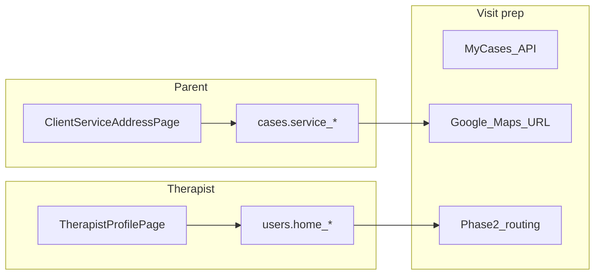

# Homecare addresses for therapists and clients

## Problem

Today [`User.location`](backend/app/models/user.py) is a single free-text field (“Location / City”) on [`TherapistProfilePage.jsx`](frontend/src/components/therapist/TherapistProfilePage.jsx). [`Child`](backend/app/models/child.py) and [`Case`](backend/app/models/case.py) have **no** address, pincode, or coordinates. Homecare therapists cannot see where to go, and there is no data model for future map routing.

## Goals (v1)

- **Therapist**: enter **home / base address** (structured + optional “Use current location” via browser GPS).
- **Client (parent)**: enter **service address + pincode** for each case (where homecare happens).
- **Therapist on assigned homecare cases**: read service address; **Open in Google Maps** link (no embedded map widget yet).
- **Admin / case manager**: set or edit service address when creating/updating cases.

You chose **structured manual entry + optional browser geolocation** (no Google Places API in v1).

## Data model

### Shared shape (Pydantic + DB columns)

Reuse one schema [`ServiceAddress`](backend/app/schemas/address.py) (name reflects “place of service”; therapist home uses same fields):

| Field | Notes |
|-------|--------|
| `address_line1` | Street / house (required when saving address) |
| `address_line2` | Optional |
| `city` | Required |
| `state` | Optional |
| `pincode` | Required for India homecare (validate 6 digits) |
| `landmark` | Optional |
| `latitude`, `longitude` | Optional; set from browser geolocation or left null until phase 2 geocoding |

### Therapist — extend `users` table

Migration adds nullable columns (prefix `home_`):

- `home_address_line1`, `home_address_line2`, `home_city`, `home_state`, `home_pincode`, `home_landmark`, `home_latitude`, `home_longitude`

Keep existing `location` for backward compatibility: auto-set to `"city, pincode"` summary on save, or HR display-only.

### Client service site — extend `cases` table

Homecare visits are tied to the **case** (service delivery point):

- `service_address_line1`, … same fields as above with `service_` prefix

Only required when `product_module == 'homecare'` (or `service_type` contains Homecare)—enforce in API validation, not DB NOT NULL globally.

## Backend

### Schemas

- [`backend/app/schemas/address.py`](backend/app/schemas/address.py) — `AddressFields`, `AddressRead`
- Extend [`MeUpdate`](backend/app/schemas/auth.py) / [`UserMeResponse`](backend/app/schemas/auth.py) with optional home address fields
- Extend [`CaseCreate`](backend/app/schemas/case.py), [`CaseUpdate`](backend/app/schemas/case.py), [`CaseRead`](backend/app/schemas/case.py) with service address fields

Helper: `format_address_summary()` and `maps_query_url(lat, lng, formatted_address)` for API responses.

### APIs

| Endpoint | Who | Action |
|----------|-----|--------|
| `PATCH /api/v1/auth/me` | Therapist | Save home address (+ lat/lng from client) |
| `GET /api/v1/auth/me` | Therapist | Return home address in `UserMeResponse` |
| `PATCH /api/v1/parent/cases/{case_id}/service-address` | Parent | Update service address for own child’s case |
| `GET /api/v1/parent/cases` | Parent | Include service address summary per case |
| `PATCH /api/v1/cases/{id}` | Admin / case manager | Set service address on create/update (extend existing) |
| `GET /api/v1/cases` / therapist-assigned list | Therapist | Include `service_address` + `maps_url` when assigned |

Authorization:

- Parent: only cases linked to their children ([`parent.py`](backend/app/api/v1/parent.py) pattern).
- Therapist: [`case_scope_check`](backend/app/core/permissions.py) — read only.
- Sensitive: do not expose home address to parents; service address not exposed to unrelated therapists.

### Validation

- Pincode: `^[0-9]{6}$` when provided.
- If any service address field set for homecare case, require `line1`, `city`, `pincode`.
- Latitude/longitude: range checks if present.

### Seed

[`demo_seed.py`](backend/app/seed/demo_seed.py): sample home address for demo therapist; service address on homecare case `IC-2026-053`.

## Frontend

### 1. Therapist profile — [`TherapistProfilePage.jsx`](frontend/src/components/therapist/TherapistProfilePage.jsx)

Replace single “Location / City” with **Home address** section:

- Fields: line1, line2, city, state, pincode, landmark
- Button **Use current location** → `navigator.geolocation.getCurrentPosition` → fill lat/lng (show coords read-only or hidden; used for maps link)
- Save via extended `PATCH /auth/me`
- Helper text: used as your base location for homecare planning (maps coming soon)

### 2. Parent — service address

New [`ClientServiceAddressPage.jsx`](frontend/src/components/client-portal/ClientServiceAddressPage.jsx) or section on dashboard:

- Per active case: edit service address + pincode + optional geolocation
- Route: `/parent/address` in [`ParentRoutes.jsx`](frontend/src/routes/ParentRoutes.jsx); nav link in [`PortalShell.jsx`](frontend/src/layouts/PortalShell.jsx)

### 3. Admin — case forms

[`AdminCreateCaseForm.jsx`](frontend/src/components/admin-portal/AdminCreateCaseForm.jsx) / [`AdminCasesPage.jsx`](frontend/src/components/admin-portal/AdminCasesPage.jsx): when module is homecare, show service address fields.

### 4. Therapist — view before visit

Phase 1 minimum: extend therapist cases API consumption (when [`MyCasesPage`](frontend/src/components/cases/MyCasesPage.jsx) is wired to API, or interim **case detail drawer** from calendar booked slot):

- Show formatted address + pincode
- Link: `Open in Google Maps` (`maps_url` from API)

[`BookSlotModal`](frontend/src/components/therapist/BookSlotModal.jsx) or slot menu: quick link to case service address when booking homecare.

Optional small component [`AddressFormFields.jsx`](frontend/src/components/shared/AddressFormFields.jsx) shared by profile, parent, admin.

## Phase 2 (document only, not v1)

- Google Places autocomplete (`GOOGLE_MAPS_API_KEY`)
- Embedded map on case detail
- Drive-time between therapist home and client service address
- Auto-geocode pincode server-side

## Tests

[`backend/app/tests/test_addresses.py`](backend/app/tests/test_addresses.py):

- Therapist updates home address on `/auth/me`
- Parent updates service address on own case only (403 on others’)
- Therapist assigned to case receives `maps_url` in case read
- Pincode validation rejects invalid input

## Relation to other plans

- Independent of [leave parent notifications](file:///Users/midhunnoble/.cursor/plans/leave_parent_notifications_4d572990.plan.md) and [therapist booking calendar](file:///Users/midhunnoble/.cursor/plans/therapist_booking_calendar_5a7394f8.plan.md).
- Booked homecare sessions can later show “Navigate” using stored `service_*` coordinates.

## Primary files

| Area | Files |
|------|--------|
| Migration | new alembic revision on `users`, `cases` |
| Models | `user.py`, `case.py` |
| Schemas | `address.py`, `auth.py`, `case.py` |
| API | `auth.py`, `parent.py`, `cases.py` |
| UI | `TherapistProfilePage.jsx`, `ClientServiceAddressPage.jsx`, `AdminCreateCaseForm.jsx`, shared `AddressFormFields.jsx` |
| Tests | `test_addresses.py` |
