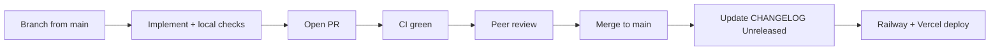

# Contributing to InsightCase

Thank you for working on InsightCase. This repo is built by a small team on a **case-centric** monorepo (FastAPI + React/Vite). Follow this guide so three (or more) contributors can ship in parallel without breaking `main`.

**Quick links:** [CHANGELOG.md](./CHANGELOG.md) · [docs/TEAM_OWNERSHIP.md](./docs/TEAM_OWNERSHIP.md) · [docs/RELEASE_CHECKLIST.md](./docs/RELEASE_CHECKLIST.md) · [docs/GITHUB_SETUP.md](./docs/GITHUB_SETUP.md) (branch protection)

---

## Golden rules

1. **Never push directly to `main`.** Open a pull request; wait for CI green + at least one review.
2. **One concern per PR.** Prefer focused diffs (billing *or* support hub, not both in one 90-file merge).
3. **CI must pass** before merge — backend pytest, Alembic single head, frontend build (see [`.github/workflows/ci.yml`](./.github/workflows/ci.yml)).
4. **Never commit secrets** — no `.env`, tokens, or SMTP keys. Use [docs/ENVIRONMENT_VARIABLES.md](./docs/ENVIRONMENT_VARIABLES.md).
5. **Update [CHANGELOG.md](./CHANGELOG.md)** under `[Unreleased]` for every merged PR (author or merger).
6. **Schema changes** — one Alembic revision per PR; rebase on `main` before adding migrations to avoid two heads.
7. **RBAC changes** — update or add tests in `test_rbac_access.py` or the feature’s test module.

---

## Workflow



### 1. Branch

```bash
git checkout main && git pull
git checkout -b feature/short-description   # or fix/, chore/, docs/
```

Naming: `feature/support-hub-capabilities`, `fix/session-log-tests`, `docs/env-reference`.

### 2. Develop locally

**Backend** (from `backend/`):

```bash
python3 -m pip install -r requirements.txt
python3 -m app.seed.demo_seed   # first time / after schema change
uvicorn app.main:app --reload --port 8000
```

**Frontend** (from `frontend/`):

```bash
npm install
npm run dev
```

### 3. Run checks before push

**Recommended (full):**

```bash
./scripts/pre-push-check.sh
```

**Minimum:**

```bash
cd backend && python3 -m pytest app/tests -q
cd frontend && npm run build
# If you touched alembic/versions/:
cd backend && PYTHONPATH=.:alembic python3 -m alembic heads   # exactly ONE (head)
```

Install optional git hooks (blocks commits to `main`, staged `.env`, private keys):

```bash
pip install pre-commit
pre-commit install
pre-commit install --hook-type pre-push
```

### 4. Open a pull request

- Use the [PR template](./.github/pull_request_template.md) — fill every checklist item that applies.
- Request review from the [area owner](./docs/TEAM_OWNERSHIP.md) (CODEOWNERS will auto-request when usernames are set).
- Link related issues or plan docs; do **not** edit attached plan files in Cursor — implement and mark todos instead.

### 5. Merge

- Squash or merge commit — team default: **squash** for cleaner history (optional).
- After merge: ensure **[CHANGELOG.md](./CHANGELOG.md)** `[Unreleased]` has a bullet with PR number, author, and area.

---

## Release (before production promote)

Run the automated release gate, then follow the manual checklist:

```bash
./scripts/pre-release-check.sh
```

Then complete [docs/RELEASE_CHECKLIST.md](./docs/RELEASE_CHECKLIST.md):

- Move `[Unreleased]` entries in CHANGELOG to a dated `## [YYYY-MM-DD]` section.
- Confirm Railway API health + Vercel production alias points at latest deployment.
- Run manual smoke (login, session log, billing view) on production URLs.

Deploy split (do not confuse):

| Platform | Project | Env vars |
|----------|---------|----------|
| **Railway** | `case-manager-new` | All backend secrets |
| **Vercel** | `insightes-projects/frontend` | **`VITE_API_URL` only** |

See [docs/RAILWAY_VERCEL.md](./docs/RAILWAY_VERCEL.md).

---

## High-risk areas (extra care)

| Area | Paths | Requirement |
|------|-------|-------------|
| RBAC / modules | `backend/app/core/permissions.py`, `modules.py` | Tests + reviewer who owns RBAC |
| Migrations | `backend/alembic/versions/` | Single head; coordinate in Slack/chat before merging two migration PRs |
| Billing | `invoice_*`, `client_billing_*` | Run billing-related tests |
| Support hub | `support_access_service.py`, `AdminSupportHubPage.jsx` | Run `test_support_access.py`, `test_support_history.py` |
| Deploy / env | `.env*`, Railway/Vercel scripts | No secrets in diff; update ENVIRONMENT_VARIABLES.md if adding vars |

---

## CI (what runs on every PR)

| Job | Checks |
|-----|--------|
| `backend` | pytest full suite, Alembic single head, dependency parity |
| `frontend` | `npm run build` |
| `vercel-monorepo-build` | Root `vercel.json` build (matches production) |
| `contributor-guards` | No staged secrets patterns; CONTRIBUTING/CHANGELOG present |

---

## Getting help

- Architecture: [docs/ARCHITECTURE.md](./docs/ARCHITECTURE.md)
- RBAC: [docs/RBAC_SCOPE.md](./docs/RBAC_SCOPE.md)
- Agents / AI assistants: [AGENTS.md](./AGENTS.md), [docs/AGENT_WORKFLOW.md](./docs/AGENT_WORKFLOW.md)
- Full doc index: [docs/README.md](./docs/README.md)

Repo admins: configure branch protection per [docs/GITHUB_SETUP.md](./docs/GITHUB_SETUP.md).
