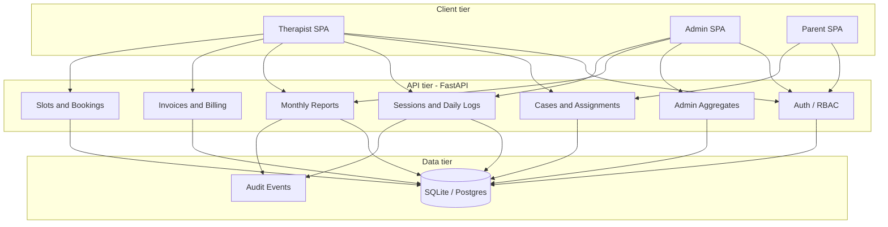
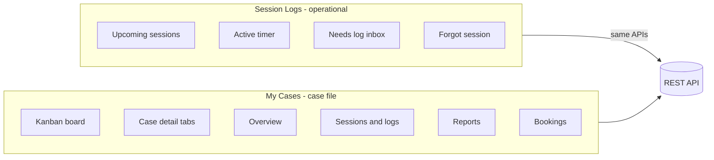
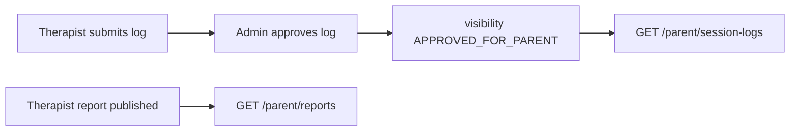
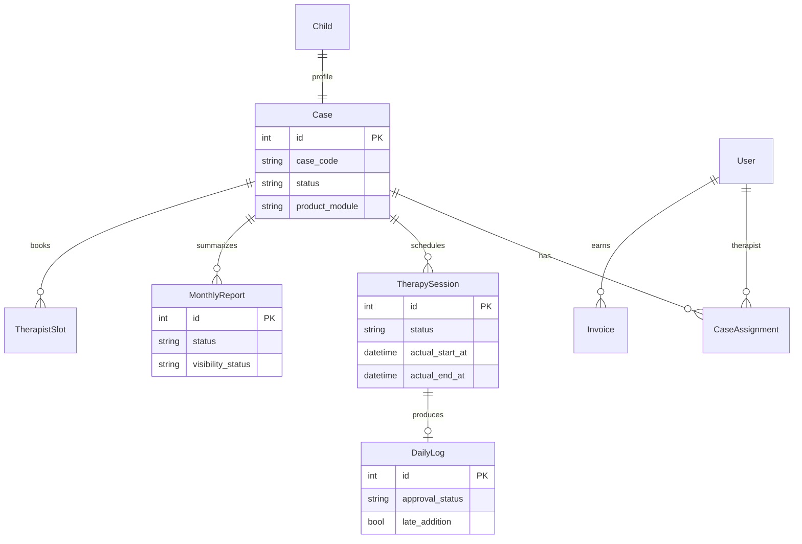
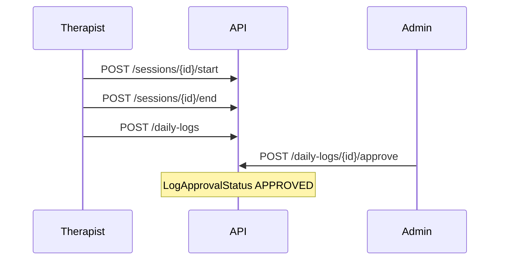
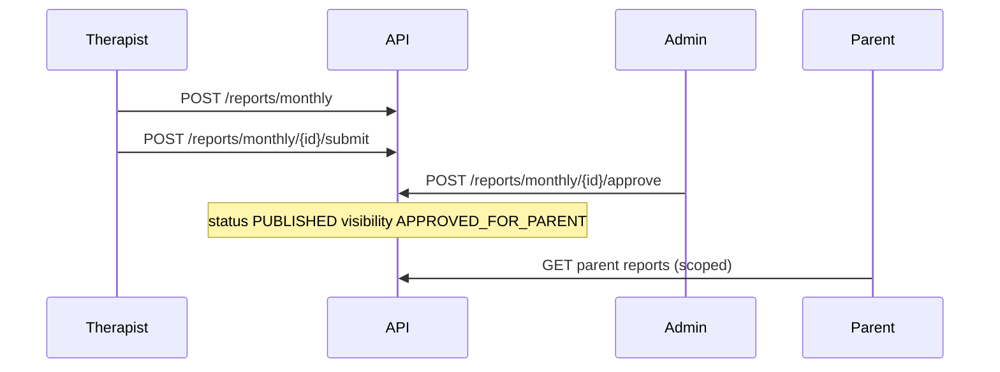
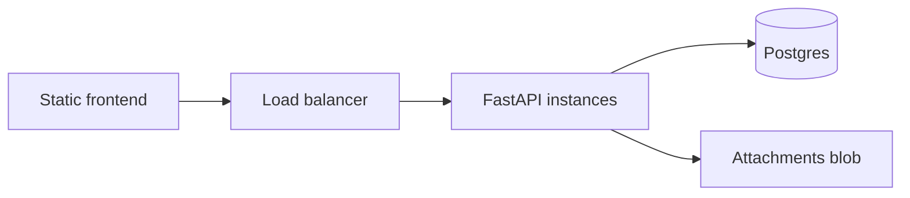

# InsightCase — System Architecture (CTO view)

_Last updated: May 2026 — reflects therapist-first delivery, dual work surfaces (Session Logs vs My Cases), and API-backed operations._

## Executive summary

InsightCase is a **case-centric operations platform** for Insighte Childcare. Every engagement is anchored on a **Case ID**; sessions, daily logs, monthly reports, bookings, invoices, and parent visibility all roll up to that case.

The current build prioritizes the **therapist portal** (daily execution) while the **admin portal** governs review, billing, and configuration. A **parent portal** consumes approved, visibility-scoped artifacts.

## Scope change: two therapist work surfaces

Earlier mockups treated “cases” and “logs” as one screen. The product now **separates concerns**:

| Surface | Route | Purpose |
|---------|--------|---------|
| **Session Logs** | `/therapist/logs` | **Today**: timer, start/end, forgot session, submit log, cross-case inbox |
| **My Cases** | `/therapist/cases`, `/therapist/cases/:id` | **Per client**: overview, sessions/logs, reports, bookings, support |

**Monthly Reports** (`/therapist/reports`) remains a **cross-case pipeline** (draft → submit → admin approve → publish). Case detail duplicates create/submit for convenience.

## Parent (client) portal architecture

Parents consume **approved, visibility-scoped** artifacts only. The UI mirrors the therapist **case-centric** model as read-only hubs.

| Surface | Route | Purpose |
|---------|--------|---------|
| Family dashboard | `/parent` | Stats, cases, notifications |
| Case hub | `/parent/cases/:id` | Overview, session updates, reports, bookings |
| Session updates | `/parent/session-logs` | Cross-child feed of approved logs |
| Approved reports | `/parent/reports` | Published monthly reports + viewer |
| IEP | `/parent/iep` | Acknowledge + download attachments |
| Billing | `/parent/billing` | `ParentBillingStatement` rows (family-facing) |
| Book / address / support | existing routes | Booking API, homecare address, tickets |

### Parent visibility rules

| Artifact | Parent API filter |
|----------|-------------------|
| Daily logs | `submitted_at` set, `approval_status=APPROVED`, `visibility_status` in `APPROVED_FOR_PARENT` / `SHARED_WITH_PARENT`; excludes `session_notes` / `observations` |
| Monthly reports | `status=PUBLISHED` + parent-visible visibility |
| IEP attachments | parent-visible; acknowledge sets `SHARED_WITH_PARENT` |
| Billing | Per-parent `parent_billing_statements` table (not therapist invoices) |

## Admin portal architecture

Admins and case managers **review, assign, and configure** cases. The UI combines **cross-case queues** (dashboard, session logs, reports, invoices) with a **case hub** for per-client operations.

| Surface | Route | Purpose |
|---------|--------|---------|
| Ops dashboard | `/admin` | KPIs + queues with deep links |
| Cases board | `/admin/cases` | List, create, drawer history |
| Case hub | `/admin/cases/:id` | Overview, assignments, logs, reports, billing, schedule |
| Session logs | `/admin/logs` | Approve/reject with internal vs family notes |
| Report review | `/admin/reports` | View modal, approve for parents, reject with comment |
| Invoices | `/admin/invoices` | Finance queue + payment modal |
| IEP | `/admin/iep` | Upload, download, share with parent |
| Incidents | `/admin/incidents` | Status workflow (supervisor+) |

### Admin approval → parent visibility

| Action | Effect on parent portal |
|--------|-------------------------|
| Approve daily log (with `parent_notes`) | Sets `APPROVED` + `APPROVED_FOR_PARENT` + `submitted_at` |
| Approve monthly report | `PUBLISHED` + `APPROVED_FOR_PARENT` visibility |
| Share IEP attachment | `PATCH` attachment to `APPROVED_FOR_PARENT` |

Dashboard and CSV export respect **product-module scoping**; invoice counts filter by therapists on scoped cases.

## Domain model (simplified)

## Request flows

### Session → log → approval

### Monthly report lifecycle

### Invoice (therapist)

Therapist uses **preview → submit**; finance/admin approves payouts separately.

## Security and tenancy

- **JWT** authentication; role + **module feature** flags (`session_logs`, `invoices`, etc.).
- **Case scope**: therapists see only assigned cases; parents see linked children.
- **Visibility** on reports/logs gates parent-facing content.
- **Audit** on approve/reject and sensitive mutations.

## Frontend architecture

| Layer | Stack | Notes |
|-------|--------|------|
| SPA | React + Vite | Role-based route trees |
| State | Context + hooks | `AuthContext`, workbench builders |
| API | `apiClient.js` | Bearer token, `/api/v1` |
| UI | CSS modules / Tailwind mix | Admin portal + therapist areas |

**Workbench pattern**: `caseWorkbench.js` and `reportWorkbench.js` aggregate list endpoints client-side for kanban/pipeline UIs without bespoke BFF endpoints (acceptable at current scale; consider GraphQL or aggregate APIs if N+1 becomes painful).

## Backend architecture

| Layer | Responsibility |
|-------|----------------|
| `api/v1/*` | HTTP routers, auth deps |
| `services/*` | Business rules (logs, invoices, assignments) |
| `models/*` | SQLAlchemy ORM |
| `core/permissions.py` | RBAC matrix |
| `core/modules.py` | Product module features |
| `alembic/` | Schema migrations |

## Deployment topology (target)

Local dev uses SQLite (`insightcase.db`) and Vite proxy to `:8000`.

## Maturity matrix

| Capability | Therapist | Admin | Parent | API |
|------------|-----------|-------|--------|-----|
| Auth / invite | ✓ | ✓ | ✓ | ✓ |
| Case list / detail | ✓ | ✓ | case hub read-only | ✓ |
| Session timer + logs | ✓ | review | approved logs only | ✓ |
| Monthly reports | ✓ pipeline | approve | view published | ✓ |
| Invoices | preview/submit | approve | — (family billing separate) | ✓ |
| Slots / bookings | view/book | manage | book + list/cancel | ✓ |
| Leave / profile | ✓ | — | profile + address | ✓ |
| IEP | admin upload | partial | acknowledge + download | ✓ |
| Support tickets | full | manage | raise + list own | ✓ |
| E2E Playwright | therapist smoke | parent smoke | admin smoke | — |
| Case hub | `/therapist/cases/:id` | `/parent/cases/:id` | `/admin/cases/:id` | — |

## Recommended next engineering steps

1. **Aggregate endpoints** for dashboard and My Cases to cut parallel fetches.
2. **Report editor** PATCH UI on Monthly Reports page (summary inline edit).
3. **E2E Playwright** — `therapist-portal.spec.js`, `parent-portal.spec.js`, and `admin-portal.spec.js`; API smoke at `backend/scripts/therapist_flow_smoke.py`.
4. **Postgres** in staging; retire SQLite-only assumptions.
5. **Event bus** (optional) for notifications when logs/reports change state.

## Related docs

- [README.md](../README.md) — local setup and demo accounts
- [backend/README.md](../backend/README.md) — API and roles
