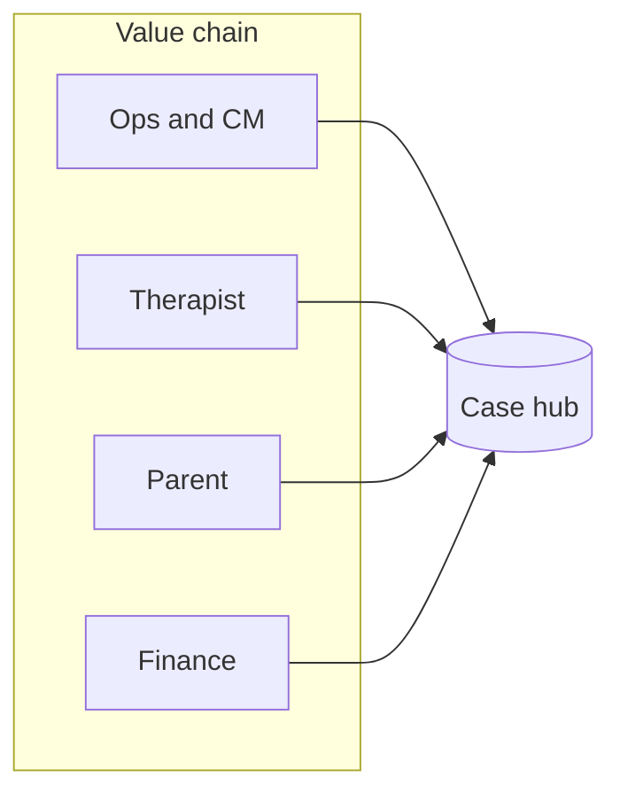

# InsightCase — Board one-pager

**Product:** Case-centric operations platform for therapy and childcare programmes (homecare, shadow support).  
**Stage:** Controlled pilot ready · Enterprise scale not yet  
**Date:** May 2026

---

## What we built

One **Case ID** anchors assignments, sessions, daily logs, monthly reports, scheduling, therapist payouts, parent billing, IEP, tickets, and incidents. Three portals (therapist, admin/ops, parent) plus HR — gated by role and product module.

---

## Why this matters commercially

| Pain in the market | Our answer |
|--------------------|------------|
| Spreadsheets + WhatsApp for assignments | Case assignments with history; pipeline board + bulk assign |
| Therapists forget logs; revenue leakage | Session Logs work surface + invoice preview / late sessions |
| Parents ask “what happened this week?” | Approved logs and reports only; client billing with line items |
| Finance pays wrong person / wrong amount | Separate therapist invoices vs parent invoices; breakdown + approve |
| School + home programmes in one org | Modules: homecare, shadow_support, billing |

**Positioning:** *Operations OS for therapy agencies* — not generic clinic software.

---

## Traction signals (technical)

| Metric | Status |
|--------|--------|
| Automated API tests | **110 passed**, 4 skipped |
| Core journeys automated | Auth, workbench, reschedule, invoice submit/approve, tickets |
| Architecture documentation | `ARCHITECTURE.md`, `billing-architecture.md`, review pack |
| Recent product delivery | CM workbench, kanban actions, unified calendar, reschedule queue |

---

## Pilot recommendation

**Go** for a limited pilot: one region, &lt;200 active cases, roles: superadmin, case manager, therapist, parent, finance.

**Gate each release:** manual checklist in [REVIEW_FINDINGS.md](./REVIEW_FINDINGS.md) (kanban, calendar, billing reject path).

**Do not** market as enterprise-ready until P0 roadmap items below are done.

---

## Top risks (board-level)

| Risk | Impact | Mitigation (roadmap) |
|------|--------|----------------------|
| Child data in local file uploads | Regulatory / reputational | Object storage, signed URLs, access audit |
| Billing errors | Trust + cash | Dual billing tests; finance breakdown mandatory |
| Ops platform slows at case volume | CM churn | Pipeline pagination / filters |
| Weak parent notifications | No-shows, disputes | Event-driven WhatsApp/email (P1) |
| Dev secrets in deploy templates | Security incident | Prod secrets, Redis refresh tokens |

---

## Investment ask (engineering focus)

| Horizon | Spend focus | Outcome |
|---------|-------------|---------|
| **0–6 weeks** | P0 production hardening | Safe pilot |
| **2–4 months** | Notifications, payments, IEP goals | Differentiation vs local competitors |
| **6–12 months** | Scale, analytics, compliance pack | Multi-site / franchise ready |

Detail: [PRODUCT_ROADMAP.md](./PRODUCT_ROADMAP.md)

---

## Executive KPIs to track in pilot

1. **Utilization** — booked slots / available slots per therapist per week  
2. **Documentation compliance** — % sessions with approved log within 48h  
3. **Parent engagement** — % cases with parent login + report view per month  
4. **Revenue integrity** — dispute rate on client invoices; therapist invoice rejection rate  
5. **Ops throughput** — median time from report submit → parent-visible approve  

---

## Decision requested

Approve **controlled pilot** with explicit **P0 completion** before expanding regions or headcount on sales.

**Contacts for demo:** see [REVIEW_ROLE_MATRIX.md](./REVIEW_ROLE_MATRIX.md) (`demo123` on all seeded accounts).

---

*Companion docs: [PRODUCT_ROADMAP.md](./PRODUCT_ROADMAP.md) · [REVIEW_FINDINGS.md](./REVIEW_FINDINGS.md) · [SCALABILITY_REVIEW.md](./SCALABILITY_REVIEW.md)*
