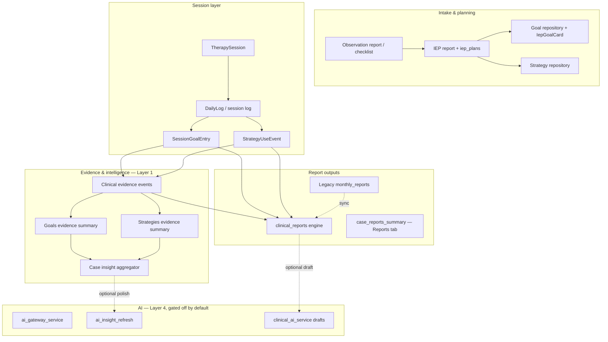
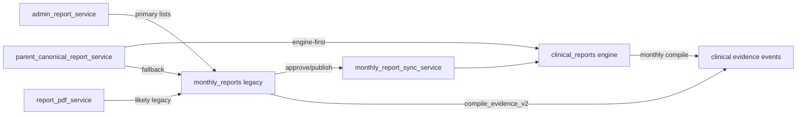

# Handover: Reports, Clinical Brain & session evidence

**Canonical session-log direction:** [product/CANONICAL_PRODUCT_DIRECTION.md](./product/CANONICAL_PRODUCT_DIRECTION.md) · [SESSION_LOG_V1.md](./product/SESSION_LOG_V1.md)

For CTO, clinical leads, and engineers taking over InsighteCase report simplification. Read with [REPORT_ARCHITECTURE.md](./REPORT_ARCHITECTURE.md), [CLINICAL_EVIDENCE_EVENT_CONTRACT.md](./CLINICAL_EVIDENCE_EVENT_CONTRACT.md), [ARCHITECTURE.md](./ARCHITECTURE.md), and [AGENTS.md](../AGENTS.md).

_Last updated: July 2026_

---

## Purpose

This document explains:

1. How **session logs** become **clinical evidence** and feed **reports**
2. The **canonical report engine** vs **legacy monthly** compatibility path
3. **Clinical Brain** and **Insights** — what they are, what they are not
4. How **goals and strategies progress** is measured (rule-based, not AI)
5. How **monthly** and **progress** reports are created today
6. **AI usage** — gated, on-demand only
7. What must happen to **retire the legacy monthly engine** safely

---

## Executive mental model

InsighteCase is converging on one report lifecycle spine (`clinical_reports`). Session logs are the evidence source of truth. Clinical Brain and Insights are **layers on top** — they do not own report approval, parent publish, or clinical truth.



### Intelligence routing (founder doctrine)

| Layer | Mechanism | Examples in this codebase |
|-------|-----------|---------------------------|
| **1** | SQL / deterministic rules | Insights tab, due-date rules, evidence strength, CM exception queue |
| **2** | Relational joins | Sessions → logs → goal/strategy events → reports |
| **3** | Vector similarity | Schema exists (`clinical_reference_embeddings`); retrieval is **keyword fallback** today |
| **4** | LLM | `clinical_ai_service`, `ai_insight_refresh` — **only on explicit user click**; `AI_ENABLED=false` by default |

---

## Core clinical data graph

Canonical sequence (from product doctrine):

`Child` → `Observations` → `Challenges` → `Goals` → `Strategies` → `Sessions` → `Evidence` → `Progress` → `Reports`

### Key tables

| Table | Role |
|-------|------|
| `TherapySession` | Scheduled/completed session on `case_id` |
| `DailyLog` | Therapist session log |
| `SessionGoalEntry` | Structured goal work: P/I/G scores (v2), notes, `goal_card_id`, domains |
| `StrategyUseEvent` | Strategy use + feedback (`HELPFUL`, `NEEDS_ADAPTATION`, etc.) |
| `IepGoalCard` | Active IEP goals on a case (from approved plan) |
| `goal_repository_items` | Goal candidates / case-specific / org pool |
| `strategy_repository_items` | Strategy candidates / case trials / org pool |
| `ClinicalReport` | Canonical report lifecycle (observation, IEP, monthly, progress) |
| `MonthlyReport` | **Legacy** monthly report (still primary write path in production) |
| `iep_plans` | Structured IEP plan data (goals, strategies, domains) — separate from report lifecycle |

---

## Session logs → evidence → reports

### Evidence materialization

`clinical_evidence_event_service.py` materializes **Clinical Evidence Event Contract** objects from `session_goal_entries` + `strategy_use_events` (logical view; no duplicate evidence table in v1).

- Spec: [CLINICAL_EVIDENCE_EVENT_CONTRACT.md](./CLINICAL_EVIDENCE_EVENT_CONTRACT.md)
- API: `GET /api/v1/cases/{id}/clinical-evidence-events?month=YYYY-MM`
- API: `GET /api/v1/daily-logs/{id}/clinical-evidence-events`

### How each report type consumes session evidence

| Report type | Primary evidence inputs | Service / path |
|-------------|------------------------|----------------|
| **Observation** | Checklist responses, session patterns | `observation_report_service` → `ClinicalReportSection` |
| **IEP** | Observation signals + `goals_plan` structured section | `iep_report_service`; approved goals sync to `IepGoalCard` |
| **Monthly (engine)** | Submitted logs for month → structured snapshot | `monthly_evidence_compiler_service` → populate engine sections |
| **Monthly (legacy)** | Same logs → HTML sections | `monthly_report_evidence_compiler.compile_evidence_v2` |
| **Progress** | Designed to aggregate monthly reports | **Not implemented** (`implemented: False` in `report_engine_constants.py`) |

### IEP plan vs IEP report (clinical distinction)

| Asset | Storage | Purpose |
|-------|---------|---------|
| **IEP plan** | `iep_plans` | Durable structured plan — goals, strategies, domains |
| **IEP report** | `clinical_reports(type=iep)` | Draft → submit → CM approve → lock lifecycle |
| **Active session goals** | `iep_goal_cards` | What therapists tag in session logs |

- Plan API: `/api/v1/cases/{id}/iep-plan`
- Report API: `/api/v1/cases/{id}/reports/iep/*` (engine)
- Bridge: `iep_report_bridge_service` syncs approved plans into engine reports
- On IEP approval: `iep_report_service.sync_approved_iep_goals_to_active_case_plan` promotes goals to `IepGoalCard`

Therapists log against **`IepGoalCard` IDs**. Repository goals remain staging until CM/IEP approval.

---

## Report engines: canonical vs legacy

Full spine doc: [REPORT_ARCHITECTURE.md](./REPORT_ARCHITECTURE.md)

### Canonical engine (`clinical_reports`)

| Report type | Engine status | Section catalog |
|-------------|---------------|-----------------|
| `observation` | **Implemented** | 17 sections — `OBSERVATION_REPORT_SECTIONS` |
| `iep` | **Implemented** | 8 sections — `IEP_REPORT_SECTIONS` |
| `monthly` | **Implemented** (flag-gated writes) | 11 sections — `MONTHLY_REPORT_SECTIONS` |
| `progress` | **Planned** | Enum exists; no section builder |
| `history` | **Planned** | Read/aggregate only |

- **Models:** `ClinicalReport`, `ClinicalReportSection`, versions, evidence, review events
- **Service:** `backend/app/services/report_engine_service.py`
- **API:** `backend/app/api/v1/clinical_reports.py`

### Legacy compatibility paths (still active)

| Path | Models | API | Production default |
|------|--------|-----|-------------------|
| **Monthly** | `MonthlyReport`, `MonthlyReportSection` | `/api/v1/reports/monthly/*` | **Primary write path** |
| **Observation** | `ObservationChecklist`, `observation_reports` | Checklist + engine fallback | Engine when revamp on |
| **IEP plan** | `iep_plans` | `/api/v1/cases/{id}/iep-plan` | Active alongside engine |

### Strangler sync

`monthly_report_sync_service.py` mirrors approved/published **legacy** monthly rows into `clinical_reports(type=monthly)` idempotently. Parent portal uses **engine-first, legacy-fallback** via `parent_canonical_report_service`.

### Feature flags

| Flag | Location | Default | Effect |
|------|----------|---------|--------|
| `REPORTS_ENGINE_V1` | `reportsRevampFlags.js` | on (dev) | Observation/IEP builder UI |
| `MONTHLY_REPORTS_USE_CLINICAL_ENGINE` | `reportsRevampFlags.js` | **off** | Monthly writes use engine APIs |
| `VITE_ENABLE_CLINICAL_BRAIN` | frontend env | off (prod) | Goal bank, AI assist surfaces |
| `AI_ENABLED` | backend `settings` | **false** | All LLM calls return skipped/mock |

Frontend monthly router: `frontend/src/lib/monthlyReportApi.js` — switches between legacy and engine endpoints.

---

## Goals & strategies — progress measurement

### Storage & scope

| Asset | Table | Assigned to child when |
|-------|-------|------------------------|
| IEP goals | `iep_goal_cards` | IEP approved / synced |
| Case goals | `goal_repository_items` (case_id set) | CM approves or case-specific active |
| Strategies | `strategy_repository_items` (case_id set) | Approved trial or case-specific active |
| Org pool | `case_id IS NULL` | **Not** child-assigned until adopted |

Goals & Strategies tab (`goals_engine_service`) returns `assigned_goals` / `assigned_strategies` with session evidence merged — active and paused only, no org pool suggestions.

### Measurement engine (Layer 1 — no AI)

**`goal_evidence_aggregation_service.py`** is the core measurer.

**Per IEP goal:**

- Counts `SessionGoalEntry` by `goal_card_id` (label fallback)
- `session_count`, `evidence_count`, P/I/G averages (v2 schema)
- Trend: improving / stable / needs_support
- `evidence_strength`: weak / moderate / strong_operational
- Linked strategy count from `StrategyUseEvent` on same logs

**Per strategy:**

- Groups `StrategyUseEvent` by label
- `use_count`, feedback distribution, linked goal IDs
- `where_helped` / `where_needs_adapting` from session notes

API: `GET /api/v1/cases/{id}/goals/evidence-summary`, `GET /api/v1/cases/{id}/strategies/evidence-summary`

### Surfaces that consume measurement

| Surface | Service | Clinician sees |
|---------|---------|----------------|
| **Insights tab** | `goal_progress_analyzer`, `strategy_response_analyzer` | Per-goal cards, strategy response, next session focus |
| **Goals & Strategies tab** | `goals_engine_service` | Assigned goals/strategies + session evidence counts |
| **Monthly compile** | `monthly_evidence_compiler_service` | Month snapshot for report sections |
| **CM exception queue** | `clinical_insight_summary_service` | Risk/quality flags |

**Progress labels are rule-based** — e.g. "Building", "Consistent", "Needs adapting", "Not enough evidence". AI does not set goal status.

---

## Insights generation

### Layer 1 — always available (rule engine)

**`case_insight_aggregator.py`** orchestrates (no AI):

1. Child snapshot — observation profile + clinical profile + session patterns
2. Goal progress cards — `goal_progress_analyzer`
3. Strategy response cards — `strategy_response_analyzer` (nested under goals)
4. Evidence cards — `evidence_mapper`
5. Collaborative inputs — parent/school via `collaborative_input_mapper`
6. Suggested goals/strategies — `suggested_goal_strategy_engine` (rules)
7. Next session focus — `next_session_focus_builder`

Frontend: `CaseInsightsTab` (Forest Light UI).

### Layer 2 — optional AI polish

**`ai_insight_refresh_service.py`** ("Refresh Insights" button):

- Recomputes Layer 1 + `input_hash`
- If unchanged → cached `ClinicalSnapshot`
- If changed → `ai_gateway_service` with compressed context (max 20 insight objects)
- Weekly cap: 2 refreshes per case/user
- AI only produces `polishedSummary` text — **never alters clinical facts**

**Disabled in production today:** `settings.AI_ENABLED = False`.

---

## Monthly report creation (today)

### Path A — Legacy (production default)

```
Therapist → CaseReportsPanel / CreateDraftModal
  → POST /api/v1/reports/monthly
  → MonthlyReport (draft)
  → ReportEditPage (edit sections)
  → Optional: compile_evidence_v2 (HTML from session logs)
  → Submit → CM review → Approve/Publish
  → monthly_report_sync_service → clinical_reports mirror
  → Parent portal (engine-first read, legacy fallback)
```

**Frontend callers:** `CaseReportsPanel`, `CreateDraftModal`, `ReportEditPage`, `AdminReportsPage`, parent monthly pages.

### Path B — Clinical engine (flag-gated)

Enable: `VITE_MONTHLY_REPORTS_USE_CLINICAL_ENGINE=true`

```
POST /api/v1/cases/{id}/reports/monthly/start
  → ClinicalReport(type=monthly) + seeded sections
POST /api/v1/reports/{id}/monthly/compile-evidence
  → monthly_evidence_compiler_service → evidence snapshot JSON
POST /api/v1/reports/{id}/monthly/populate-from-evidence
  → report_engine_service.populate_monthly_from_evidence
Optional: clinical_ai_service.draft_monthly_report_section (requires AI_ENABLED)
Submit/approve: /api/v1/reports/{id}/submit | approve
```

**Known gaps vs legacy:** PDF/export parity, full admin/parent routing on engine-only path.

### Engine monthly sections (canonical keys)

| Key | Label | Required |
|-----|-------|----------|
| `child_summary` | Child Summary | yes |
| `sessions_summary` | Sessions Summary | yes |
| `goals_progress` | Goals Progress | yes |
| `strategies_used` | Strategies Used | no |
| `strengths_observed` | Strengths Observed | no |
| `support_needs` | Support Needs | no |
| `barriers_or_context` | Barriers or Context | no |
| `next_month_focus` | Next Month Focus | yes |
| `therapist_notes` | Therapist Notes | no |
| `internal_notes` | Internal CM Notes | no |
| `parent_summary` | Parent Summary | yes (parent-visible) |

Legacy section keys map via `LEGACY_MONTHLY_SECTION_KEY_MAP` in `report_engine_constants.py`.

---

## Progress report (today)

| Aspect | Status |
|--------|--------|
| Engine enum | `ClinicalReportType.PROGRESS` exists |
| Section builder | **Not implemented** |
| Evidence hook | `monthly_reports` (planned) |
| UI | `CaseProgressReportsSection` / placeholder |
| Reports tab | Due rules in `case_reports_summary_service` (6-month interval) |

**Clinical action needed:** Sign off progress report template before engineering implements sections.

---

## Case Reports tab (new read model)

**Not a report editor** — orchestration and history for one child.

- **Service:** `case_reports_summary_service.py` (Layer 1, no AI)
- **API:** `GET /api/v1/cases/{id}/reports/summary`
- **Frontend:** `CaseReportsTab` (`frontend/src/components/clinical/reports-tab/`)

Delivers: attention items, lifecycle strip, filters, report history timeline, working progress. CTAs route to existing editors (observation, IEP, monthly, progress).

---

## Clinical Brain

Clinical Brain is **not** a third report engine. It attaches to `clinical_reports`:

| Service | Purpose |
|---------|---------|
| `clinical_brain_evidence_service` | Evidence summaries for report sections |
| `clinical_brain_draft_service` | Draft section text → therapist must accept |
| `clinical_brain_suggestion_service` | Goal/strategy wording suggestions |
| `clinical_brain_review_service` | Quality checks |
| `clinical_ai_service` | improve session note, draft monthly section, IEP wording, recommend strategies |

**Clinical Brain must not:**

- Create independent reports
- Approve or publish to parents
- Mutate IEP goals automatically
- Bypass CM review

**Gated by:** `enable_clinical_brain` (backend) + `VITE_ENABLE_CLINICAL_BRAIN` (frontend).

---

## AI usage (actual state)

| Capability | Trigger | Default |
|------------|---------|---------|
| Session note improve | User click | **Off** |
| Monthly section draft | User click after evidence compile | **Off** |
| IEP goal wording suggest | User click | **Off** |
| Strategy recommend | User click | **Off** |
| Insights refresh polish | User click, 2/week cap | **Off** |
| Embeddings / RAG | Reference retrieval | Keyword fallback |

Gateway: `ai_gateway_service.py` — logs to `ai_generation_logs`; mock when disabled.

**Token economy:** Monthly compile and insights use **structured snapshots** (IDs, scores, flags) — not raw session prose — when engine path is used.

---

## Frontend surface map (therapist)

| UI | Data source | Engine |
|----|-------------|--------|
| Case → **Reports** tab | `reports/summary` | Read model (new) |
| Case → Reports → **Monthly** | `CaseReportsPanel` | **Legacy monthly** |
| Case → Reports → Observation / IEP | Engine routes | `clinical_reports` |
| Case → **Insights** | Case insight payload | Rule engine + optional AI refresh |
| Case → **Goals & Strategies** | `goals-engine` | Assigned + evidence |
| Case → **Logs** | Daily logs + structured evidence | Session capture |
| `/therapist/reports` (global) | Therapist pipeline API | Legacy caseload (redirects to case tab when revamp on) |

---

## Old ↔ new dependencies



**New depends on legacy:** sync on approval; parent fallback; admin queues.

**Legacy depends on new:** sync target; observation/IEP feed summary + insights; shared evidence contract.

---

## Retiring legacy monthly — checklist

### Must migrate (high risk)

1. **Write paths** — `CreateDraftModal`, `CaseReportsPanel`, `ReportEditPage`, admin approve/publish, parent read → engine only via `monthlyReportApi`
2. **Admin operations** — `AdminReportsPage`, bulk approve, parent review status
3. **Parent portal** — `parent_canonical_report_service` engine-only after backfill
4. **PDF/export** — `report_pdf_service` from `ClinicalReportSection`
5. **Notifications** — links to legacy report IDs
6. **Data backfill** — historical `monthly_reports` → `clinical_reports`
7. **Tests** — `test_clinical_reports_strangler.py`, admin/parent report tests

### Safe to delete after parity

- `monthly_report_evidence_compiler.py` (legacy HTML compiler)
- Monthly CRUD in `report_service.py` (or read-only archive)
- `/api/v1/reports/monthly/*` (or thin delegate to engine)

### Keep after scrap

- `iep_plans`, session evidence tables, `clinical_evidence_event_service`
- Insights aggregators, goal/strategy repository
- `clinical_reports` engine for all report types

### Flags to flip (staging first)

```bash
# frontend/.env.local
VITE_MONTHLY_REPORTS_USE_CLINICAL_ENGINE=true
VITE_ENABLE_REPORTS=true
VITE_ENABLE_REPORT_BUILDER=true

# backend — when AI drafting is clinically signed off
AI_ENABLED=true
enable_clinical_brain=true
```

---

## Simplification recommendations

### Engineering

1. **One write spine:** `clinical_reports` only; legacy monthly → read-only archive after backfill
2. **One compile pipeline:** `monthly_evidence_compiler_service` → populate sections; retire `compile_evidence_v2`
3. **One therapist monthly UX:** case Reports tab → engine monthly editor; remove `CaseReportsPanel` legacy path
4. **Progress report v1:** aggregate approved monthly snapshots + goal trends (Layer 1) before any LLM narrative
5. **One dashboard:** case `reports/summary` only; retire global pipeline duplication
6. **AI behind one door:** `clinical_ai_service` + gateway only

### Clinical team

1. **Session log quality is the bottleneck** — monthly and insights track structured goal entries + strategy feedback
2. **IEP approval gates goals** — until goals are on `IepGoalCard`, progress measurement is weak
3. **Monthly workflow target:** compile evidence → review populated sections → edit parent summary → submit (&lt;10 min verification)
4. **Insights tab** is safe for operational decisions; AI refresh is cosmetic only today
5. **Progress report** needs template sign-off before build

---

## Legacy report bridge retirement (operational)

### Artifact families

| Family | Storage | Prod reality |
|--------|---------|--------------|
| Uploaded PDFs | `case_documents` + R2 versions | Primary prod reports today |
| Structured legacy | `monthly_reports` | Historical / in-flight drafts |
| Engine canonical | `clinical_reports` | Target write spine when flags ON |

### Scripts (read-only / additive)

```bash
cd backend
python -m scripts.inventory_report_artifacts          # dry-run counts
python -m scripts.inventory_report_artifacts --json
python -m scripts.backfill_legacy_monthly_to_clinical # dry-run
python -m scripts.backfill_legacy_monthly_to_clinical --apply
```

### Session log safety (out of scope)

Do **not** change session log write APIs or `DailyLog` / `TherapySession` models in report migration PRs.

Pre-merge check on changed files:

```bash
rg "DailyLog|TherapySession|SessionGoalEntry|StrategyUseEvent" backend/app frontend/src
```

### Frontend bridge

All `/api/v1/reports/monthly` calls must go through `frontend/src/lib/monthlyReportApi.js` only.

### Triple-read priority (summary service)

1. `clinical_reports` (engine)
2. Uploaded PDFs (`case_documents`)
3. Legacy `monthly_reports`
4. Due-rule placeholder

Dedupe: `case_id + report_type + month`. Do not hide uploaded PDF when engine row has no export yet.

### Staging smoke (flags ON — staging Vercel only)

- `VITE_ENABLE_REPORTS=true`
- `VITE_ENABLE_REPORT_BUILDER=true`
- `VITE_MONTHLY_REPORTS_USE_CLINICAL_ENGINE=true`

Checklist:

1. Case Reports tab loads `GET /cases/{id}/reports/summary`
2. New monthly draft → `clinical_reports` only
3. Case with **only** uploaded PDF appears in history
4. Parent can download uploaded PDF (same path as before)
5. PDF + legacy/engine → no duplicate rows
6. Documents tab unchanged
7. No legacy monthly **write** calls for new drafts

### PR split

| PR | Scope | Prod flags |
|----|-------|------------|
| A | Inventory script + `monthlyReportApi` choke-point + docs | OFF |
| B | Backfill script + triple-read summary service | OFF |
| C | Staging validation | Staging ON only |
| D | Controlled prod enable (cohort rollout) | Supervised |
| E | Legacy freeze/delete | After sign-off |

### Phase 5 deferred (do not ship yet)

- Freeze `POST /api/v1/reports/monthly`
- Remove sync triggers
- Drop legacy routes (not tables) after retention sign-off

---

## Key file index

| Area | Path |
|------|------|
| Report architecture | `docs/REPORT_ARCHITECTURE.md` |
| Section catalogs | `backend/app/report_engine_constants.py` |
| Canonical engine | `backend/app/services/report_engine_service.py` |
| Canonical API | `backend/app/api/v1/clinical_reports.py` |
| Legacy monthly API | `backend/app/api/v1/reports.py` |
| Legacy → engine sync | `backend/app/services/monthly_report_sync_service.py` |
| Evidence events | `backend/app/services/clinical_evidence_event_service.py` |
| Goal/strategy measurement | `backend/app/services/goal_evidence_aggregation_service.py` |
| Insights orchestration | `backend/app/services/insights/case_insight_aggregator.py` |
| AI insight refresh | `backend/app/services/insights/ai_insight_refresh_service.py` |
| Clinical AI tasks | `backend/app/services/clinical_ai_service.py` |
| Case Reports tab summary | `backend/app/services/case_reports_summary_service.py` |
| Artifact triple-read | `backend/app/services/report_artifact_read_service.py` |
| Inventory script | `backend/scripts/inventory_report_artifacts.py` |
| Backfill script | `backend/scripts/backfill_legacy_monthly_to_clinical.py` |
| IEP orchestration | `backend/app/services/iep_report_service.py` |
| Goals engine payload | `backend/app/services/goals_engine_service.py` |
| Frontend flags | `frontend/src/lib/reportsRevampFlags.js` |
| Monthly API router | `frontend/src/lib/monthlyReportApi.js` |
| Reports tab UI | `frontend/src/components/clinical/reports-tab/` |
| Insights UI | `frontend/src/components/clinical/insights-v2/` |

---

## Related docs

| Doc | Purpose |
|-----|---------|
| [CLINICAL_REPORTS_UI_DESIGN.md](./CLINICAL_REPORTS_UI_DESIGN.md) | Stitch UI contract for reports |
| [CLINICAL_EVIDENCE_ROADMAP.md](./CLINICAL_EVIDENCE_ROADMAP.md) | Evidence capture roadmap |
| [design/stitch/case-reports-tab/](./design/stitch/case-reports-tab/) | Case Reports tab Stitch refs |
| [design/stitch/insights-tab/](./design/stitch/insights-tab/) | Insights tab Stitch refs |
| [CTO_DIRECTION_AND_DESIGN.md](./CTO_DIRECTION_AND_DESIGN.md) | Broader product direction |

---

## Demo verification (local)

```bash
cd backend && python3 -m app.seed.demo_seed && uvicorn app.main:app --reload --port 8000
cd frontend && npm run dev   # http://localhost:5173
```

Sign in `therapist@demo.com` / `demo123`. Open a case:

1. **Logs** — add structured goal + strategy entries
2. **Goals & Strategies** — confirm assigned cards show session evidence
3. **Insights** — confirm goal progress cards update (no AI refresh needed)
4. **Reports** tab — attention items, lifecycle, history
5. **Reports → Monthly** — legacy draft flow (unless `VITE_MONTHLY_REPORTS_USE_CLINICAL_ENGINE=true`)
