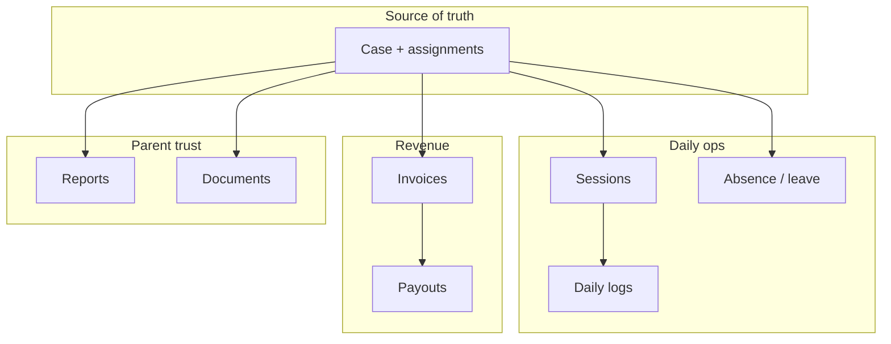

# CTO direction & design feedback — InsighteCase

_Last updated: June 2026 — distilled from architecture docs, product roadmap, and the [therapist UX session](./sessions/3264f04a-therapist-ux-merge-session-summary.md)._

**Audience:** Engineering, product, design, and AI agents working on `case-manager-new`.

---

## North star

InsighteCase is a **case-centric operations platform** for Insighte Childcare. Every session, log, report, invoice, ticket, and parent-visible artifact rolls up to a **Case ID**. The product wins when therapists can execute daily work on mobile, case managers can review and bill with confidence, and parents see timely, approved updates.

---

## CTO engineering direction

### Architecture (non-negotiable)

| Principle | Implementation |
|-----------|----------------|
| **Case-centric data** | `case_assignments` with history; never rely on `case.therapist_id` alone |
| **Session ≠ daily log** | Clock-in/out on `Session`; narrative + approval on `DailyLog` |
| **Module RBAC** | `homecare`, `shadow_support`, `billing` gate admin/support features |
| **Therapist isolation** | Own cases, logs, invoices, tickets, profile only |
| **Billing at allotment** | Client rate/package + therapist pay share set when case is created; admin/HR may revise |
| **Postgres in production** | Alembic single head; `migrate_production.py` on Railway boot |
| **Deploy split** | Railway = API + secrets; Vercel `insightes-projects/frontend` = `VITE_API_URL` only |
| **PR-only to main** | CI: backend pytest, frontend build, vercel-monorepo-build, contributor-guards |

### Phased delivery (default)

Unless the user explicitly requests a single mega-pass:

1. **Core backend + admin MVP** — cases, assignments, RBAC, session logs  
2. **Therapist execution** — my cases, session composer, billing preview  
3. **Parent + finance** — visibility, invoices, payments (roadmap R-008)  
4. **Polish** — notifications, exec dashboard, compliance pack  

See [PRODUCT_ROADMAP.md](./PRODUCT_ROADMAP.md) for P0 pilot blockers (object storage, security, finance UI).

### Recent platform additions (June 2026 — PR #5)

| Feature | Design choice |
|---------|---------------|
| **Session absence** | Child absent → `/api/v1/sessions/{id}/absence` + parent/admin approval + billing ledger rules |
| **Therapist leave from session** | Reuses `/api/v1/leave` (same as Leave module)—no duplicate leave records |
| **Case documents** | Share-with-CM/parents on upload; PDF preview in drawer; fixed download paths |
| **Observation checklist** | Summary card when read-only; edit form for DRAFT/REJECTED |
| **Session time correction** | Admin approves log **and** corrected clock when `sessionHasTimeEdit` |
| **Terminology** | “Scheduling” not “Open Slots” across therapist nav and notifications |

Migration: `c5d6e7f8a9b0` (`session_absence_requests`).

### What we are not building (focus)

- Full EMR / e-prescribing  
- Separate supervisor inbox (until clinical workflow is defined — roadmap R-020 deferred)  
- MongoDB or parallel document DB for case data  
- Multi-tenant franchise isolation until strategy confirms (R-019)

### Insights Engine (June 2026)

| Principle | Implementation |
|-----------|----------------|
| **On-demand AI only** | No AI on tab open, month change, report open, or log typing |
| **Mock-first gateway** | `AI_PROVIDER=mock` until OpenAI/Gemini keys configured |
| **Snapshot reuse** | `input_hash` dedup; store in `clinical_snapshots` |
| **80–90% deterministic** | SQL preview + rules before any LLM call |
| **Parent isolation** | Internal snapshots never exposed to parent portal |

Full spec: [INSIGHTS_ENGINE.md](./INSIGHTS_ENGINE.md) · UI contract: [CLINICAL_REPORTS_UI_DESIGN.md §14](./CLINICAL_REPORTS_UI_DESIGN.md#14-insights-tab--visual-contract)

---

## Design direction

### Product personality

**Operational clarity first, warmth second.** Users are clinicians, coordinators, and parents under time pressure. UI should feel **calm, legible, and mobile-safe**—not flashy at the cost of scanability.

### Role-specific UX goals

| Portal | Density | Mobile | Primary jobs |
|--------|---------|--------|--------------|
| **Therapist** | Medium | **First-class** | Start/end session, submit log, leave/absence, book slot, invoice preview |
| **Admin / CM** | **High** | Pill tabs + cards ≤900px | Approve logs, pipeline, scheduling, billing review |
| **Parent** | Low–medium | First-class | Book sessions, approve absences, view reports/invoices |
| **HR / Finance** | High | Secondary | Profiles, leave, payouts, invoice composer |

### Design system anchors (current codebase)

- **Teal primary:** `#0d9488`, gradient headers `#0f766e` → `#0d9488`  
- **Admin mobile:** `AdminMobilePillTabs`, `AdminDataList`, 900px breakpoint — [admin-mobile-ux.md](../frontend/docs/admin-mobile-ux.md)  
- **Dates (India):** `frontend/src/lib/datetime.js` — DD-MM-YYYY display without timezone shift on API date strings  
- **Session times:** `sessionTimes.js` — scheduled vs clock vs corrected ranges; `formatSessionLogRowTitle` for admin lists  

### Antigravity design language (optional layer)

When using the `antigravity-design-expert` skill:

- Apply **glassmorphism and motion** on login, booking success sheets, and empty states  
- Use **staggered entrances** for card grids—not for approval queues or invoice tables  
- Always disable motion for `prefers-reduced-motion: reduce`  
- See [ANTIGRAVITY_MIGRATION.md](./ANTIGRAVITY_MIGRATION.md) Part 2 for phased rollout  

---

## Design feedback (June 2026 therapist UX pass)

### What worked

| Area | Feedback |
|------|----------|
| **Leave/Absence tab in session composer** | Correct split: therapist leave (primary) vs child absent (secondary) matches field mental model |
| **Shared leave form** | `TherapistLeaveRequestFields` + `leaveFormUtils.js` aligned with `TherapistLeavePage`—reduces duplicate validation and copy drift |
| **Child absent single reason field** | Combining notes + reason lowered form fatigue on mobile |
| **Editable session time on absence** | Therapists can correct wall-clock before submitting absence |
| **Document PDF preview + expand** | CM/parent share flags at upload time; drawer auto-open after upload improves review loop |
| **Observation checklist summary** | Read-only users see status without a dead-end empty form |
| **Scheduling rename** | “Scheduling” is clearer than “Open Slots” for therapists managing calendar + availability |

### What to improve next

| Area | Recommendation | Priority |
|------|----------------|----------|
| **Admin session log density** | Keep new time-edit badges (“Times edited”, “Approve log & times”) but avoid adding more pill types per row | P1 |
| **Parent absence approvals** | Add push/email when pending (roadmap R-007); dashboard card is easy to miss | P1 |
| **Mobile session composer tabs** | Three-column tab layout needs real-device QA on iPhone SE width | P1 |
| **Invoice modal on small screens** | `GenerateInvoiceModal` still tall; consider stepped wizard | P2 |
| **Antigravity motion** | Pilot on login + `BookingSuccessSheet` only; measure LCP before expanding | P3 |
| **E2E coverage** | Extend Playwright for absence approval path and document share flow | P2 |

### Accessibility & content

- Maintain **44px minimum** touch targets on therapist actions  
- Error strings should say **what to do next** (“Ask your case manager to approve”) not only what failed  
- Use **Indian date format** consistently in therapist/parent surfaces; admin lists may use compact `DD/MM/YY` via `fmtDate` where space is tight  

---

## Agent / Antigravity instructions (summary)

When implementing features for this repo:

1. Read `AGENTS.md` and this doc before coding  
2. Do not edit attached plan files; use existing todos  
3. Commit only when the user asks  
4. Run `pytest` + `npm run build` before PR  
5. Use design skills for portal work; do not sacrifice admin data density for aesthetics  
6. Keep case-centric APIs and module RBAC in every new endpoint  

Full agent skill: [`.agents/skills/insightecase/SKILL.md`](../.agents/skills/insightecase/SKILL.md)

---

## Decision log (quick reference)

| Date | Decision | Rationale |
|------|----------|-----------|
| 2026-05 | Therapist: Session Logs vs My Cases split | Separates daily inbox from per-client CRM |
| 2026-05 | Billing amounts at case create | Simplifies therapist invoice preview |
| 2026-06 | Therapist leave via `/api/v1/leave` from composer | Single leave record; HR reports stay consistent |
| 2026-06 | Child absent via session absence API | Parent approval + billing impact isolated |
| 2026-06 | PR #5 to main | CI green; migration `c5d6e7f8a9b0` on production health |
| 2026-06 | Antigravity toolchain migration doc | Gemini CLI sunset June 2026 for consumer accounts |
