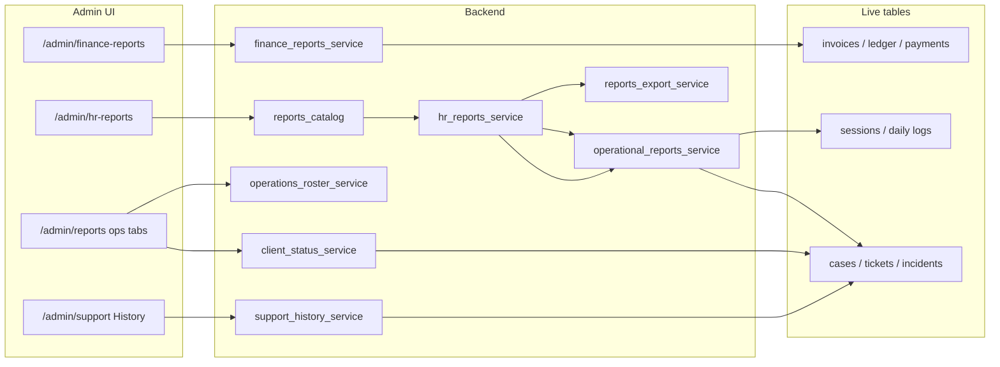

# CTO Handover — Admin Operational Reports (Finance / HR / CRM)

**Date:** 2026-08-02  
**Scope:** Admin **operational** report surfaces — Finance Reports, People & HR Reports (incl. CRM lifecycle), Operations roster / client-status exports, Support History.  
**Not in scope:** Clinical monthly / observation / IEP review workflow (`/admin/reports` queue & TipTap editor). That is a different product; see `docs/Cursor_Handover_Clinical_Reports_Structure.md` if needed.

---

## 1. Executive picture

These “Reports” are **on-demand queries and file exports**, not saved report documents.

| Question | Answer |
|---|---|
| Do we store report runs? | **No.** No `report_runs` / export archive table. |
| What do they produce? | Live JSON preview + downloadable **CSV / XLSX / PDF** (format depends on surface). |
| Is there one framework? | **Partial.** HR/CRM catalog is shared (`reports_catalog` → `operational_reports_service` → `reports_export_service`). Finance, Support History, and Operations rosters are **parallel** patterns. |
| Source of truth | Operational tables (invoices, ledger, sessions, logs, cases, tickets, incidents, assignments, audit) — never a frozen report blob. |

**One sentence:** Admin Reports = catalogued (or hardcoded) SQL aggregations over live ops data, streamed as files for Finance, HR, and CRM — not the clinical monthly narrative workflow.

---

## 2. Where they live in the app (nav)

| Sidebar | Route | UI entry | Audience |
|---|---|---|---|
| **Finance → Reports** | `/admin/finance-reports` | `AdminFinanceReportsPage` + `AdminFinanceReportsTab` | Finance / billing module holders |
| **People & HR → Reports** | `/admin/hr-reports` | `AdminHrReportsPage` | HR / people admins |
| **Operations → Reports** | `/admin/reports` | `AdminReportsPage` tabs **Client status** + **Operations** (same page also hosts clinical queue — ignore those tabs for this brief) | CM / clinical admins with report feature |
| **Support → History** | `/admin/support?tab=reports` | `AdminSupportReportsPage` (tab labeled History) | Support-scoped staff |

Legacy: `/admin/invoices?tab=reports` **redirects** to `/admin/finance-reports`.

Nav wiring: `frontend/src/layouts/PortalShell.jsx`.

---

## 3. Common structure — what is / isn’t shared

### Shared pattern (HR / CRM / session ops)

```
reports_catalog.py
    → GET /admin/hr-reports/catalog
    → GET /admin/hr-reports/{report_key}?filters&format=
         → hr_reports_service.run_hr_report
              → operational_reports_service.run_report   (modern keys)
              → legacy SQL helpers                       (legacy keys)
         → reports_export_service  (json | csv | xlsx | pdf)
```

Each catalog entry has: `key`, `label`, `description`, `category`, `filters[]`, `formats[]`, optional `multi_sheet`.

### Not shared

| Surface | Pattern |
|---|---|
| **Finance** | Hardcoded keys in FE + `finance_reports_service.REPORT_LABELS`; param is only `billing_month`; formats json/csv/xlsx (**no PDF**) |
| **Operations rosters** | Dedicated `operations_roster_service` → XLSX only under `/admin/reports/operations/...` |
| **Client status** | Paginated JSON table (`client_status_service`); **no download buttons** in UI |
| **Support History** | Own list + CSV (`support_history_service`) |

There is **no** common React report shell across Finance vs HR vs Support — each page is bespoke.

---

## 4. Catalog — HR / CRM / session ops (`/admin/hr-reports`)

**Source of truth:** `backend/app/core/reports_catalog.py`  
**UI:** loads catalog from API; **hides** category `legacy` (keys still callable via API).

### Categories shown in UI

| Category id | Label | Report keys |
|---|---|---|
| `hr_attendance` | HR & attendance | `bulk-attendance`, `therapist-log-compliance` |
| `session_ops` | Session logs & billing | `session-log-detail`, `session-monthly-summary` |
| `crm_lifecycle` | CRM & client lifecycle | `replacement-history`, `support-tickets-parent`, `incident-reports`, `inactive-clients`, `parent-portal-usage` |
| `case_manager` | Case manager compliance | `cm-meetings` |

### What each entails (plain English)

| Key | Entails |
|---|---|
| `bulk-attendance` | Monthly case-level attendance / leave / report submission for HR pay review |
| `therapist-log-compliance` | Completed sessions 2+ days old still missing logs |
| `session-log-detail` | Every session in range with log, approval, billable flags |
| `session-monthly-summary` | Client-wise + therapist-wise aggregates (**multi-sheet** XLSX/PDF) |
| `replacement-history` | Therapist changes on cases (CRM) |
| `support-tickets-parent` | Parent grievances / requests |
| `incident-reports` | Safeguarding / ops incidents linked to cases |
| `inactive-clients` | Active cases with no completed session in 7+ days |
| `parent-portal-usage` | Parent login Active/Inactive + last login by case |
| `cm-meetings` | CM checklist / IEP meetings + monthly rollups (**multi-sheet**) |

### Legacy keys (API only; UI hidden)

`observation`, `client-monthly`, `session-logs`, `cases-roster`, `staff-status`, `therapist-status` — CSV summaries / rosters. **Not** the clinical approval editor.

### Filters (per definition)

`month`, `date_from` / `date_to`, `product_module`, `case_manager_user_id`, `therapist_user_id`, `case_id` — applied only when listed on that report.

### Formats

Modern keys: `csv` | `xlsx` | `pdf`. Export helpers cap rows (`MAX_EXPORT_ROWS = 5000` in `reports_export_helpers.py`).

### Auth

API: `hr_report.export` **or** `user.manage`.  
Nav: feature `hr_reports` (org module `hr_ops`) and/or those perms. Typical: **HR**, MODULE_ADMIN / SUPER_ADMIN. Finance role is denied (covered in tests).

---

## 5. Finance reports (`/admin/finance-reports`)

**Service:** `backend/app/services/finance_reports_service.py`  
**API:** `GET /api/v1/admin/finance-reports/{report_key}?billing_month=YYYY-MM&format=json|csv|xlsx`  
**Auth:** `invoice.approve` + billing module (`require_billing`).  
**Persistence:** Docstring is explicit — *“Computed finance reports (read-only, no report tables).”*

### Report keys (hardcoded; no catalog endpoint)

| Key | Label | Typical data |
|---|---|---|
| `monthly-billing` | Monthly billing | Client invoices for month |
| `outstanding` | Outstanding balances | Unpaid / partial / overdue invoices |
| `collections` | Collections | Payments in month |
| `therapist-payouts` | Therapist payouts | Posted payout invoices |
| `therapist-payout-preview` | Therapist payout preview | Preview calc (default UI selection) |
| `pending-payout-approvals` | Pending payout approvals | Awaiting approval |
| `ledger-missing` | Ledger missing | Sessions/logs gaps vs ledger |
| `manual-adjustments` | Manual adjustments | Manual invoice lines |
| `revenue-by-service` | Revenue by service | Aggregated by service type |
| `margin-by-case` | Margin by case | Case-level margin (read-only reconcile path) |

**UI:** pick report + billing month → Preview / CSV / XLSX. No PDF on this surface.

---

## 6. Operations + CRM bits on `/admin/reports` (ops tabs only)

Clinical tabs on this page are out of scope. Ops-relevant tabs:

### Client status lifecycle

| Piece | Detail |
|---|---|
| UI | `AdminClientStatusReportSection` |
| API | `GET /api/v1/admin/reports/client-status` |
| Auth | `case.read.all` |
| Output | Paginated **JSON** table (filters: status, dates, CM, service, ageing) |
| Storage | Live `Case` query. Status **changes** audit in `case_client_status_audit` — that is an audit log, not an export store. |

### Operations Excel rosters

| Endpoint | Output |
|---|---|
| `GET /api/v1/admin/reports/operations/cases/export.xlsx` | Cases workbook |
| `GET /api/v1/admin/reports/operations/therapists/export.xlsx` | Therapists workbook |

Params: `month`, `product_module`. Auth: clinical reports reader (`monthly_report.approve` + feature `reports`). Built by `operations_roster_service` — **not** the HR catalog.

HR page copy points users here for some roster-style needs.

---

## 7. Support / CRM history (`/admin/support?tab=reports`)

| Piece | Detail |
|---|---|
| UI | `AdminSupportReportsPage` (nav label **History**) |
| API | `GET /admin/support/history`, `.../history/export.csv` |
| Filters | `record_type` (all \| tickets \| incidents), status, product_module, dates, therapist, child |
| Auth | Support hub scope ≠ none |
| Storage | None — query + CSV stream |

Related CRM rows also appear in the **HR catalog** (`support-tickets-parent`, `incident-reports`) with richer export formats.

---

## 8. How generation works

```
User selects report + filters
        │
        ├─ Preview  → format=json (table in browser)
        └─ Download → format=csv|xlsx|pdf
                │
                ▼
        Service runs SQL / aggregations on live DB
                │
                ▼
        Bytes returned with Content-Disposition
        (optional export_meta: generatedBy / generatedAt)
```

- **No background jobs**, no scheduled snapshots, no “save report” action.  
- Re-run tomorrow → different data if source rows changed.  
- Finance Control Tower (`/admin/invoices` overview) is a **separate** read-only dashboard; it is not this Reports catalog (though some finance report keys overlap conceptually with tower cards).

---

## 9. Schema / storage

| Artifact | Persisted as a “report”? |
|---|---|
| Finance / HR / ops / support exports | **No** — ephemeral response |
| Clinical `monthly_reports` | Yes — different product |
| `case_client_status_audit` | Yes — status change audit only |

---

## 10. RBAC summary

| Surface | Gate |
|---|---|
| Finance Reports | `invoice.approve` + org module `billing` / feature `invoices` |
| HR Reports | `hr_report.export` or `user.manage`; nav also `hr_reports` feature / `hr_ops` module |
| Ops tabs on `/admin/reports` | Clinical reports feature + `monthly_report.approve` (client-status API stricter: `case.read.all`) |
| Support History | Support hub capabilities / scope |

---

## 11. Architecture sketch



---

## 12. File index

| Layer | Paths |
|---|---|
| Catalog | `backend/app/core/reports_catalog.py` |
| Finance | `backend/app/services/finance_reports_service.py`, `backend/app/api/v1/finance_ops.py` |
| HR / ops | `hr_reports_service.py`, `operational_reports_service.py`, `reports_export_service.py`, `api/v1/hr_ops.py` |
| Rosters / client status | `operations_roster_service.py`, `client_status_service.py`, routes in `api/v1/admin.py` |
| Support | `support_history_service.py`, `api/v1/admin_support.py` |
| FE | `AdminFinanceReportsPage.jsx`, `AdminFinanceReportsTab.jsx`, `AdminHrReportsPage.jsx`, `AdminReportsPage.jsx` (ops tabs), `AdminClientStatusReportSection.jsx`, `AdminSupportReportsPage.jsx` |
| Tests | `test_finance_reports.py`, `test_hr_reports.py`, `test_operations_roster.py`, `test_support_history.py`, `test_client_status.py` |

---

## 13. Gaps / consolidation opportunities (for CTO planning)

1. **Three+ export stacks** — Finance vs HR catalog vs Operations roster vs Support CSV. Unifying behind one catalog would cut FE/BE drift.  
2. **`/admin/reports` name collision** — Operations nav “Reports” is primarily **clinical** review; ops exports are secondary tabs. Easy to confuse with Finance/HR Reports.  
3. **No export audit trail** — who downloaded what, when, with which filters is not stored.  
4. **Client status** has no CSV/XLSX in UI despite being called a report.  
5. **Legacy HR keys** still in API; UI already hides them — candidates for deletion once consumers confirm.

---

## 14. CTO summary

**Admin Finance / HR / CRM Reports are live, permission-gated export catalogs (and a few sibling pages), not stored monthly documents.** HR/CRM share one catalog + export pipeline; Finance and Support use parallel ad-hoc endpoints; nothing writes a report row — regenerating always re-queries production operational data.
