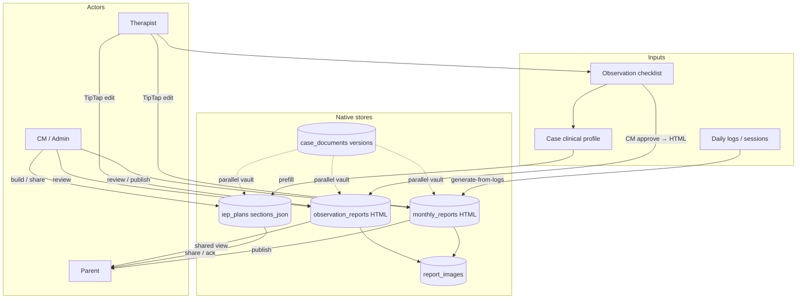

# CTO Handover — Clinical Reports Structure

**Date:** 2026-08-02  
**Scope:** Clinical / operational **case reports** inside InsighteCase (monthly, observation, progress-as-category, IEP, case documents).  
**Out of scope:** Finance Control Tower, finance/HR/support “reports” catalogs, incident safety forms (linked only where they share naming).

---

## 1. Executive picture

Reports in this product are **case-centric narrative + review artifacts**, not a single polymorphic `reports` table.

| Product surface | What it is | Primary store |
|---|---|---|
| **Client monthly report** | Therapist monthly narrative for a case/month | `monthly_reports` |
| **Progress / milestone / termination / annual** | Same editor & table; `category=PROGRESS` + `sub_category` | `monthly_reports` |
| **Observation report** | Narrative after observation checklist approval (also direct create) | `observation_reports` |
| **Observation checklist** | Structured intake that *feeds* an observation report | `observation_checklists` |
| **IEP plan** | Versioned structured JSON plan | `iep_plans.sections_json` |
| **Case documents** | Parallel file/HTML vault that *mirrors* clinical categories | `case_documents` (+ versions) |

**There is no common content schema across all report types.** What is shared is thinner: case FK, status/visibility enums (partly), TipTap HTML editor for monthly/observation bodies, PDF-on-download, and a parent/admin review loop for monthly + IEP.

**Generation today is deterministic, not AI.** “Generate from session logs” compiles HTML visit blocks from submitted daily logs. No LLM drafts, no finalize-by-AI, no embedding lookup on report paths.

---

## 2. Is there a common structure?

### Shared (yes)

| Layer | Shared pieces |
|---|---|
| **Ownership** | Always tied to a `case_id` (child via `case.child`) |
| **Lifecycle language** | `ReportStatus`: `DRAFT` → `UNDER_REVIEW` → `PUBLISHED` / `REJECTED` (monthly & observation) |
| **Visibility** | `VisibilityStatus`: `INTERNAL_ONLY` / `APPROVED_FOR_PARENT` / `SHARED_WITH_PARENT` |
| **Category vocabulary** | `ReportCategory` enum used as labels/filters (not one physical table) |
| **Rich text** | Monthly + observation: `body_html` + TipTap editor + `report_images` |
| **Export** | PDF generated **on demand** (ReportLab); not stored as source of truth |
| **Review trail** | `reviews`, `document_comments` (monthly/parent hub); IEP has suggestions |

### Not shared (important)

| Concern | Reality |
|---|---|
| **Content shape** | Monthly = free HTML; Observation checklist = fixed section keys; IEP = versioned `sections_json` (schema v2) |
| **Tables** | Three native stores (`monthly_reports`, `observation_reports`, `iep_plans`) + parallel `case_documents` |
| **Parent workflow** | Monthly has publish → parent approve/feedback/rating; observation is simpler share/view; IEP has acknowledge / suggest edits |
| **Versioning** | Monthly/observation: **edit in place**. IEP: **new version rows** (`v1`, `v2`…). Case documents: explicit version numbers |
| **Progress reports** | **No** `progress_reports` table — stored as monthly rows with `category=PROGRESS` |
| **Session linkage** | No FK from report → session/log; compile queries logs by `case_id` + calendar month |

**Doctrine note:** Founder doctrine describes Observation → Goals → Strategies → Sessions → Evidence → Progress → Reports as a knowledge graph. Current shipping code still treats monthly bodies as **free-text HTML**; goals/strategies on logs are free-text fields, not library FKs inside the report row. IEP JSON is the closest structured clinical container (`learning_environments[].strengths/goals/strategies/supports_needed`).

---

## 3. Schema (source of truth)

### 3.1 `monthly_reports` — `MonthlyReport`

**Model:** `backend/app/models/report.py`

| Column | Role |
|---|---|
| `id`, `case_id`, `therapist_user_id` | Identity / ownership |
| `month` | Label string (`"May 2026"` or `"2026-05"`) |
| `status` | `ReportStatus` |
| `summary` | Plain text (kept in sync with HTML where applicable) |
| `body_html` | Canonical rich narrative |
| `plan_next_month` | Forward plan text |
| `category` | Default `CLIENT_MONTHLY`; also `PROGRESS`, `CM_MEETING`, … |
| `sub_category` | Progress subtypes: `TERMINATION` / `ANNUAL` / `MILESTONE` |
| `report_date` | Optional date |
| `reviewer_comment` | Internal reject/review note |
| `visibility_status` | Parent visibility gate |
| `parent_review_status`, `parent_feedback`, `parent_monthly_rating`, `parent_reviewed_at` | Parent hub |
| `submitted_for_review_at` | Submit timestamp |
| `cm_published_at` / `cm_published_by_user_id` | CM publish-to-parent |
| `admin_published_at` / `admin_published_by_user_id` | Admin override publish |
| `created_at`, `updated_at` | Audit |

Hub create path **rejects** storing `IEP_PLAN` / `INCIDENT_DOCUMENT` on monthly rows (those live elsewhere).

### 3.2 `observation_reports` — `ObservationReport`

Same file. Leaner twin of monthly: `title`, `content`, `body_html`, `plan_next_month`, `category` (default `OBSERVATION`), `sub_category`, `report_date`, `status`, `visibility_status`, `created_at`. **No** parent-review columns, **no** `updated_at`, **no** CM/admin publish timestamps.

### 3.3 `report_images` — `ReportImage`

Polymorphic: `report_type` (`monthly` \| `observation`) + `report_id` (app-level, not DB FK). Bytes in object storage (`storage_provider` + `storage_key`) and/or local `file_path`.

### 3.4 Observation intake

| Table | Role |
|---|---|
| `observation_checklists` | 1:1 with case; `section_responses_json` keyed by fixed section list; status `DRAFT\|SUBMITTED\|APPROVED\|REJECTED`; optional `observation_report_id` |
| `case_clinical_profiles` | 1:1 with case; plain fields `history`, `diagnosis`, `strengths`, `interests`, `goals_summary` (not doctrine JSON key columns) |

**Checklist sections** (`backend/app/clinical_constants.py`):  
`referral_context`, `classroom_setting`, `social_communication`, `academic_learning`, `behavior_regulation`, `motor_play`, `summary_recommendations`.

### 3.5 IEP — `iep_plans` / `iep_plan_suggestions`

| Table | Role |
|---|---|
| `iep_plans` | `case_id`, `version`, `status`, **`sections_json`**, `visibility_status`, optional `attachment_id`, publish metadata |
| `iep_plan_suggestions` | Parent/staff suggested edits; `resolved_at` |

**`sections_json` shape** (`IepPlanSections`, schema_version **2**) — `backend/app/schemas/iep_plan.py`:

- `header` — child/service/meeting metadata  
- `observations`, `challenges`, `interventions`, narrative strings  
- `learning_environments[]` — `{ environment, strengths, goals, strategies, supports_needed }`  
- `current_performance[]` — domain + notes  
- `learning_style`, `talent_development`, `other_areas_of_need`  
- `verification` — therapist / CM / client sign-off fields  
- `supplementary_attachment_ids[]`

**IEP statuses:** `DRAFT` → `INTERNAL_REVIEW` → `SHARED_WITH_PARENT` → `PARENT_ACKNOWLEDGED` / `EDITS_SUGGESTED` → `APPROVED`.

### 3.6 Parallel vault — `case_documents`

Upload / link / native-HTML document pipeline with its **own** statuses and versions. Categories overlap clinical naming (`CLIENT_MONTHLY_REPORT`, `OBSERVATION_REPORT`, `MONTHLY_PROGRESS_REPORT`, `IEP_PLAN`, termination/annual progress, incident, other). Can point at legacy entities via `legacy_entity_type` / `legacy_entity_id`. **Not the same rows** as `monthly_reports` / `observation_reports`.

### 3.7 Cross-links

`case_manager_meetings` may reference `linked_monthly_report_id`, `linked_observation_report_id`, `linked_observation_checklist_id`, `linked_iep_id`.

### 3.8 Migration note

`observation_reports`, rich-text columns, images, parent hub, publish workflow, IEP, case documents have Alembic revisions. **`monthly_reports` itself is not created by an in-repo Alembic `CREATE TABLE`** — it comes from SQLAlchemy metadata / bootstrap / SQLite patches. Treat that as a schema-ops footgun for greenfield Postgres.

---

## 4. How reports are generated

```
Session logs (DailyLog + TherapySession)
        │  on-demand button only
        ▼
report_compile_service  ──►  HTML visit blocks into monthly.body_html
        │
Therapist TipTap edit / autosave
        │
Submit → UNDER_REVIEW
        │
CM/Admin review → PUBLISHED (+ optional publish-to-parent)
        │
Parent hub → approve / changes requested / rating
```

### Monthly — generate from logs

| Piece | Detail |
|---|---|
| Service | `report_compile_service` + `report_log_query` |
| Trigger | Explicit UI: **Generate from session logs** (`replace` \| `append`) |
| Inputs | Submitted daily logs for case + parsed report month; approval `PENDING` or `APPROVED` |
| Fields used | `activities_done`, `goals_addressed`, `parent_notes`, `observations`, `follow_ups`, `session_notes` |
| Output | HTML sections (“What we did”, “Goals worked on”, …); may seed `plan_next_month` |
| Not used | Goal library FKs, strategy effectiveness metrics, evidence blobs, embeddings, LLMs |

IEP context for the editor: `GET /reports/monthly/iep-context` reads latest IEP `learning_environments` for insert helpers — does not auto-write the monthly body.

### Observation

1. Therapist fills **checklist** on the case (`PUT` + submit).  
2. CM **approves** checklist → service builds HTML from sections → creates/updates `ObservationReport` → can move to `PUBLISHED` / parent visibility.  
3. Pieces may sync into `CaseClinicalProfile`.  
4. Direct create/edit of observation reports also exists on `/reports/observation`.

### IEP

Manual structured builder (admin/CM) with prefill from case/child/checklist/profile. Share-with-parent may materialize an HTML **attachment**. New clinical truth = new **version row**, not in-place overwrite of published history.

### Progress

Same generate/edit/submit path as monthly; therapist/admin sets `category=PROGRESS` and a sub-type. No separate compiler.

---

## 5. How reports are stored

| Asset | Storage |
|---|---|
| Narrative HTML / text | Postgres columns on report / IEP / checklist tables |
| Embedded images | `report_images` + object storage key under `…/report-images/case_{id}/…` |
| IEP structured body | `iep_plans.sections_json` |
| Shared IEP HTML copy | Optional `attachments` row |
| Case document files | `case_document_versions.storage_key` / URL |
| PDF | **Ephemeral** — built at download time (`report_pdf_service`, IEP PDF helpers) |
| Queue exports | Admin XLSX/PDF of report lists (ops), not clinical body archives |

**No DOCX** clinical export. **No content version history** for monthly/observation (reject → edit draft again). Comments and `reviews` are the audit trail, not full snapshots.

---

## 6. UI map (what it entails for each role)

### Therapist

| Surface | Path | Job |
|---|---|---|
| Reports workbench | `/therapist/reports` | Pipeline: attention / in progress / published (`GET /therapist/reports/pipeline`) |
| Create draft | modal on workbench | Case + month + category → `POST /reports/monthly` |
| Editor | `/therapist/reports/edit/:id` | TipTap body, plan next month, session-context sidebar, generate-from-logs, submit, PDF |
| Observation | Case tab `observation` | Checklist form (not the monthly TipTap flow) |

Flag: `VITE_ENABLE_REPORTS` (Coming soon if off). Permission: `monthly_report.create`.

Mobile: sticky Save / Submit bar; metadata and session context collapsed by default.

### Admin / Case Manager

| Surface | Path | Job |
|---|---|---|
| Reports hub | `/admin/reports` | Queue, all reports, missing monthly, observation list, bulk approve/reject, exports, client-status ops section |
| Report view | `/admin/reports/view/:id` | Read + comments |
| Report edit | `/admin/reports/edit/:id?edit=1` | Same `ReportEditPage` as therapist when allowed |
| Case tab | `/admin/cases/:id?tab=reports` | Per-case monthly + observation |
| Observation checklists | Admin workbench | Approve/reject intake |
| IEP org + builder | `/admin/iep`, case `?tab=iep` | Dashboard, planner, structured builder, share, PDF, suggestions |

Permissions: `monthly_report.approve` + feature `reports`; IEP via `iep.read` / `iep.manage`.

### Parent

| Surface | Path | Job |
|---|---|---|
| Reports hub | `/parent/reports` | Tabs: monthly / IEP / documents |
| Case detail | observation / iep tabs | View shared artifacts |
| Actions | detail sheet | Approve monthly, request changes, rate; acknowledge IEP; comment / suggest |

### Do not confuse with

| Nav label | Route | Purpose |
|---|---|---|
| Finance Reports | `/admin/finance-reports` | Billing/payout exports |
| Finance Control Tower | invoices overview tab | Ledger readiness (flags) |
| HR Reports | `/admin/hr-reports` | HR catalog CSV/XLSX |
| Support reports | support hub | Tickets/incidents history |

---

## 7. Status workflows (clinical)

### Monthly (richest)

```
DRAFT ──submit──► UNDER_REVIEW ──publish-to-parent──► PUBLISHED
                      │                              + visibility APPROVED_FOR_PARENT
                      │                              + parent_review_status PENDING
                      ├── reject ──► REJECTED ──edit──► DRAFT
                      └── internal approve without parent share (PUBLISHED, non-parent visibility)

Parent: APPROVED | CHANGES_REQUESTED (can return case to UNDER_REVIEW)
CM publish stamps vs admin override publish after policy window
```

`ReportStatus.APPROVED` exists on the enum but **writers primarily use `PUBLISHED`**; treat `APPROVED` as legacy-tolerant in reads/exports.

### Observation

Submit → under review → approve/reject; checklist CM approve can create/publish in one step. No parent approve/rating columns.

### IEP

Draft → internal review → shared with parent → acknowledged / edits suggested → approved; version bumps via `create_new_version`.

---

## 8. API surface (clinical only)

Base: `/api/v1`.

| Area | Prefix / examples |
|---|---|
| Therapist/shared | `/reports/monthly`, `/reports/observation`, generate-from-logs, images, comments, PDF download, session-context, session-logs CSV export |
| Therapist home | `/therapist/reports/pipeline` |
| Admin | `/admin/reports/*` (summary, queue, bulk, export, missing-monthly, publish, cm-review), `/admin/observation-checklists/*`, `/admin/iep/*`, `/admin/cases/{id}/iep-plan*` |
| Parent | `/parent/reports/hub`, monthly approve/feedback, observation/IEP detail & download, IEP acknowledge/suggestions |
| Case clinical | `/cases/{id}/clinical-profile`, `observation-checklist`, `iep-plan` |
| Case documents | `/cases/{id}/documents` (+ versions, workflow) |

Key services: `report_service`, `report_compile_service`, `report_pdf_service`, `report_image_service`, `admin_report_service`, `parent_reports_service`, `observation_checklist_service`, `iep_plan_service`, `case_document_service`.

---

## 9. Categories & constants

**Report categories** (`report_constants.py` / `frontend/src/lib/reportCategories.js`):

`CLIENT_MONTHLY`, `OBSERVATION`, `CM_MEETING`, `IEP_PLAN`, `INCIDENT_DOCUMENT`, `PROGRESS`

**Progress sub-categories:** `TERMINATION`, `ANNUAL`, `MILESTONE`

**Hub filters** typically exclude IEP + incident (managed on other screens).

---

## 10. Architecture sketch



---

## 11. Gaps vs product doctrine / roadmap

| Expectation | Current state |
|---|---|
| Unified report schema / knowledge graph output | **Fragmented** HTML + IEP JSON + checklist JSON |
| Progress as first-class time-series of monthly compounds | **Category flag** on monthly rows only |
| AI draft / ClinicalSnapshot compression | **Not implemented** on report paths |
| Structured goal/strategy cross-links in report rows | **Free text** on logs; IEP JSON fields manual |
| Single document model | **Dual:** native report tables **and** `case_documents` |
| Alembic provenance for `monthly_reports` create | **Missing** in-repo |

Roadmap pointer: `docs/PRODUCT_ROADMAP.md` (e.g. IEP goals linked to logs/reports) remains aspirational relative to compile-from-logs HTML.

---

## 12. File index (start here)

| Layer | Paths |
|---|---|
| Models | `backend/app/models/report.py`, `report_image.py`, `clinical.py`, `iep_plan.py`, `case_document.py` |
| Constants / schemas | `backend/app/core/report_constants.py`, `clinical_constants.py`, `schemas/report.py`, `schemas/iep_plan.py` |
| Compile / PDF | `backend/app/services/report_compile_service.py`, `report_pdf_service.py`, `report_log_query.py` |
| APIs | `backend/app/api/v1/reports.py`, admin/parent/cases routers |
| Therapist UI | `frontend/src/components/monthly-reports/*`, `frontend/src/components/reports/*` |
| Admin UI | `frontend/src/components/admin-portal/AdminReportsPage.jsx`, `AdminIepPage.jsx`, `IepBuilderPanel.jsx` |
| Parent UI | `frontend/src/components/client-portal/ParentReportsPage.jsx` |
| FE libs | `frontend/src/lib/reportCategories.js`, `reportGenerateFromLogs.js`, `reportFilters.js` |
| Broader architecture | `docs/ARCHITECTURE.md` |

---

## 13. One-sentence CTO summary

**Clinical reporting is a case-owned, mostly free-form HTML + review workflow (monthly/observation) beside a structured versioned IEP JSON and a parallel case-document vault — generated from session logs by deterministic templating, stored in Postgres (images in object storage), with PDF as a download artifact, not a unified knowledge-graph report model.**
