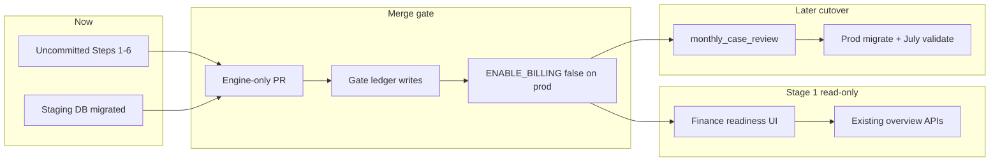

# Cursor Handover — Finance Module Build Readiness

**Document status:** Inspection-only (Plan Mode). No code was changed. Target filename requested: `Cursor_Handover_Finance_Module_Build_Readiness.md` — produce that file in-repo only after you approve this plan (or treat this plan body as the handover until then).

**Inspected at:** 2026-08-02 · workspace `case-manager-new-1` · branch `billing`

---

## A. Git and deployment state

| Item | Value |
|------|--------|
| Current branch | `billing` |
| Current HEAD SHA | `8a57ad75e61e325220b2b97ffca1e5cc9602a1c2` |
| HEAD subject | `feat(session-log): voice-first V1 and SessionLogApplicationService canonicalisation` |
| `origin/staging/stabilisation-pre-reports` | **Same SHA** `8a57ad7…` |
| `origin/main` | `1e85aa2f5a6a39f4f41075710cf59354f351a007` (`made corrections to the payout report`) |
| `origin/main...HEAD` | **84 ahead / 20 behind** |

### Critical finding — Steps 1–6 are NOT in commits

Committed tip of `billing` / staging does **not** contain the Finance Calculation Engine. Steps 1–6 live as **uncommitted / untracked working-tree files**, including:

- Untracked migrations: `y2z3a4b5c6d7`, `z3a4b5c6d7e8`, `a4b5c6d7e8f9`
- Untracked: [backend/app/services/billing_step6_service.py](backend/app/services/billing_step6_service.py), [backend/app/models/billing_step6.py](backend/app/models/billing_step6.py), Step 5/6 tests, verify scripts, exports
- Modified (unstaged): [backend/app/services/billing_ledger_service.py](backend/app/services/billing_ledger_service.py) (+670 lines), [backend/app/api/v1/ledger_billing.py](backend/app/api/v1/ledger_billing.py), [backend/app/models/case.py](backend/app/models/case.py), [backend/app/models/session.py](backend/app/models/session.py), [backend/app/api/v1/daily_logs.py](backend/app/api/v1/daily_logs.py), [backend/app/services/session_service.py](backend/app/services/session_service.py), CHANGELOG, etc.

Staging Railway DB may already have been migrated locally against these revisions during prior agent runs; **git history does not yet record that engine**.

### Commits on `billing` absent from `main` (sample)

Large clinical/voice/insights/stabilisation set (not Finance Steps 1–6), e.g.:

- `8a57ad7` voice-first session log
- `c1f84a0` force Coming Soon for reports and billing on production
- `9959bc6` case insights rebuild
- `7c821c5` clinical brain WIP with feature gates
- … (~80 more)

**Verdict on unrelated content:** Yes — staging/`billing` tip is dominated by unrelated WIP. Engine Steps 1–6 are local dirt on top.

### Recommended safe merge method

**Cherry-pick / carve a dedicated PR from a clean engine-only branch** — not a direct PR of `billing` → `main`.

1. Commit Steps 1–6 only onto `feat/billing-engine-steps-1-6` branched from current `main` (or rebase carefully).
2. Do **not** merge the 84-commit clinical/voice stack in the same PR.
3. Keep `ENABLE_BILLING=false` / `VITE_ENABLE_BILLING` force-off on canonical production until cutover.

### Deploy / DB / auto-money

| Question | Finding |
|----------|---------|
| `main` auto-deploys production? | Docs: merge to `main` → Railway API + Vercel frontend ([docs/RAILWAY_VERCEL.md](docs/RAILWAY_VERCEL.md), [CONTRIBUTING.md](CONTRIBUTING.md)). No separate “manual promote” gate documented. |
| Separate DBs? | Yes by design — Railway envs (prod vs staging Postgres). |
| Migrations on deploy? | **Yes** — [backend/scripts/start-production.sh](backend/scripts/start-production.sh) → `migrate_production.py` on every API start. |
| Auto recalculate / ledger / invoices / payouts / Zoho / RazorpayX? | **No schedulers** for those. Startup: schema/seed only. Session day-end cron closes sessions only. Zoho Books / RazorpayX webhooks **not implemented**. |
| **Silent ledger writes (important)** | Log approve and `end_session` call `billing_ledger_service` **outside** `require_billing` ([daily_logs.py](backend/app/api/v1/daily_logs.py), [session_service.py](backend/app/services/session_service.py)). Admin ledger/invoice routers **are** behind `Depends(require_billing)` in [router.py](backend/app/api/v1/router.py). |

### Feature flags protecting engine / UI

| Flag | Default | Role |
|------|---------|------|
| `ENABLE_BILLING` / `settings.enable_billing` | `False` | Gates admin invoice/ledger/client-billing routers via `require_billing()` |
| `VITE_ENABLE_BILLING` / `isBillingModuleEnabled()` | false; **forced off** on canonical prod | Hides finance nav; Coming Soon on therapist/parent billing |
| `BILLING_LEDGER_DRAFTS` | `True` | Ledger draft behaviour |
| `finance_ops` routes | **Not** behind `require_billing` | Overview/reports/bulk still permission-gated (`invoice.approve`) |

### Final merge verdict

# **NOT_SAFE_TO_MERGE_YET**

Reasons:

1. Engine not committed — cannot merge “audited Steps 1–6” as git objects today.
2. Branch tip ≠ engine; merging `billing`→`main` ships unrelated clinical/voice + production Coming Soon behaviour.
3. Production runs migrations on deploy — shipping `y2z3`/`z3a4`/`a4b5` without a cutover plan changes prod schema.
4. Session/log write paths create/update ledger **even when `ENABLE_BILLING=false`** — code-without-cutover is not behaviour-without-cutover until those paths are gated or no-op when billing module off.

**Pre-merge fixes required:** commit engine-only PR; gate ledger sync behind billing flag (or explicit `BILLING_LEDGER_WRITES`); keep UI flags off on prod; do not run finance classifications as part of merge.

---

## B. Engine implementation inventory (working tree + staging-proven)

Alembic chain (billing tip): `y2z3a4b5c6d7` → `z3a4b5c6d7e8` → `a4b5c6d7e8f9`.

### 1. Case billing typing
- Models: [backend/app/models/case.py](backend/app/models/case.py) — `BillingType.MONTHLY_FIXED`, `client_monthly_rate_inr`, retainer fields
- Guard: [backend/app/core/billing_validation.py](backend/app/core/billing_validation.py)
- Migration: `y2z3a4b5c6d7_case_monthly_billing_first_class.py` (+ `monthly_case_review`)
- Tests: `test_monthly_billing_rate_guard.py`
- Export: `exports/monthly_case_review_staging.csv`

### 2. Monthly fixed calculations
- [billing_ledger_service.py](backend/app/services/billing_ledger_service.py) — `ensure_period_charges`, `_upsert_monthly_fee_charge`
- [billing_step6_service.py](backend/app/services/billing_step6_service.py) — `compute_monthly_fixed_amount_v6`, `build_step6_monthly_periods`
- **Confirmed:** Feb/Apr/Jan full month = flat rate (`test_billing_step6.py`); leave day = `rate/30`

### 3. Package + `package_session_count`
- Client charge: `PACKAGE_PURCHASE` = `package_amount_inr`; consumption ₹0
- Soft fallback `package_session_count or 1` in payout helpers — missing counts need finance cleanup query (not counted from this workspace)

### 4. Client vs therapist money
- Client: `client_*`, `package_amount_inr`
- Therapist: `pay_share_amount_inr`, `therapist_fixed_pay_inr`
- **Confirmed:** `therapist_package_payout_amount` / `compute_session_line_amount` do not use client package amount

### 5. Session financial-effect
- `resolve_session_financial_effect` in `billing_ledger_service.py`
- Step 6: `package_unit_effect_for_status` — status once; therapist leave not payable
- Child absence: `ProductBillingRule.child_absent_therapist_payable`, `package_consumes_on_child_absent`

### 6. Leave / leave-credit
- No dedicated balance table — `leave_policy_service.get_leave_balance`
- Ladder + `MISSING_LEAVE_CREDIT_BALANCE` in `billing_step6_service.classify_leave_day`
- Wired into monthly fee via deductible leave dates

### 7. Assignment windows / reassignment
- `assignment_windows_for_month` (client monthly periods)
- **Gap:** therapist payout still filters `session.therapist_user_id` ([invoice_billing_service.fetch_billable_sessions](backend/app/services/invoice_billing_service.py)) — not date-active assignment

### 8. Effective-dated rate changes
- Table/model: `case_client_rate_periods` / `CaseClientRatePeriod`
- API: `POST /api/v1/admin/ledger-billing/cases/{case_id}/client-rate-change`
- Choices: `START_OF_MONTH` | `CHANGE_DATE` | `NEXT_SESSION_ONWARD`
- Empty history = valid legacy baseline (ADD 7)

### 9. Retainer
- Case fields `retainer_*`; overlay client rates only (ADD 6) — not therapist payout

### 10. Add-ons
- `sessions.add_on_kind`, `parent_session_id`; legacy `is_additional_visit`
- Migration soft-maps EXTRA_DAY **without** rewriting `billing_ledger`
- `effective_add_on_kind()` backward compatible
- **Gap:** valuation not wired into ledger upsert; `parent_session_id` unused in services

### 11. Billing eligibility (Step 5)
- Timestamp-complete → SESSION-keyed row; hold = `PENDING_REVIEW`; approve flips in place
- Tests: `test_billing_eligibility_step5.py`; staging script `staging_step5_eligibility_acceptance.py`
- API: `GET .../eligibility-exceptions`

### 12. Payout eligibility
- Still approved-log gate in `fetch_billable_sessions` (Step 4 verified calculators when type right)
- Step 5 did not change therapist invoice eligibility

### 13. Exceptions
- Persisted: `billing_calc_exceptions`, `billing_period_flags` (`ACTIVE_NO_SESSIONS`)
- Codes: `RATE_*`, `MISSING_LEAVE_CREDIT_BALANCE`, `MISSING_ADD_ON_RATE`, `UNKNOWN_LEAVE_TYPE`, `ASSIGNMENT_PERIOD_OVERLAP`
- API: `GET .../calc-exceptions`, `GET .../period-flags` — **no resolve workflow**

### Confirmations checklist

| Rule | Status |
|------|--------|
| Full month Feb/Apr/Jan = flat | Yes (unit + staging smoke) |
| Leave day = rate/30 | Yes |
| Client package ≠ therapist payout | Yes |
| Package leave once via status | Helpers yes; invoice path still separate |
| Child absence rule flags | Yes |
| Missing leave balance → exception | Yes |
| Add-on migration no ledger money rewrite | Yes |
| `effective_add_on_kind()` legacy map | Yes |

---

## C. Read-only dashboard API contract (Stage 1 relevant)

Base: `/api/v1`. Auth mostly `invoice.approve`.

### Strongest existing Stage 1 sources

| Method | Route | Source | Numbers quality |
|--------|-------|--------|-----------------|
| GET | `/admin/finance-overview/summary?billing_month=` | `finance_overview_summary` | **Partial** queue **counts** (not ₹ totals) |
| GET | `/admin/ledger-billing/ledger` | `list_ledger` | **Partial** — ledger rows; not “reconciled July” |
| GET | `/admin/ledger-billing/eligibility-exceptions` | Step 5 holds + confirmation queue | **Partial** operational |
| GET | `/admin/ledger-billing/calc-exceptions` | Step 6 exceptions | **Incomplete** until finance resolves |
| GET | `/admin/ledger-billing/period-flags` | zero-session flags | Partial |
| GET | `/admin/ledger-billing/reconciliation` | case-month reconcile | Partial / estimated |
| GET | `/admin/client-billing/summary` | client billing hub | Partial |
| GET | `/admin/client-billing/invoices` | client invoices | Draft/sent/paid — not engine-reconciled |
| GET | `/invoices` | therapist payout invoices | Status counts; eligibility still log-gated |
| GET | `/admin/finance-reports/{report_key}` | `finance_reports_service` | Report-dependent |

Representative overview payload (from service, used by UI):

```json
{
  "billingMonth": "2026-07",
  "activeCases": 0,
  "queues": {
    "notInvoicedThisMonth": 0,
    "ledgerReady": 0,
    "therapistPending": 0,
    "therapistSubmitted": 0,
    "draftInvoices": 0,
    "payoutsInReview": 0,
    "payoutsApprovedUnpaid": 0,
    "paymentClaimsPending": 0,
    "openDisputes": 0,
    "unpaidClientInvoices": 0,
    "ledgerPendingReview": 0
  },
  "links": { "composerNotInvoiced": "/admin/invoices/compose?...", "...": "..." }
}
```

### Stage 1 KPIs with **no reliable ₹ endpoint** today

- Monthly **billable value** (engine-correct, post-typing)
- Collections / outstanding **ageing buckets**
- Therapist payable **totals** from Step 6/5 eligibility (vs approved-log invoices)
- Contribution / profitability (must stay **Estimated/Incomplete**)
- Package missing-`package_session_count` exception list as first-class API
- Assignment gap/overlap as finance KPI (only calc-exception rows when ensure runs)

Do not invent fields — Stage 1 must either use counts above or add thin read aggregations over `billing_ledger` / invoices.

---

## D. Existing frontend inventory

| Surface | Path | Status | Extend? |
|---------|------|--------|---------|
| AdminInvoicesPage | `frontend/src/components/admin-portal/AdminInvoicesPage.jsx` | Working hub (tabs) behind billing flag | **Safe to extend** for Stage 1 |
| AdminFinanceOverviewTab | `.../AdminFinanceOverviewTab.jsx` | Working queue cards → links | **Primary Stage 1 host** |
| InvoiceComposer | `.../InvoiceComposer.jsx` | Working | Stage 2+ writes — not Stage 1 |
| AdminClientInvoicePage | `.../AdminClientInvoicePage.jsx` | Working | Stage 2+ |
| ParentBillingPage | `.../client-portal/ParentBillingPage.jsx` | Working when flag on; Coming Soon off | Later |
| InvoicesPage / `/therapist/invoices` | `.../invoices/InvoicesPage.jsx` | Partial (API + mock checklist) | Later |
| AdminTherapistPayoutsPage | `/admin/therapist-payouts` | Exists | Stage 1 read link OK |
| PortalShell finance nav | `layouts/PortalShell.jsx` | Needs `invoice.approve` + billing module + flag | Reuse |

Reusable: `AdminStatCard`, `AdminPanel`, `AdminDataList`, `AdminFilterGrid`, `AdminEmptyState`, `QueryState`, `StatusBadge` under `admin-portal/ui/` and `shared/`.

Billing UIs are **admin-portal / slate**, not Forest Light — Stage 1 can extend admin patterns first, then Forest-align.

---

## E. Forest design-system inventory

| Asset | Path | Notes |
|-------|------|-------|
| Tokens | [frontend/src/styles/forest-light-theme.css](frontend/src/styles/forest-light-theme.css) | Surfaces, primary/mint; Manrope / Inter / JetBrains Mono vars |
| Contract | [docs/design/UI_CONTRACT.md](docs/design/UI_CONTRACT.md) | Forest vs legacy |
| Typography | [docs/design/FOREST_LIGHT_TYPOGRAPHY.md](docs/design/FOREST_LIGHT_TYPOGRAPHY.md) | Exists |
| Confidence badges (Reconciled/Partial/Estimated/Incomplete) | — | **MISSING** — no shared component or CSS tokens |
| Recommendation | Extend shared `StatusBadge` + Forest tokens; **do not** invent a finance-only DS |

---

## F. RBAC and privacy

| Role | Billing perms ([permissions.py](backend/app/core/permissions.py)) |
|------|------------------------------------------------------------------|
| SUPER_ADMIN | all |
| FINANCE | `invoice.approve`, `invoice.generate`, `payout.override` + module `billing` |
| ADMIN / MODULE_ADMIN / CASE_MANAGER | `invoice.approve` |
| THERAPIST | `invoice.generate` (own invoices) |
| PARENT | parent billing APIs only |
| HR / CRM | no invoice.* in ROLE_PERMISSIONS matrix |

Enforced today:

- Parents: parent routes — no therapist pay fields by design of parent serializers (verify on Stage 2)
- Therapists: own invoice list via therapist_user_id
- CM: nav filtered; case scope on many case APIs
- Finance writes vs reads: mutation permission helpers vs GET

Gaps before Stage 2:

- **Maker-checker on rate changes** — single `invoice.approve` actor on `client-rate-change` (no dual approval)
- **Closed-period lock** — not implemented
- CRM cannot see payout: ensure CRM lacks `invoice.approve` / billing module (confirm org module maps)
- `finance_ops` not behind `require_billing` — tighten for Stage 1 if overview must follow same flag

---

## G. Exception system readiness

| Capability | Today |
|------------|--------|
| Models | `BillingCalcException`, `BillingPeriodFlag`, `BillingDispute`, ledger `dispute_status` |
| Persisted? | Yes (calc + period + client disputes) |
| Ownership / evidence / comments / history | **Client disputes only** (partial). Calc exceptions: code+message only |
| Resolve API | Client disputes resolve; calc-exceptions **read-only** |
| UI | Disputes tab; **no** calc-exception UI |
| Lifecycle OPEN→…→CLOSED | **Not implemented** for engine exceptions — reuse `BillingDispute` patterns later; do not overload Step 6 table yet |

---

## H. Stage 1 proposed build boundary (smallest safe)

**Read-only only.** No invoice create, eligibility change, payout approve, ledger mutate, Zoho, RazorpayX.

### Build

1. New tab or page under Admin Invoices: **Finance readiness** (or expand `AdminFinanceOverviewTab`).
2. Feature flag: keep `VITE_ENABLE_BILLING` / add `VITE_ENABLE_FINANCE_DASHBOARD_V1` if need finer control (default off on prod).
3. KPIs as **action queue counts** (more prominent than charts) from existing overview + eligibility + calc-exceptions + period-flags.
4. Every KPI drills to existing list routes (composer queues, ledger list, disputes, payouts).
5. Confidence badge on each KPI: until cutover, default **Partial** or **Incomplete** (never Reconciled for ₹ unless sourced from post-cutover reconciliation).
6. Profitability: omit or label **Estimated/Incomplete** only.

### Missing thin read APIs (optional Stage 1.1)

- Aggregate `SUM(amount_inr)` by `billable_status` for month from `billing_ledger` (label Partial)
- Count PACKAGE cases with null/`<=0` `package_session_count`

### Acceptance tests

- Overview loads with billing_month
- Flag off → Coming Soon / 404
- FINANCE role sees; therapist/parent do not see admin dashboard
- No POST from Stage 1 UI
- Drill-down links resolve

---

## I. Required documents (repo search)

| Document | Status |
|----------|--------|
| `Insighte_Finance_Billing_Module_Scope.md` | **NOT FOUND** in repo |
| `Cursor_Handover_Continue_In_Plan_Mode.md` | **NOT FOUND** |
| `Cursor_Handover_Finance_Dashboard_And_UI.md` | **NOT FOUND** |
| `Cursor_Prompt_Step6_Full.md` / `Cursor_Step6_Revisions.md` | **NOT FOUND** (referenced in chat only) |
| Step 1–6 implementation reports | **NOT FOUND** as named docs; evidence in CHANGELOG + tests + this handover |
| Step 6 12/12 verification | Present as [backend/app/tests/test_billing_step6.py](backend/app/tests/test_billing_step6.py) (12 tests) — no separate report file |
| July audit workbooks | Local exports: `exports/july_2026_payout_verification.xlsx`, attendance export; Downloads references from prior chat |
| Finance DS brief | Partial: UI_CONTRACT + FOREST_LIGHT_TYPOGRAPHY — no finance-specific brief |
| Related in-repo | [docs/billing-architecture.md](docs/billing-architecture.md), [CHANGELOG.md](CHANGELOG.md) Unreleased billing bullets |

---

## J. Readiness table

| Area | Ready | Partial | Missing | Blocks Stage 1 | Blocks Cutover | Blocks Stage 2+ |
|------|-------|---------|---------|----------------|----------------|-----------------|
| Engine Steps 1–6 logic (local/staging) | Yes | | Commit to git | Commit | Commit + finance typing | |
| Git merge hygiene | | | Engine-only PR | Yes | Yes | |
| Write-path billing gate | | | Gate session/log ledger | Soft | **Yes** | |
| `monthly_case_review` finance decisions | | Staging CSV | Prod classifications | No | **Yes** | |
| Read overview APIs | Counts | ₹ KPIs | Ageing, reconciled totals | Thin aggregations optional | | |
| Admin UI shell | Yes | Forest | Confidence badges | No | No | Forest polish |
| Exception lifecycle | Persist codes | | Ownership/evidence/resolve | No | No | **Yes** |
| Payout date-assignment attribution | | | Wire assignment-on-date | No | Should fix | |
| Add-on ledger wiring | Schema/helpers | | Ledger upsert | No | Optional | |
| Zoho / RazorpayX | | | Entirely | No | No | Integrations |
| Maker-checker rates | | | Dual approval | No | No | **Yes** |
| Closed period lock | | | | No | Prefer | **Yes** |

### Recommendations

1. **Safe merge:** Do **not** merge `billing` tip to `main`. Carve `feat/billing-engine-steps-1-6` from `main`, commit engine-only, PR with `ENABLE_BILLING=false` on prod and gated ledger writes.
2. **Pre-merge checklist:** engine commit; write-path gate; migration downgrade smoke on staging; no prod migrate until cutover event; CI green on engine tests.
3. **Stage 1 prerequisites:** engine committed; flags; extend AdminFinanceOverviewTab; confidence badges; no write buttons.
4. **Cutover prerequisites:** finance `monthly_case_review` done; package_session_count cleanup; backup + rollback drill; July validation (Isa ₹29k, etc.); finance in room.
5. **Stage 2+ blockers:** exception lifecycle; maker-checker; closed periods; assignment-based payout attribution; dashboard on reconciled ₹.
6. **Branches:** `feat/billing-engine-steps-1-6`, `feat/finance-dashboard-stage1`, later `cutover/billing-prod-YYYYMMDD`.
7. **Flags:** `ENABLE_BILLING`, `VITE_ENABLE_BILLING`, optional `VITE_ENABLE_FINANCE_DASHBOARD_V1`, `BILLING_LEDGER_WRITES` (new, recommended).
8. **Test commands:**
   - `../scripts/agent-pytest.sh app/tests/test_billing_step6.py -k "test_" -q --tb=line`
   - `../scripts/agent-pytest.sh app/tests/test_billing_eligibility_step5.py -k "test_" -q --tb=line`
   - `../scripts/agent-pytest.sh app/tests/test_period_charge_calculator.py -k "monthly_amount or partial_month or retainer" -q --tb=line`
   - `../scripts/agent-pytest.sh app/tests/test_monthly_billing_rate_guard.py -k "test_" -q --tb=line`



---

**Stop.** No implementation in this step. After approval: write `Cursor_Handover_Finance_Module_Build_Readiness.md` into the repo from this content (docs-only), then optionally start Stage 1 planning as a separate plan.