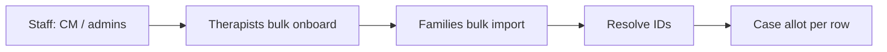

# Production data import (therapists, clients, cases)

How to load **real** people and cases into InsightCase without using `demo_seed` (dev/demo only).

**See also:** [AGENT_WORKFLOW.md](./AGENT_WORKFLOW.md), [backend/README.md](../backend/README.md), [RBAC_SCOPE.md](./RBAC_SCOPE.md).

---

## How entities are identified

| Entity | Shown in UI | Database | Stable import key |
|--------|-------------|----------|-------------------|
| Admin / CM / finance / HR | Name, email | `users.id` + `roles` | **Email** (unique) |
| Therapist | Name, email, services | `users.id` + `therapist_profiles` | **Email** |
| Parent (guardian) | Name, email | `users.id` + `parent_guardians` | **Email** |
| Child | First + last name | `children.id` | Name + parent email (no login) |
| Case | **`case_code`** (e.g. `IC-2026-HC-041`) | `cases.id` | **`case_code`** (unique) or auto-generated |
| Therapist on case | Therapist name on card | `case_assignments.therapist_user_id` | Resolve therapist **email** → `user_id` |

**Legacy IDs (stored alongside internal ids):**

| Column | Table | Use |
|--------|-------|-----|
| `external_employee_id` | `users` | HR / payroll employee number |
| `external_client_id` | `children` | CRM client or student id |
| `external_case_ref` | `cases` | Legacy case reference |

Login remains **email** only. Import script upserts by external id or email.

**Roles (login):** `SUPER_ADMIN`, `MODULE_ADMIN`, `CASE_MANAGER`, `THERAPIST`, `FINANCE`, `HR`, `PARENT`, etc. Staff are not separate tables—only roles on `users`.

**Product modules:** `homecare`, `shadow_support`, `billing` — assigned on staff/therapist create and used to scope admin features.

---

## Import order



1. **Migrations** on target DB: `cd backend && alembic upgrade head` (Postgres) or fresh local DB.
2. **Staff** — case managers and module admins first (`POST /api/v1/admin/users` or admin UI). Note each `user_id`.
3. **Therapists** — bulk onboard (needs `primary_case_manager_user_id`).
4. **Families** — child + parent (no case yet).
5. **Cases** — one allot per active case (therapist + billing + optional `case_code`).
6. **Verify** — login samples, case kanban, assignment on case detail.

---

## Built-in bulk tools

### Therapists

| Item | Detail |
|------|--------|
| Template download | Admin → Therapist onboard → **Download CSV/XLSX**, or `GET /api/v1/admin/therapists/bulk-template.csv` (auth required) |
| Upload | `POST /api/v1/admin/therapists/bulk-onboard` (max **100** rows) |
| CSV columns | Full Name, Email, Phone, Services (pipe-separated), Notes |
| Required in request | `primary_case_manager_user_id` (internal id), `mode` (`invite` or `direct`) |

**Service IDs** (examples): `homecare`, `shadow_support`, `occupational_therapy`, `speech_therapy` — see second sheet in XLSX or `GET /api/v1/therapist/service-categories`.

Example row:

```csv
Full Name,Email,Phone,Services (pipe-separated),Notes
Priya Sharma,priya.sharma@company.com,+91 9876543210,homecare|shadow_support,
```

### Client families (child + parent)

| Item | Detail |
|------|--------|
| UI | Admin → **Client profiles** → Bulk client import (paste CSV) |
| API | `POST /api/v1/admin/clients/bulk-import` (max **200** rows) |
| Columns | child first, child last, parent email, parent name, phone (optional) |

Example:

```csv
child_first,child_last,parent_email,parent_full_name,phone
Asha,Kumar,parent@example.com,Priya Kumar,+91 9876543210
```

Does **not** create cases or therapist assignments.

### Cases + assignment

No bulk CSV endpoint yet. For each case use **Admin → Case allotment** or:

`POST /api/v1/admin/cases/allot`

Resolve IDs first:

- `GET /api/v1/admin/families?search=...` → `childId`
- `GET /api/v1/admin/users/directory?roles=THERAPIST,CASE_MANAGER` → `id` per email

**Optional `case_code`:** must be unique. Auto format: `IC-{year}-{HC|SS}-{seq}` (`HC` = homecare, `SS` = shadow_support).

Set **billing at allot**: `billing_type` (`PER_SESSION` | `PACKAGE`), rates, `compensation_mode`, `pay_share_pct`, `client_billing_mode`, etc.

---

## Mapping template (master sheet)

Use this in Excel/Sheets to drive API calls or a future import script. Columns are logical—not all exist on one API.

### Sheet: staff

| external_employee_id | email | full_name | role_names | module_assignments | region |
|----------------------|-------|-----------|------------|--------------------|--------|
| EMP-001 | cm@company.com | Neha CM | CASE_MANAGER | homecare,shadow_support | Bangalore |

### Sheet: therapists

| external_employee_id | email | full_name | phone | services_offered | primary_cm_email |
|----------------------|-------|-----------|-------|------------------|------------------|
| EMP-101 | t1@company.com | Jane Doe | +91… | homecare\|shadow_support | cm@company.com |

### Sheet: families

| external_client_id | child_first | child_last | parent_email | parent_full_name | phone |
|--------------------|-------------|------------|--------------|------------------|-------|
| CLI-5001 | Asha | Kumar | parent@example.com | Priya Kumar | +91… |

### Sheet: cases

| legacy_case_ref | case_code | product_module | service_type | child_first | child_last | parent_email | therapist_email | cm_email | billing_type | client_rate_per_session_inr | package_session_count | package_amount_inr | compensation_mode | pay_share_pct | therapist_fixed_pay_inr | client_billing_mode |
|-----------------|-----------|----------------|--------------|-------------|------------|--------------|-----------------|----------|--------------|----------------------------|----------------------|-------------------|-------------------|---------------|-------------------------|---------------------|
| OLD-99 | IC-2024-HC-099 | homecare | Occupational therapy | Asha | Kumar | parent@example.com | t1@company.com | cm@company.com | PER_SESSION | 1500 | | | PERCENTAGE | 70 | | POSTPAID |
| | | homecare | Speech therapy | Ravi | Singh | ravi.parent@example.com | t2@company.com | cm@company.com | PACKAGE | | 20 | 25000 | PERCENTAGE | 65 | | PREPAID |

Leave `case_code` blank to auto-generate. `product_module`: `homecare` or `shadow_support`.

---

## API quick reference

| Step | Method | Path |
|------|--------|------|
| Create staff | POST | `/api/v1/admin/users` |
| Therapist template | GET | `/api/v1/admin/therapists/bulk-template.csv` |
| Bulk therapists | POST | `/api/v1/admin/therapists/bulk-onboard` |
| Bulk families | POST | `/api/v1/admin/clients/bulk-import` |
| Lookup families | GET | `/api/v1/admin/families?search=` |
| Lookup users | GET | `/api/v1/admin/users/directory?roles=THERAPIST,CASE_MANAGER` |
| Allot case | POST | `/api/v1/admin/cases/allot` |

Authenticate as a user with `user.manage` / case permissions (e.g. super admin). Base URL: local `http://127.0.0.1:8000` or production API from [DEPLOY.md](./DEPLOY.md).

---

## demo_seed vs production

| | `python3 -m app.seed.demo_seed` | Production import |
|--|--------------------------------|-------------------|
| Purpose | Local demo, CI, tests | Real therapists/clients/cases |
| Passwords | Resets demo accounts (`demo123`) | Invites or admin-set passwords |
| Data | Fixed fictional cases | Your CSV / APIs |
| When | Dev, after schema change on SQLite | Once per environment after migrate |

---

## Production import script (recommended)

```bash
cd backend
alembic upgrade head
python3 -m scripts.import_production --dir ../docs/import-templates --actor-email superadmin@demo.com --dry-run
python3 -m scripts.import_production --dir ../docs/import-templates --actor-email superadmin@demo.com
```

CSV templates live in [`docs/import-templates/`](import-templates/): `staff.csv`, `therapists.csv`, `families.csv`, `cases.csv`.

Staging verification: [STAGING_SMOKE.md](./STAGING_SMOKE.md).

## Large imports

- **300 therapists / 500 families:** use `import_production.py` (in-process, idempotent by email / external id).
- **API batches:** therapists max 100 per request; families max 200 per request.

---

## Verification checklist

- [ ] Parent and therapist can log in with work email
- [ ] Case appears in admin kanban with expected `case_code`
- [ ] Case detail shows **active** `case_assignment` (not only case header)
- [ ] Billing fields match source spreadsheet
- [ ] Therapist sees only their cases in portal
- [ ] Module admin without `shadow_support` does not see shadow cases (if scoped)
