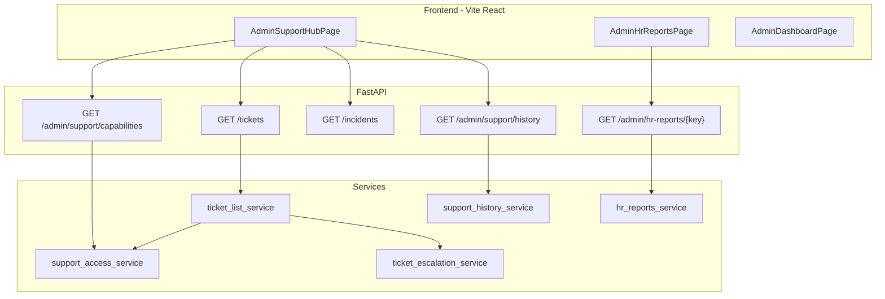

# Handover: Support hub, HR dashboard, and HR reports

For engineers taking over InsightCase / case-manager-new. Read this with [ARCHITECTURE.md](./ARCHITECTURE.md), [RBAC_SCOPE.md](./RBAC_SCOPE.md), [AGENT_WORKFLOW.md](./AGENT_WORKFLOW.md), and ADR [adr-0001-support-hub-access-scopes.md](./adr/adr-0001-support-hub-access-scopes.md).

## Run the app locally

```bash
# From repo root — Postgres/Redis/API via Docker optional
cd backend
python3 -m app.seed.demo_seed
uvicorn app.main:app --reload --port 8000

cd ../frontend
npm install
npm run dev   # http://localhost:5173 — /api proxied to :8000
```

**Demo accounts** (password `demo123`):

| Email | Role | What to verify |
|-------|------|----------------|
| `hr@demo.com` | HR | Dashboard at `/admin`, Support desk, HR Reports |
| `finance@demo.com` | Finance | Billing desk tickets, own + `BILLING_PAYMENT` topic |
| `therapist@demo.com` | Therapist | Raise ticket → visible on HR or CM desk |
| `superadmin@demo.com` | Super admin | Full support queue |

## Architecture (support + HR slice)



## Access scopes (source of truth)

File: `backend/app/services/support_access_service.py`

| `scope` | Who | Tickets | Incidents |
|---------|-----|---------|-----------|
| `full` | Clinical managers, super admin | Case/module filtered org queue | Full queue + manage |
| `hr_desk` | HR | `THERAPIST` topic or `HR` category | List + **read** detail (`can_access_incident_on_desk`) |
| `finance_desk` | Finance | `BILLING_PAYMENT` topic, `FINANCE` category, or self-raised | List (read paths) |
| `own` | Other `ticket.manage` | Only `raised_by_user_id` | Only reporter |
| `none` | Therapist/parent on admin API | — | — |

**Module features** (in `backend/app/core/modules.py`):

- `hr_ops`: `tickets`, `incidents`, `hr_reports`, leave, memos, therapist_hr
- `billing`: `tickets`, `incidents`, invoices, dashboard

Demo HR/Finance users need `org_capability_grants` for those modules (see `demo_seed.py` `sync_user_access_fields`).

## Escalation matrix (tickets)

File: `backend/app/services/ticket_escalation_service.py`

| Topic | L1 | L2 | L3 |
|-------|----|----|-----|
| `BILLING_PAYMENT` | FINANCE | ADMIN | SUPER_ADMIN |
| `THERAPIST` | CASE_MANAGER | HR | ADMIN |
| `CASE_MANAGER` | CASE_MANAGER | SUPERVISOR | ADMIN |
| `OTHER` | ADMIN | SUPER_ADMIN | — |

Desk filters:

- `ticket_visible_to_hr_desk(ticket)`
- `ticket_visible_to_finance_desk(ticket, user_id=...)`

## Key frontend routes

| Route | Component | Notes |
|-------|-----------|-------|
| `/admin` | `AdminIndexPage` → `AdminDashboardPage` | HR `dashboard_variant: hr` |
| `/admin/support` | `AdminSupportHubPage` | Tabs from capabilities API |
| `/admin/hr-reports` | `AdminHrReportsPage` | Requires `hr_reports` feature |
| `/admin/people` | `AdminPeoplePage` | Staff directory |

Nav: `frontend/src/layouts/PortalShell.jsx` — Support item uses `ticket.manage` + `tickets`/`incidents` features (no clinical module required).

## HR reports API

Prefix: `GET /api/v1/admin/hr-reports/{report_key}`

Keys: `observation`, `client-monthly`, `session-logs`, `cases-roster`, `staff-status`, `therapist-status`, etc.

Permission: `hr_report.export` on HR role.

Service: `backend/app/services/hr_reports_service.py`

## Tests to run before release

```bash
cd backend
python3 -m pytest app/tests/test_support_access.py app/tests/test_hr_reports.py app/tests/test_support_history.py -q
python3 -m pytest app/tests -q   # full suite; note any pre-existing failures
```

## Manual smoke checklist

1. **Therapist → HR ticket**: Login therapist → Support → create ticket (topic Therapist). Login HR → Support → Tickets → open → resolve/close.
2. **Therapist → Finance ticket**: Topic Billing/payment → Finance desk sees it.
3. **HR incidents**: HR → Support → Incidents → open row (must not 403).
4. **HR dashboard**: HR → sidebar Dashboard → stays on `/admin` (not redirect to People).
5. **HR reports**: HR → Reports → preview `staff-status` CSV.

## Deploy notes

| Tier | Project | Env |
|------|---------|-----|
| API | Railway `case-manager-new` | All backend vars |
| UI | Vercel `insightes-projects/frontend` | `VITE_API_URL` only |

See [RAILWAY_VERCEL.md](./RAILWAY_VERCEL.md). After schema changes: `alembic upgrade head` then re-seed in non-prod.

## Known gaps / follow-ups

- HR incident desk is **read-only** for workflow actions; assign/status still needs clinical role or future `hr_incident.operate` permission.
- HR home dashboard widget counts may differ from Support hub totals (different scoping).
- `cm-meeting` / `progress` HR report keys return placeholder rows until dedicated export tables exist.
