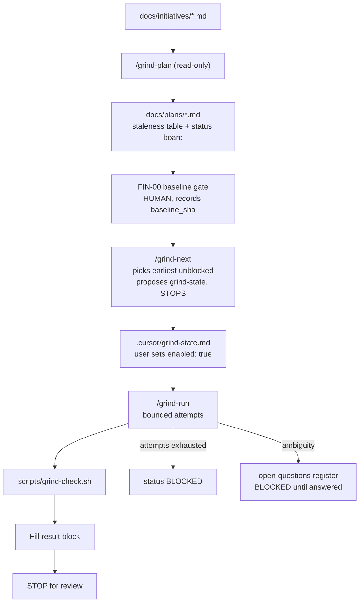

# Grind-loop system

Bounded autonomous loops for large initiatives. Tracked counterpart to the untracked machinery in `.cursor/` — the same relationship [AGENT_FIX_POLICY.md](./AGENT_FIX_POLICY.md) has with `.cursor/rules/`.

**Why bounded.** "Improve the whole finance dashboard" is an initiative, not a testable loop task. Handing it to one loop burns tokens building the wrong thing. The system splits it into independently verifiable outcomes and stops for review after each.

## Layout

| Path | Tracked | Purpose |
|------|---------|---------|
| `docs/initiatives/<name>.md` | yes | Intent, users, non-negotiables, success criteria |
| `docs/plans/<name>.md` | yes | `baseline_sha`, staleness table, status board, work packages, result blocks |
| `docs/plans/finance-open-questions.md` | yes | Escalation register; blocks packages until answered |
| `.cursor/rules/06-grind-loop.mdc` | no | Always-on interlock |
| `.cursor/skills/grind-{plan,next,run}/` | no | The three loop types |
| `.cursor/grind-state.template.md` | no | Template for arming a loop |
| `.cursor/grind-state.md` | no | **The arming switch.** Absent = no loop can run |
| `scripts/grind-check.sh` | yes | Objective DONE gate |

`.cursor/` is gitignored (`.gitignore:42`), so plans and initiatives live in `docs/` to get PR history — an initiative whose non-negotiables include an audit trail should not have a local-only plan.

## Three loop types

| Loop | Skill | Edits code | Purpose |
|------|-------|-----------|---------|
| Discovery | `/grind-plan` | No | Verify current state, decompose into packages |
| Implementation | `/grind-next` then `/grind-run` | Yes, scoped | Deliver one outcome and prove it |
| Integration | `/grind-run` on the final package | Yes, scoped | Verify packages work together; classify failures, do not redesign |

## Flow



## Four start interlocks

`/grind-run` refuses to start unless all hold:

1. `.cursor/grind-state.md` exists with `enabled: true` and `status: ACTIVE`.
2. The plan board records a `baseline_sha`.
3. `git status --porcelain` is empty — no baseline to revert to otherwise.
4. `work_package` equals the earliest unblocked package on the board — catches skipped dependencies and a bypassed controller.

## Rules that make it safe

- One work package per agent run. Never auto-start the next.
- Edit only `## Permitted scope`; never `## Do not change`.
- Stop at `max_attempts` (3–5); set `BLOCKED` and report.
- DONE needs pasted verification output. Visual appearance is never evidence.
- Never weaken, skip or delete a test to pass. A contradicting test is an escalation.
- Never infer a financial rule — no rate, proration basis, rounding mode, status transition or eligibility guess.
- Baseline, git, migration and deploy gates are human-executed, never loop work.
- Prior audit docs are not current until each section carries a `verified` verdict with a proving path.

## Running the finance initiative

1. **FIN-00 baseline gate, by hand.** Carve `feat/billing-engine-steps-1-6` from `origin/main`, commit engine-only, record the SHA in `baseline_sha`. Loops cannot do this.
2. `/grind-plan docs/initiatives/finance-dashboard.md` — fills the staleness table and the work packages.
3. Review the plan.
4. `/grind-next docs/plans/finance-dashboard-revamp.md` — proposes a `grind-state.md`.
5. Approve it, set `enabled: true`, then `/grind-run`.
6. Review the result block. Repeat from step 4.

## Result-block fields

Fixed per package, no substitutions:

```
status:
files_changed:
tests_run:      # pasted command + final output line
result:
deviations:
new_risks:
baseline_sha:
date:           # DD-MM-YYYY
```

## Verification

```bash
./.cursor/verify-rules.sh                 # rules, skills, scripts present
./scripts/grind-check.sh frontend         # frontend gate
./scripts/grind-check.sh backend app/tests/test_x.py::test_y
```

`grind-check.sh` is deliberately scoped. [scripts/run-ci-parity-checks.sh](../scripts/run-ci-parity-checks.sh) runs the full pytest suite and is a human pre-push gate, not a loop gate.
