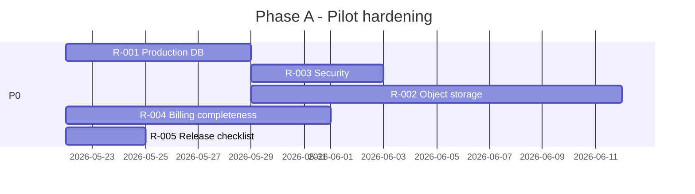

# InsightCase — Prioritized product & engineering roadmap

Prioritized from CEO/platform review (May 2026).  
**Legend:** P0 = pilot blocker · P1 = competitive differentiation · P2 = scale · P3 = polish

| ID | Priority | Theme | Initiative | Owner hint | Effort | Depends on | Success metric |
|----|----------|-------|------------|------------|--------|------------|----------------|
| R-001 | P0 | Platform | Postgres-only production; fix Alembic/SQLite drift; one deploy runbook | Eng | S | — | Clean migrate on fresh DB; zero duplicate-column failures |
| R-002 | P0 | Compliance | Move uploads (IEP, tickets, reports) to object storage + signed URLs | Eng | M | R-001 | No PHI on local disk in prod |
| R-003 | P0 | Security | Production JWT secrets, Redis refresh tokens, document SUPER_ADMIN break-glass | Eng/Ops | S | R-001 | Security review checklist passed |
| R-004 | P0 | Billing | Finance reject + payment status UI; leave deduction in invoice preview (tested) | Eng | M | — | Finance can close month without spreadsheets |
| R-005 | P0 | Release | Manual release gate: kanban, calendar parity, mobile parent book | QA/Ops | S | — | Checklist signed per release |
| R-006 | P1 | Scale | Pipeline board: server filters + pagination (not load-all cases) | Eng | M | — | p95 &lt; 2s at 500 cases |
| R-007 | P1 | Engagement | Notification v1: reschedule pending, report approved, invoice sent (email/WhatsApp adapter) | Eng | L | — | 80% critical events delivered within 5 min |
| R-008 | P1 | Revenue | Parent payment: Razorpay (or UPI link) + webhook → `client_payments` | Eng | L | R-002 | 50% invoices paid without manual entry |
| R-009 | P1 | Clinical | IEP goals (3–5 per case) linked to logs/reports narrative | Product/Eng | L | — | Schools see goal progress in reports |
| R-010 | P1 | Product | Supervision model doc + optional supervision note on case (not new inbox) | Product | S | — | No duplicate queue confusion |
| R-011 | P2 | Scale | `POST /admin/cases/bulk-assign` for kanban | Eng | S | — | 50-case bulk &lt; 10s |
| R-012 | P2 | Scale | Calendar API cache (therapist + case + week) | Eng | S | Redis | 50% fewer calendar DB hits |
| R-013 | P2 | Ops | Observability: request ID, Sentry, slow-query log on pipeline/reports | Eng | M | R-001 | MTTR &lt; 1h for P1 incidents |
| R-014 | P2 | Quality | Playwright: reschedule E2E, finance invoice E2E, kanban bulk | Eng | M | — | 3 green E2E paths in CI |
| R-015 | P2 | Quality | ESLint triage on `frontend/src` (block new errors in CI) | Eng | M | — | Zero new lint errors on PR |
| R-016 | P2 | Analytics | Executive dashboard: utilization, log compliance, revenue/case | Eng/Product | L | R-006 | Weekly leadership report without SQL |
| R-017 | P3 | Compliance | Audit export per case; parent consent timestamps on IEP | Eng | M | R-002 | DPDP/HIPAA diligence pack |
| R-018 | P3 | Product | Parent ticket escalate + accept/rate E2E coverage | Eng | S | — | Tests in CI |
| R-019 | P3 | Infra | Multi-tenant / franchise isolation (if strategy confirms) | Eng | XL | R-006 | — |
| R-020 | P3 | Defer | Separate supervisor request inbox | — | — | — | Only if clinical supervision workflow defined |

---

## Phased timeline

### Phase A — Pilot hardening (weeks 1–6)

**Goal:** Safe pilot with finance and parents.

**Exit:** Pilot sign-off in [REVIEW_FINDINGS.md](./REVIEW_FINDINGS.md) + P0 rows closed.

---

### Phase B — Differentiation (months 2–4)

**Goal:** Win on parent trust and ops speed.

- R-006 Pipeline scale  
- R-007 Notifications  
- R-008 Parent payments  
- R-009 IEP goals  
- R-010 Supervision clarity  

**Exit:** Pilot NPS from parents and CMs; payment collection without manual-only workflow.

---

### Phase C — Scale & leadership (months 4–12)

**Goal:** Multi-site readiness.

- R-011–R-016 (bulk API, cache, observability, E2E, exec dashboard)  
- R-017 Compliance pack when pursuing larger contracts  

---

## What we are not building (focus)

| Item | Reason |
|------|--------|
| Full EMR / e-prescribing | Out of scope |
| Duplicate supervisor ops inbox | Workbench + CM meetings sufficient |
| Real-time chat platform-wide | Tickets + notifications enough |
| Second admin reports hub | `/admin/reports` already shipped |

---

## Module / SKU mapping (commercial)

| SKU | Modules | Buyer |
|-----|---------|-------|
| Homecare Ops | `homecare` | Programme leads |
| Shadow / School Ops | `shadow_support` | School partnership leads |
| Finance Add-on | `billing` | CFO / finance |
| View-only audit | `VIEWER` role | Schools, auditors |

---

## Engineering capacity guide

| Size | Phase A | Phase B | Phase C |
|------|---------|---------|---------|
| 1 full-stack + 0.5 QA | 6 weeks | 10–12 weeks | ongoing |
| 2 eng + 1 QA | 3–4 weeks | 6–8 weeks | parallel B+C |

---

## Links

| Doc | Use |
|-----|-----|
| [BOARD_ONE_PAGER.md](./BOARD_ONE_PAGER.md) | Board / investor summary |
| [REVIEW_FINDINGS.md](./REVIEW_FINDINGS.md) | QA sign-off and defect log |
| [SCALABILITY_REVIEW.md](./SCALABILITY_REVIEW.md) | Technical scale notes |
| [TEST_GAP_BACKLOG.md](./TEST_GAP_BACKLOG.md) | Test automation backlog |
| [REVIEW_ROLE_MATRIX.md](./REVIEW_ROLE_MATRIX.md) | Demo accounts |

---

*Update this roadmap when P0 items close or pilot metrics change. Do not edit attached Cursor plan files.*
