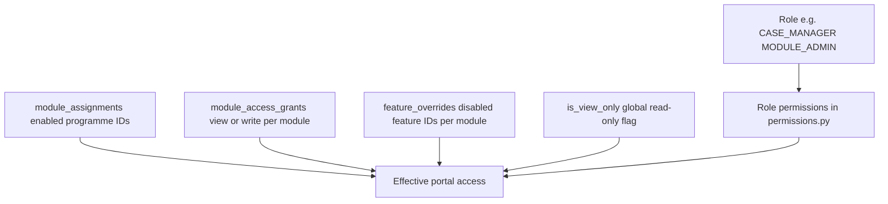

# RBAC scope — user creation and access control

## Purpose

One **access editor** configures who a staff user is (role), which **programme modules** they can use, whether each module is **view** or **edit**, and which **features** inside a module are on or off. This replaces ad-hoc role chips + module list + global view-only with a single, reviewable matrix.

## Layers (how access is computed)

1. **Role** — fixed permission set (`ROLE_PERMISSIONS`). Not editable per user in v1 (no custom permission checklist).
2. **Programme modules** — `homecare`, `shadow_support`, `billing`, plus dynamic **service** modules from `service_categories`.
3. **Module grant** — per module: `enabled` + `access` = `view` | `write`. View hides destructive actions in UI and blocks write API paths tied to that module.
4. **Feature overrides** — within an enabled module, individual features (reports, IEP, incidents, …) can be turned off. Stored as `feature_overrides[module_id] = [disabled_feature_ids]`.
5. **Global view-only** — `is_view_only` forces read-only across all granted modules (overrides per-module write).

**Super Admin** bypasses module and feature gates (`admin.override`).

## Assignable roles (admin portal provisioning)

| Role | Label | Portal | Typical modules |
|------|-------|--------|-----------------|
| `SUPER_ADMIN` | Super Admin | Admin | All (bypass) |
| `MODULE_ADMIN` | Module Admin | Admin | Homecare + Shadow + Billing (configure per user) |
| `ADMIN` | Legacy operations admin | Admin | Same as Module Admin (migrate to MODULE_ADMIN) |
| `CASE_MANAGER` | Case Manager | Admin | Homecare + Shadow (clinical) |
| `FINANCE` | Finance | Admin | Billing |
| `HR` | HR | HR portal | Homecare + Shadow (people ops) |

**Not created via this editor:** `THERAPIST`, `PARENT`, `SCHOOL_COORDINATOR` (separate onboarding flows).

**Deprecated (hidden from new users):** `SUPERVISOR`, `VIEWER` — existing accounts unchanged until migrated.

## Module and feature catalog

### Fixed programme modules

| Module ID | Label | Case product scope |
|-----------|-------|-------------------|
| `homecare` | Homecare | `homecare` |
| `shadow_support` | Shadow Support | `shadow_support` |
| `billing` | Billing & finance | (org-wide finance) |

### Dynamic service modules

Active rows in `service_categories` appear as modules with the same clinical feature set as Homecare (cases, session logs, reports, IEP, CM meetings, tickets, incidents).

### Features (per clinical module)

| Feature ID | Portal area |
|------------|-------------|
| `cases` | Cases & pipeline |
| `session_logs` | Workbench / session logs |
| `reports` | Reports & observations |
| `iep` | IEP builder |
| `cm_meetings` | CM meetings |
| `tickets` | Support tickets |
| `incidents` | Incidents |

Billing module features: `invoices`, `dashboard`.

## API

| Endpoint | Description |
|----------|-------------|
| `GET /api/v1/admin/rbac/catalog` | Roles, modules, features, defaults, assignable role metadata |
| `POST /api/v1/admin/rbac/preview` | Effective permissions, features, portal areas, warnings for a draft config |
| User create / invite / PATCH | Accept `module_access_grants`, `feature_overrides`; sync `module_assignments` |

## UI: RBAC Editor

Used on **People → Staff** (invite / create / edit access):

1. Pick **primary role** (replace-not-accumulate; optional combine roles).
2. Toggle **programme modules**; per module **View / Edit**.
3. Expand module → **feature checkboxes** (persisted overrides).
4. Optional **global view-only** shortcut.
5. Live **preview panel**: portal areas unlocked + warnings (e.g. role lacks permission for enabled feature).

## Related delivery (post RBAC v1 core)

| Item | Status |
|------|--------|
| Case Manager home (`/admin/cm`) | Shipped — CM-focused nav + caseload API |
| Per-module write enforcement (API + case UI) | Partial — see [ROLE_MODEL_PHASES.md](./ROLE_MODEL_PHASES.md) |
| Role migration (ADMIN → MODULE_ADMIN, retire VIEWER/SUPERVISOR) | Done |
| Case documents: `CM_REVIEW` status (was `SUPERVISOR_REVIEW`) | Done |
| CM change/suspension approval workflows | Pending |

## Out of scope (RBAC editor v1)

- Renaming `/api/v1/admin/families` → `clients`
- Per-permission ad-hoc editor (still role-based permissions only)
