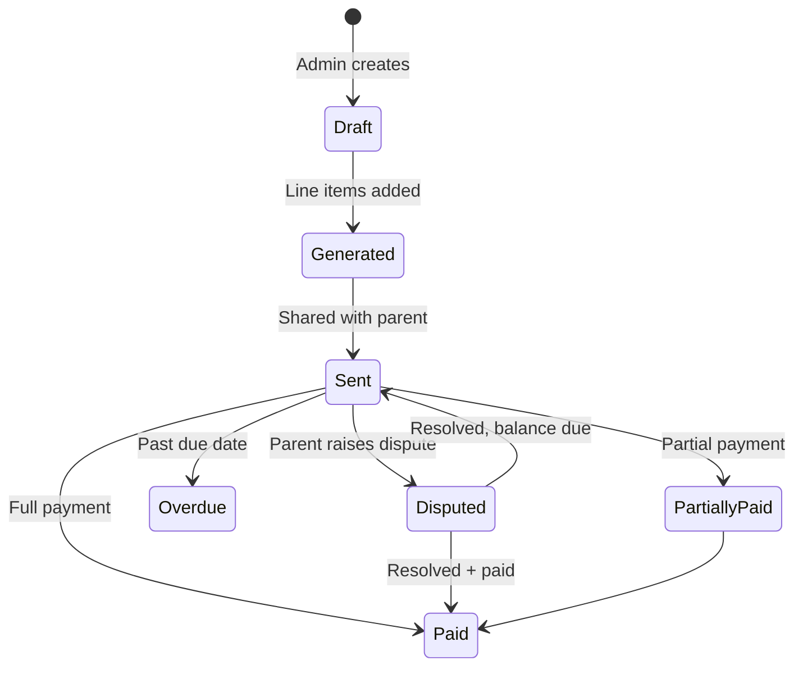

# Client billing architecture

## Philosophy

Parents see **what they pay for**, which sessions were billed, package balance, prepaid vs postpaid, and pending amounts. Finance retains override capability. Schema supports future Razorpay/Stripe without redesign.

## Data model

| Table | Purpose |
|-------|---------|
| `client_invoices` | Family-facing invoice (not therapist payout `invoices`) |
| `client_invoice_lines` | Session-level breakdown linked to `sessions` / `daily_logs` |
| `care_packages` | Prepaid session packs per case |
| `client_payments` | Manual / gateway payment records |
| `billing_disputes` | Parent disputes with admin resolution |

Therapist payout invoices (`invoices`, `invoice_case_lines`, `invoice_session_lines`) remain separate.

## Invoice workflow

**Types:** `PREPAID` (package purchase / drawdown) · `POSTPAID` (month-end from completed sessions).

**Case default:** `cases.client_billing_mode` (`PREPAID` | `POSTPAID`) is set at case allotment — package therapist billing defaults to prepaid; per-session defaults to postpaid. Client invoices copy this mode when generated.

## Package workflow

- Package stored on `care_packages` (total / used / validity).
- Completed sessions deduct when policy says so (v1: manual `used_sessions` in seed; future: hook on session `COMPLETED`).
- Cancelled sessions: no deduction. Client absent: configurable per case (`billing_notes`).

## Parent APIs

| Method | Path |
|--------|------|
| GET | `/parent/billing/dashboard` |
| GET | `/parent/billing/invoices` |
| GET | `/parent/billing/invoices/{id}` |
| GET | `/parent/billing/invoices/{id}/print` |
| GET | `/parent/billing/lines/{id}/session` |
| GET | `/parent/billing/packages` |
| POST | `/parent/billing/invoices/{id}/disputes` |

Filters: `month`, `case_id`, `service`, `payment_bucket` (`paid` \| `unpaid` \| `partial` \| `disputed`).

## Admin / finance APIs

| Method | Path |
|--------|------|
| GET | `/admin/client-billing/disputes` |
| POST | `/admin/client-billing/invoices/{id}/payments` |
| POST | `/admin/client-billing/disputes/{id}/resolve` |

## Dispute workflow

Parent raises → `OPEN` → finance `UNDER_REVIEW` → `RESOLVED` / `REJECTED` with optional `adjustment_inr` on invoice.

## Notifications (v1 in-app)

Invoice generated, payment recorded, dispute updated, package low (future). WhatsApp/email channels plug into same `notification_service` events.

## Future payment gateway

- Add `gateway_payment_id`, `gateway_provider` on `client_payments`.
- Webhook handler sets `amount_paid_inr` and invoice status.
- Subscription / auto-pay as separate `billing_subscriptions` table when needed.

## UI

- **Parent:** `ParentBillingPage` — summary, packages table, filters, invoice detail drawer, session drill-down, dispute form, print view.
- **Admin:** extend invoice approval UI with client dispute queue (API ready).
