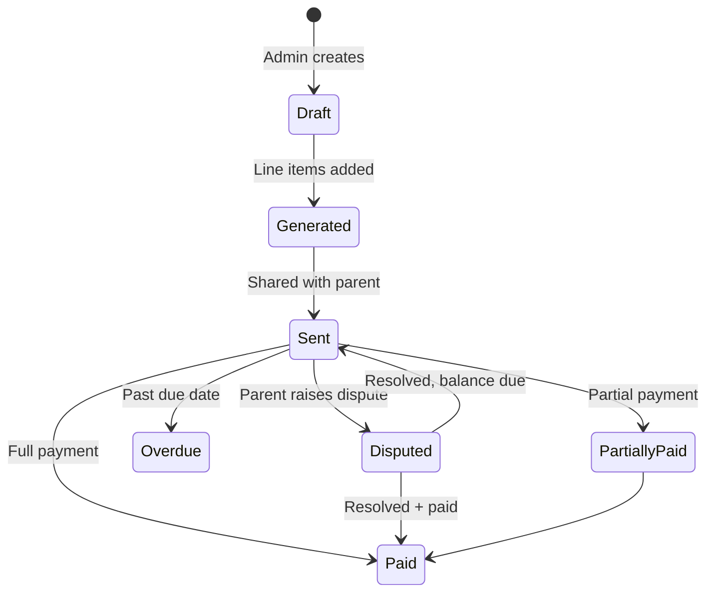

# Client billing architecture

## Philosophy

Parents see **what they pay for**, which sessions were billed, package balance, prepaid vs postpaid, and pending amounts. Finance retains override capability. Schema supports future Razorpay/Stripe without redesign.

## Data model

| Table | Purpose |
|-------|---------|
| `client_invoices` | Family-facing invoice (not therapist payout `invoices`) |
| `client_invoice_lines` | Session-level breakdown linked to `sessions` / `daily_logs` |
| `care_packages` | Prepaid session packs per case |
| `client_payments` | Manual / gateway payment records |
| `billing_disputes` | Parent disputes with admin resolution |

Therapist payout invoices (`invoices`, `invoice_case_lines`, `invoice_session_lines`) remain separate.

## Ledger-first client billing (addendum)

| Table | Purpose |
|-------|---------|
| `product_billing_rules` | Catalog: product module, billing model, rates, GST/HSN, cancellation flags |
| `billing_ledger` | Source of truth before client invoice lines; one row per billable clinical event |
| `organisations` | B2B billing entity (GSTIN, address) linked from `client_invoices` |

**Flow:** approved session/daily log → `billing_ledger` (via product rule on case) → finance review → `generate-draft` → `client_invoices` DRAFT with GST snapshot on lines → send / payment / disputes.

**Case link:** `cases.product_billing_rule_id` overrides catalog defaults; per-case rates still live on `cases.client_rate_per_session_inr` etc.

**Service SSOT (2026):** Commercial products are authored under **Settings → Service categories** as `service_products` rows. Each product syncs a linked `product_billing_rules` record (`service_product_id` on the rule). Case allotment and the invoice composer should prefer rules from the selected service line’s active products. Clinical access (which service lines a user sees) is separate from org capabilities (`billing`, `people_admin`, `hr_ops`) stored in `service_access_grants` / `org_capability_grants`.

**Therapist payouts:** unchanged; reconciliation API compares ledger billable totals vs `invoice_session_lines` per case/month.

## Invoice workflow



**Types:** `PREPAID` (package purchase / drawdown) · `POSTPAID` (month-end from completed sessions).

**Case default:** `cases.client_billing_mode` (`PREPAID` | `POSTPAID`) is set at case allotment — package therapist billing defaults to prepaid; per-session defaults to postpaid. Client invoices copy this mode when generated.

## Package workflow

- Package stored on `care_packages` (total / used / validity).
- Completed sessions deduct when policy says so (v1: manual `used_sessions` in seed; future: hook on session `COMPLETED`).
- Cancelled sessions: no deduction. Client absent: configurable per case (`billing_notes`).

## Parent APIs

| Method | Path |
|--------|------|
| GET | `/parent/billing/dashboard` |
| GET | `/parent/billing/invoices` |
| GET | `/parent/billing/invoices/{id}` |
| GET | `/parent/billing/invoices/{id}/print` |
| GET | `/parent/billing/lines/{id}/session` |
| GET | `/parent/billing/packages` |
| POST | `/parent/billing/invoices/{id}/disputes` |

Filters: `month`, `case_id`, `service`, `payment_bucket` (`paid` \| `unpaid` \| `partial` \| `disputed`).

## Admin / finance APIs

| Method | Path |
|--------|------|
| GET | `/admin/client-billing/composer-cases` |
| GET | `/admin/client-billing/composer-preview` |
| POST | `/admin/client-billing/cases/{id}/build-from-ledger` |
| POST | `/admin/client-billing/remind-therapist` |
| POST/PATCH/DELETE | `/admin/client-billing/invoices/{id}/lines` |
| POST | `/admin/client-billing/invoices/{id}/recalculate` |
| GET | `/admin/client-billing/invoices/{id}/audit-trail` |
| GET | `/admin/client-billing/disputes` |
| POST | `/admin/client-billing/invoices/{id}/payments` |
| POST | `/admin/client-billing/disputes/{id}/resolve` |

Finance UI entry: `/admin/invoices/compose` (Billing Composer). Replaces separate “raise invoice” and “generate from ledger” flows.

## Dispute workflow

Parent raises → `OPEN` → finance `UNDER_REVIEW` → `RESOLVED` / `REJECTED` with optional `adjustment_inr` on invoice.

## Notifications (v1 in-app)

Invoice generated, payment recorded, dispute updated, package low (future). WhatsApp/email channels plug into same `notification_service` events.

## Future payment gateway

- Add `gateway_payment_id`, `gateway_provider` on `client_payments`.
- Webhook handler sets `amount_paid_inr` and invoice status.
- Subscription / auto-pay as separate `billing_subscriptions` table when needed.

## UI

- **Parent:** `ParentBillingPage` — summary, packages table, filters, invoice detail drawer, session drill-down, dispute form, print view.
- **Admin:** Finance hub at `/admin/invoices` with tabs: Overview, Client invoices, Client payments, Therapist payouts, Rules & packages, Reports. Composer at `/admin/invoices/compose`.

## Finance module audit (2026 maturity pass)

### Schema reused (do not duplicate)

| Domain | Tables |
|--------|--------|
| Client billing | `client_invoices`, `client_invoice_lines`, `billing_ledger`, `client_payments`, `billing_disputes`, `care_packages`, `product_billing_rules`, `case_billing_preferences` |
| Therapist payout | `invoices`, `invoice_case_lines`, `invoice_session_lines`, `invoice_manual_lines`, `reviews` |

UI labels: **Client invoices** = `client_invoices`; **Therapist payouts** = backend table `invoices`.

### Avoided / legacy (not used for new flows)

- No `finance_charge_heads`, `therapist_payouts`, or `payout_items` tables.
- `payouts` model exists but has no API — do not wire.
- `parent_billing_statements` is legacy; parent portal uses `client_invoices` routes.
- No separate billing queue table — composer queues are computed from case/invoice/ledger state (`new_clients`, `not_invoiced_this_month`, etc.).

### Operational pipeline (why buttons fail)

```text
Session COMPLETED → Daily log approved → billing_ledger BILLABLE → Build from ledger → client_invoices DRAFT
```

Build from ledger requires billable ledger rows. Completed sessions alone are insufficient until logs are approved.

### Key admin APIs (maturity pass)

| Method | Path |
|--------|------|
| POST | `/admin/client-billing/cases/{id}/onboarding-invoice-draft` |
| POST | `/admin/client-billing/invoices` (manual draft) |
| POST | `/admin/client-billing/cases/{id}/build-from-ledger` |
| POST | `/admin/client-billing/remind-therapist` |
| GET | `/admin/finance-overview/summary` |
| GET | `/admin/finance-reports/{report_key}` |
| POST | `/admin/finance-bulk/client-invoices` |
| POST | `/admin/finance-bulk/therapist-payouts` |

### Migration policy

- Single Alembic head; additive migrations only.
- Optional: `invoice_manual_lines.line_category` (nullable VARCHAR) for payout reporting.
- `client_invoice_lines.line_item_type` is `String(32)` — extend via constants without DB enum migration when possible.
