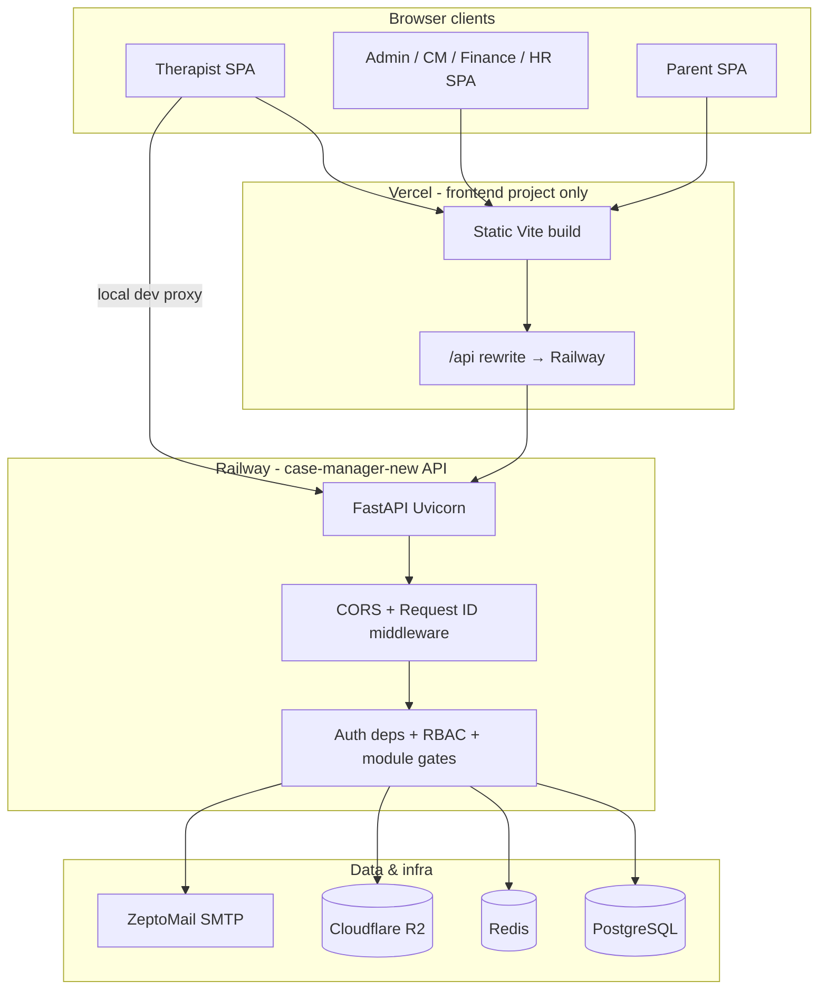
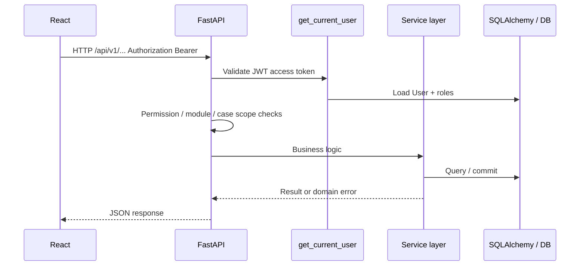
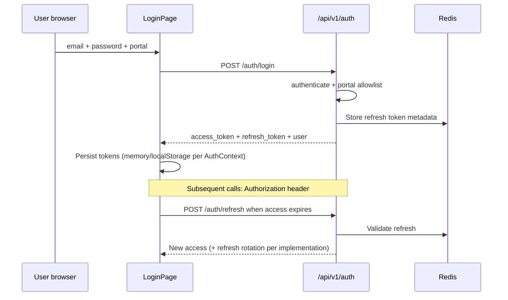
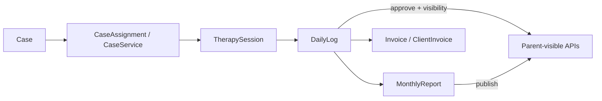
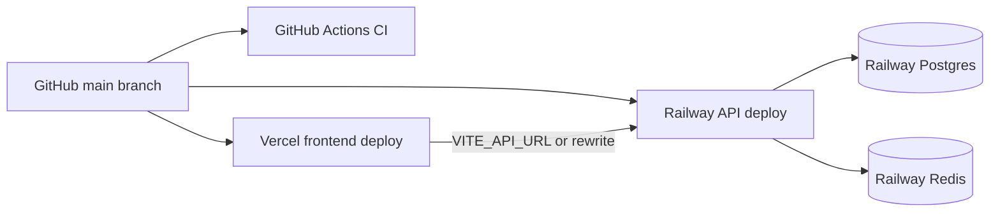

# 02 — Architecture

Facts below are derived from `backend/app/main.py`, `backend/app/api/v1/router.py`, `frontend/src/lib/apiClient.js`, `vercel.json`, and [docs/ARCHITECTURE.md](../ARCHITECTURE.md).

---

## High-level system architecture

**Inference:** On `www.insighte.org`, the browser often calls **same-origin** `/api/...`; Vercel rewrites to the Railway API. Locally, Vite dev server proxies `/api` and `/health` to `localhost:8000` when `VITE_API_URL` is empty.

---

## Application tiers

### Frontend (single SPA, multiple portals)

- **Entry:** `frontend/src/main.jsx` → `AppRoutes.jsx`  
- **Portals:** `therapist`, `admin` (includes CM/finance/HR routes), `parent`  
- **State:** React Context (`AuthContext`), TanStack Query for server state  
- **API:** `apiFetch()` in `frontend/src/lib/apiClient.js` — Bearer access token, refresh flow, 30s timeout  

### Backend (monolithic FastAPI)

- **Entry:** `backend/app/main.py` — lifespan bootstrap, exception handlers, CORS  
- **Routes:** Aggregated in `backend/app/api/v1/router.py` under prefix **`/api/v1`**  
- **Layers:** Routers → services (`backend/app/services/*`) → SQLAlchemy models → Postgres/SQLite  
- **Cross-cutting:** `app/core/security.py`, `app/core/permissions.py`, `app/core/module_access.py`, audit via `app/core/audit.py`  

### Database

- **ORM:** SQLAlchemy 2.0 declarative models in `backend/app/models/`  
- **Migrations:** Alembic in `backend/alembic/versions/` (many revisions; CI enforces **single head**)  
- **Local SQLite:** `bootstrap_schema()` + `ensure_sqlite_schema_patches()` on startup  

### Optional subsystems

| Subsystem | When active | Mount point |
|-----------|-------------|-------------|
| Integration API | `INTEGRATION_API_ENABLED=true` | `/api/v1/integrations/*` |
| MCP server | `MCP_ENABLED=true` + integration on | `/mcp` (Streamable HTTP) |
| Clinical reports | `ENABLE_CLINICAL_REPORTS_ENGINE=true` | clinical report routers |
| Billing routers | `ENABLE_BILLING=true` | finance_ops, ledger_billing, client_billing, etc. |

---

## Request / response flow (typical authenticated call)

**Example trace (therapist submits log):**

1. `POST /api/v1/daily-logs` — `daily_logs.py` router  
2. `get_current_user` + therapist case access check  
3. `session_log_service` / related services persist `DailyLog`, link to `TherapySession`  
4. Audit event optional via `log_audit`  
5. Response schema from `app/schemas/`  

---

## Authentication flow

Logout revokes refresh in Redis (`revoke_refresh_token`). Production **requires** Redis; dev may use in-memory fallback after ~2s probe ([backend/README.md](../../backend/README.md)).

---

## Data flow (case-centric)

Clinical parallel path: `CaseClinicalProfile`, `IepPlan`, `ClinicalReport`, `CaseDocument` — see [06_DATABASE.md](./06_DATABASE.md).

---

## Deployment architecture

- **Frontend build:** `npm run build` in `frontend/` (or monorepo root `vercel.json`).  
- **API build:** Docker `backend/Dockerfile`; start `scripts/start-production.sh` (migrate + uvicorn workers).  
- **Staging/testing:** **UNKNOWN — VERIFY WITH TEAM** for dedicated hostnames; repo references retired Vercel apps `insightecasestaging` / `insightecasetesting` that should be disconnected from Git.

---

## External services (summary)

| Service | Role |
|---------|------|
| Railway | API hosting, Postgres, Redis |
| Vercel | Frontend hosting, optional Analytics (`@vercel/analytics`) |
| Cloudflare R2 | Private object storage (report images, attachments) |
| ZeptoMail | Transactional email SMTP |
| Zoho Books | Optional invoice sync seam (`ZOHO_BOOKS_*` flags) |
| Razorpay | Payout provider stub (`PAYOUT_PROVIDER=RAZORPAY`) |
| Policies bot | External URL (`POLICIES_BOT_URL`) linked from support UI |
| Google Calendar | `ctz` and calendar connection models — invite links |

Full integration doc: [13_THIRD_PARTY_INTEGRATIONS.md](./13_THIRD_PARTY_INTEGRATIONS.md).

---

## AI / LLM

**Fact:** No LLM API client found in `backend/requirements.txt` or common service imports. IEP “suggestions” and report tooling appear **rule/template and structured UI driven**; any future AI must follow `.cursorrules` (Layer 4, explicit buttons only).

**Inference:** Product vision includes clinical intelligence; current shipped code is predominantly **relational + structured forms**.

---

## Background jobs and cron

**Fact:** No Celery worker in repo. Scheduled/ops scripts live under `backend/scripts/` (e.g. `auto_close_sessions_day_end.py`, migration utilities) — typically run via **external scheduler** (Railway cron, manual, or **UNKNOWN — VERIFY WITH TEAM**).

---

## Logging and errors

- Request ID middleware: `app/core/request_middleware.py`  
- DB errors mapped to HTTP via handlers in `main.py` (`IntegrityError`, `OperationalError`)  
- User-facing DB detail gated by `expose_db_errors` (off in production)  
- Health: `GET /health` — DB, Redis, SMTP configured, migration revision  

---

## Communication summary

| From | To | Protocol |
|------|-----|----------|
| Browser | Vercel CDN | HTTPS static assets |
| Browser | API | HTTPS JSON REST `/api/v1/*` |
| API | Postgres | SQLAlchemy / psycopg2 |
| API | Redis | refresh token store |
| API | R2 | S3-compatible API (boto3) |
| API | SMTP | ZeptoMail |
| Integration clients | API | `/api/v1/integrations/*` + JWT (`INTEGRATION_JWT_SECRET_KEY`) |
