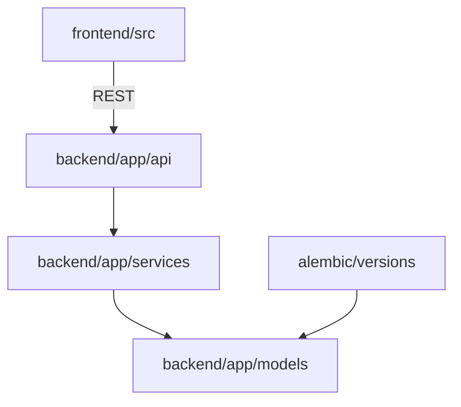

# 03 — Repository Structure

Monorepo root: **`case-manager-new/`**. Primary languages: **Python 3.11** (backend, CI), **JavaScript/JSX** (frontend, Node 24 in CI).

---

## Top-level map

| Path | Purpose | Modify when | Avoid |
|------|---------|-------------|-------|
| `backend/` | FastAPI API, models, migrations, tests, scripts | API, schema, business rules | Unrelated frontend-only changes |
| `frontend/` | Vite React SPA (all portals) | UI/UX, client validation | Backend secrets |
| `docs/` | Human documentation index + handover | Docs, runbooks | — |
| `scripts/` | Repo-root ops (pre-push, Vercel setup) | CI/deploy helpers | App business logic |
| `docker-compose.yml` | Local Postgres + Redis + API | Dev infra | Production config |
| `vercel.json` | Vercel monorepo build + `/api` rewrites | Frontend deploy routing | Backend env |
| `Makefile` | `make check`, hooks | Dev ergonomics | — |
| `.github/workflows/` | CI pipelines | Quality gates | — |
| `CONTRIBUTING.md`, `CHANGELOG.md`, `AGENTS.md` | Team process + agent memory | Process updates | — |

**Do not commit:** `.env`, `backend/.env`, `frontend/.env.local`, credentials, local SQLite `insightcase.db` (gitignored).

---

## `backend/`

| Path | Purpose |
|------|---------|
| `app/main.py` | FastAPI app, lifespan, CORS, health, router mount |
| `app/api/v1/*.py` | HTTP routers (one domain per file) |
| `app/api/deps.py` | `get_db`, `get_current_user`, permission dependencies |
| `app/core/` | Config (`config.py`), security, permissions, modules, feature flags, pagination |
| `app/models/` | SQLAlchemy ORM (~75 model modules) |
| `app/schemas/` | Pydantic request/response models |
| `app/services/` | Business logic (large — primary place for hidden rules) |
| `app/storage/` | Local + R2 storage abstraction |
| `app/seed/` | Demo seed (`demo_seed.py`) |
| `app/mcp/` | Optional MCP server mount |
| `app/tests/` | Pytest suite |
| `alembic/` | Migration env + `versions/*.py` |
| `scripts/` | Production migrate, smoke, SMTP check, one-off backfills |
| `requirements.txt` | Pip dependencies |
| `Dockerfile`, `railway.toml` | Container + Railway config |
| `.env.example`, `env.railway.example` | Env templates |

**Dependencies:** Frontend calls `/api/v1/*` only; no direct DB access from UI.

**Schema changes:** Always add Alembic revision for Postgres; SQLite may get runtime patches — prefer Alembic for anything shared with production.

---

## `frontend/`

| Path | Purpose |
|------|---------|
| `src/main.jsx` | React bootstrap, providers |
| `src/routes/AppRoutes.jsx` | All portal routes (large) |
| `src/routes/ParentRoutes.jsx`, `TherapistRoutes.jsx` | Parent/therapist route fragments |
| `src/context/AuthContext.jsx` | Session, portal selection, token refresh |
| `src/lib/apiClient.js` | HTTP client, auth headers, production host rules |
| `src/lib/` | RBAC helpers, dates, finance flags, portal login |
| `src/components/admin-portal/` | Admin/CM/finance UI |
| `src/components/client-portal/` | Parent UI |
| `src/components/daily-logs/`, `cases/`, `invoices/` | Therapist ops |
| `src/components/reports-engine/` | Clinical report builders (IEP/observation) |
| `src/components/hr-portal/` | HR pages (also routed under `/admin`) |
| `src/hooks/` | React Query wrappers |
| `src/layouts/PortalShell.jsx` | Nav chrome per portal |
| `e2e/` | Playwright tests |
| `vite.config.js` | Dev proxy, PWA, Tailwind |
| `vercel-env.example` | Vercel env template |

**Build output:** `frontend/dist/` (generated — do not hand-edit).

---

## `docs/` (existing, outside handover)

Use for deep dives: billing, finance cutover, RBAC phases, data import, email DNS, R2, therapist guides. Handover package lives in **`docs/handover/`** and links outward rather than duplicating runbooks.

---

## Configuration files worth knowing

| File | Role |
|------|------|
| `backend/app/core/config.py` | All backend settings from env |
| `backend/app/core/production_checks.py` | Production startup guards |
| `backend/app/core/modules.py` | Product module IDs |
| `backend/app/core/permissions.py` | Role → permission mapping |
| `frontend/src/lib/featureFlags.js` (and hooks) | Vite env-driven UI gates |
| `.cursorrules` | Product/clinical engineering doctrine (for AI-assisted dev) |

---

## Generated / vendor (generally do not edit)

- `frontend/node_modules/`, `frontend/package-lock.json` (lockfile: commit via npm)  
- `backend/__pycache__/`, `.pytest_cache/`  
- Playwright report artifacts  

---

## Cross-cutting dependency graph

When adding a feature, typical touch points: **model + migration + schema + service + router + frontend page + test**.
