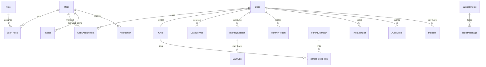

# 06 — Database

---

## Technology

| Item | Value |
|------|--------|
| Primary DB | **PostgreSQL 16** (production, Docker Compose, CI migration proof) |
| Local default | **SQLite** file `backend/insightcase.db` (via `config.default_sqlite_database_url`) |
| ORM | SQLAlchemy 2.x |
| Migrations | Alembic (`backend/alembic/`) |
| Driver | `psycopg2-binary` |

Connection URL normalization: `postgres://` → `postgresql+psycopg2://` in `config.py`.

---

## Connection architecture

- Engine/session: `backend/app/core/database.py`  
- Pool: `DB_POOL_SIZE`, `DB_MAX_OVERFLOW` per Uvicorn worker  
- Tests: `backend/app/tests/conftest.py` sets `APP_ENV=test` and isolated SQLite before imports  

---

## Migration workflow

| Environment | Apply schema |
|-------------|--------------|
| **Postgres (staging/prod)** | `python scripts/migrate_production.py` (runs Alembic upgrade head) |
| **Railway startup** | `scripts/start-production.sh` invokes migrate before uvicorn |
| **SQLite local** | `bootstrap_schema()` in `app/db/bootstrap.py` + `ensure_sqlite_schema_patches()` — **Alembic skipped** |
| **Docker Compose** | `alembic upgrade head` in container command |

**Create migration:**

```bash
cd backend
PYTHONPATH=.:alembic python3 -m alembic revision -m "description"
# edit new file in alembic/versions/
PYTHONPATH=.:alembic python3 -m alembic upgrade head
```

**Integrity checks (CI):**

```bash
python3 scripts/check_alembic_integrity.py
PYTHONPATH=.:alembic python3 -m alembic heads   # exactly one (head)
```

**Health:** `GET /health` includes `db_migration` revision when implemented in `main.py`.

**Emergency:** `scripts/repair_production_schema.py` — use only per [docs/DEPLOY.md](../DEPLOY.md) DBA guidance.

---

## Entity relationship (core operational model)

Simplified ER — full model list in `backend/app/models/__init__.py` (~70+ tables).



---

## Important tables (purpose and features)

### Identity & access

| Table | Purpose | Features |
|-------|---------|----------|
| `users` | All login accounts | Auth, profiles, module JSON, employment status |
| `roles`, `permissions`, `user_roles`, `role_permissions` | RBAC | Authorization |
| `invite_tokens` | Staff/parent invites | Onboarding |
| `password_reset_tokens` | Password reset | Auth emails |

### Case core

| Table | Purpose | Features |
|-------|---------|----------|
| `cases` | Operational anchor (`case_code`, status, product module, billing fields) | All portals |
| `children` | Client profile | Cases, parent links |
| `case_assignments` | Therapist ↔ case history | Assignments API |
| `case_services` | Service lines on a case | Multi-service cases |
| `case_therapist_transitions` | Handover windows | Transition billing days |
| `case_operational_notes` | Internal CM notes | Admin case hub |
| `case_clinical_profiles` | Structured clinical JSON columns | Neuro-affirmative profile |
| `observation_checklists` | Initial observation workflow | Observation reports |

### Sessions & logs

| Table | Purpose | Features |
|-------|---------|----------|
| `therapy_sessions` | Scheduled/completed visits | Timer, start/end |
| `daily_logs` | Session log content, approval, visibility | Therapist + admin + parent |
| `session_absence_requests` | Parent/therapist absence | Parent portal |
| `session_goal_entries`, `strategy_use_events` | Structured evidence (flagged) | IEP session log |

### Reports & documents

| Table | Purpose | Features |
|-------|---------|----------|
| `monthly_reports`, `observation_reports` | Legacy/report pipeline | Therapist reports |
| `clinical_reports`, `clinical_report_sections`, … | New clinical engine | Observation/IEP builders |
| `iep_plans`, `iep_plan_suggestions` | IEP planning | IEP admin/parent |
| `attachments`, `report_images` | Files metadata | Downloads via API |
| `case_documents`, `case_document_versions` | Case document workflow | CM review, parent approve |

### Billing & finance (flagged)

| Table | Purpose | Features |
|-------|---------|----------|
| `invoices`, `invoice_*_lines` | Therapist invoices | Therapist + admin |
| `client_invoices`, `client_payments`, `billing_ledgers` | Client billing engine | Finance module |
| `parent_billing_statements` | Parent-facing billing rows | Parent portal |
| `billing_approval_requests` | Low-margin approvals | Admin |
| `finance_correction_proposals`, `finance_payout_deductions` | Writable finance corrections | Finance ops |
| `therapist_payout_batches`, `therapist_payout_transfers` | Payout export/release | Finance cutover |

### HR & ops

| Table | Purpose | Features |
|-------|---------|----------|
| `staff_attendance`, `staff_attendance_segments` | Clock in/out | HR admin |
| `staff_leaves`, `therapist_leaves` | Leave | HR + therapist |
| `therapist_profiles` | Therapist HR profile | Onboarding/reviews |
| `memos`, `memo_messages` | Internal memos | Support hub |

### Support & compliance

| Table | Purpose | Features |
|-------|---------|----------|
| `support_tickets`, `ticket_attachments` | Help desk | All portals |
| `incidents`, `incident_messages` | POSH/POCSO-style routing | Restricted roles |
| `audit_events` | Immutable audit trail | Compliance |
| `email_logs`, `email_suppressions` | Email delivery audit | SMTP diagnostics |

### Scheduling

| Table | Purpose | Features |
|-------|---------|----------|
| `therapist_slots`, `recurring_schedule_assignments` | Booking | Parent + therapist |
| `staff_availability_rules`, `user_calendar_connections` | Availability | Scheduling |
| `case_manager_meetings`, `meeting_actions` | CM meetings | Admin |

### Integrations

| Table | Purpose | Features |
|-------|---------|----------|
| `integration_clients`, `integration_credentials` | Machine clients | Integration API |
| `integration_webhooks`, `integration_signals` | Webhooks | External systems |

---

## Indexes and constraints

- Defined per model in `backend/app/models/*.py` and Alembic revisions  
- Foreign keys link case-scoped entities to `cases.id`  
- Uniqueness: `case_code`, integration client IDs, etc. — verify in migrations  

**Important query patterns:** Case-scoped list endpoints paginate via `app/core/pagination.py`; finance reports use dedicated services under `finance_*_service.py`.

---

## Seed data

- **Demo:** `python3 -m app.seed.demo_seed` — users, cases, sample logs  
- **Import:** Production bulk import — [docs/DATA_IMPORT.md](../DATA_IMPORT.md)  

---

## Database logic outside migrations

- SQLite runtime patches: `ensure_sqlite_schema_patches()`  
- Postgres drift repair on startup: `_repair_postgres_schema_drift()` in `main.py`  
- Goal repository column repair: `repair_goal_repository_columns`  

**Inference:** These exist to reduce local/dev friction; **production should rely on Alembic**, not patches.

---

## Related documentation

- [docs/billing-architecture.md](../billing-architecture.md)  
- [docs/Cursor_Handover_Clinical_Reports_Structure.md](../Cursor_Handover_Clinical_Reports_Structure.md)  
- Finance cutover: [docs/FINANCE_CUTOVER_RUNBOOK.md](../FINANCE_CUTOVER_RUNBOOK.md)  
