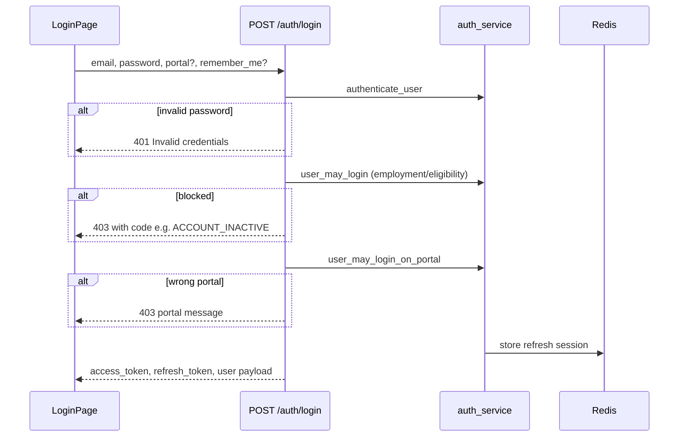

# 10 — Authentication and Authorization

---

## Authentication mechanism

| Aspect | Implementation |
|--------|----------------|
| Protocol | Stateless **JWT** access tokens + **JWT refresh** tokens |
| Password hashing | passlib bcrypt (`auth_service`) |
| Access token | Signed with `JWT_SECRET_KEY`; short TTL (`JWT_ACCESS_TOKEN_EXPIRE_MINUTES`, default 30) |
| Refresh token | Signed with `JWT_REFRESH_SECRET_KEY`; stored in **Redis** with revocation metadata (production required) |
| Transport | `Authorization: Bearer <access>` on API calls |
| OpenAPI login | `POST /api/v1/auth/login` |

**Not used:** Session cookies for API auth (browser stores tokens client-side via frontend AuthContext).

---

## Login flow

**Portal enforcement:** `portal_login_service.py` — therapist cannot use parent login URL and vice versa.

**Demo accounts:** [backend/README.md](../../backend/README.md).

---

## Refresh and logout

- `POST /api/v1/auth/refresh` — validates refresh token in Redis, rotates/issue new access  
- `POST /api/v1/auth/logout` — revokes refresh (`revoke_refresh_token`)  

Dev without Redis: in-memory fallback after probe (~2s) — **not for production**.

---

## Registration

- **Staff/parent:** Invite-only — `POST /auth/accept-invite` with token from email  
- **Self-signup:** Not enabled for therapists (UI TODOs reference disabled self-onboarding)  

---

## Password reset

1. `POST /auth/forgot-password` — rate limited (`PASSWORD_RESET_RATE_LIMIT_PER_HOUR`)  
2. Email link to `{FRONTEND_URL}/reset-password/{token}`  
3. `GET /auth/reset-password/{token}/preview`  
4. `POST /auth/reset-password`  

---

## Token storage (frontend)

- Implemented in `AuthContext.jsx` — access token attached by `apiClient.js`  
- Refresh triggered on 401 handling path in api client (read source for exact retry rules)  

**Security assumption:** XSS on frontend could exfiltrate tokens — sanitize user HTML (DOMPurify) where rich text is rendered.

---

## Authorization — roles

Defined in `app/models/role.py` + `app/core/permissions.py`.

| Role | Portal access (typical) |
|------|-------------------------|
| `SUPER_ADMIN` | All admin areas; bypasses module gates |
| `MODULE_ADMIN` | Admin ops scoped by assigned modules |
| `CASE_MANAGER` | CM home, cases, logs, reports in granted modules |
| `FINANCE` | Billing, invoices, payouts |
| `HR` | People, leave, attendance, HR reports |
| `THERAPIST` | Therapist portal only |
| `PARENT` | Parent portal only |
| `ADMIN` | Legacy → migrate to `MODULE_ADMIN` |
| `VIEWER`, `SUPERVISOR` | Deprecated |

Migration script: `python3 -m scripts.migrate_staff_roles`.

---

## Authorization — permissions

- Each role maps to permission strings in `ROLE_PERMISSIONS`  
- Routers use `Depends(require_permission("..."))` or custom deps  
- **Not editable per user** in v1 — only role + module + feature overrides  

---

## Module and feature gates

From [docs/RBAC_SCOPE.md](../RBAC_SCOPE.md):

1. **Programme modules:** `homecare`, `shadow_support`, `billing`, plus dynamic IDs from `service_categories`  
2. **Per-module access:** `view` vs `write` in `module_access_grants`  
3. **Feature overrides:** disable features within a module (e.g. incidents off)  
4. **Global view-only:** `is_view_only` on user  

API helpers: `app/core/module_access.py` — `modules_for_api`, `get_user_features`, `is_view_only_user`.

**Super Admin** bypass via `admin.override` permission.

---

## Case-level scoping

Case managers see cases where:

- `case_manager_user_id = current user`, **or**  
- `case.region` matches user region  

Filtered by granted `product_module`. Implemented in admin/case list services — not global SQL row-level security.

Therapists: assignments on case. Parents: linked children → cases.

---

## Protected routes

### Backend

- Default: `get_current_user` dependency  
- Integration routes: separate integration JWT deps (`deps_integration.py`)  

### Frontend

- `Protected` component checks portal match  
- Additional UI hiding via module/feature hooks — **supplement**, not replace API checks  

---

## Integration API auth

When `INTEGRATION_API_ENABLED=true`:

- Separate `INTEGRATION_JWT_SECRET_KEY`  
- Client credentials in `integration_clients` / `integration_credentials` tables  
- Rate limits from config  

Optional MCP at `/mcp` when `MCP_ENABLED=true`.

---

## Security assumptions and review areas

| Topic | Current behavior |
|-------|------------------|
| HTTPS | Required in production deployments |
| CORS | Explicit allowlist; production rejects localhost-only misconfig |
| CSRF | Bearer tokens — CSRF less relevant for API; **VERIFY** cookie usage if added later |
| Brute force | Password reset rate limit; login rate limiting **UNKNOWN — verify** |
| Account lockout | Employment status blocks login with restore flow |
| Sensitive incidents | Role-scoped APIs in `incidents.py` |

---

## Related files

- `backend/app/api/v1/auth.py`  
- `backend/app/services/auth_service.py`  
- `backend/app/core/security.py`  
- `backend/app/services/portal_login_service.py`  
- `backend/app/services/therapist_eligibility_service.py`  
- `frontend/src/lib/portalLogin.js`  
- `frontend/src/context/AuthContext.jsx`  
