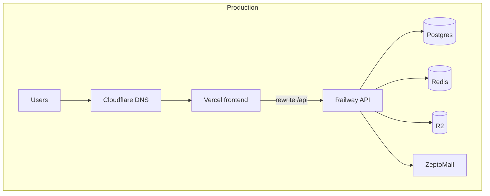

# 14 — Deployment

Based on [docs/DEPLOY.md](../DEPLOY.md), [docs/RAILWAY_VERCEL.md](../RAILWAY_VERCEL.md), `vercel.json`, and `backend/scripts/start-production.sh`.

---

## Environment tiers

| Tier | Frontend | API | Database | Notes |
|------|----------|-----|----------|-------|
| **Local** | Vite `:5173` | Uvicorn `:8000` | SQLite or Docker Postgres | No R2 required |
| **CI** | Build only | pytest | Ephemeral SQLite + Postgres migration job | Fixed `VITE_API_URL` in workflow |
| **Staging/testing** | **UNKNOWN — VERIFY WITH TEAM** | Likely Railway preview + flags | Postgres | See finance staging acceptance docs |
| **Production** | Vercel `frontend` + `insighte.org` | Railway `case-manager-new` | Railway Postgres + Redis | Strict `production_checks` |

---

## Deployment architecture



---

## Git branches and deploy triggers

| Branch | CI | Deploy |
|--------|-----|--------|
| `main` | Push + PR checks | **Inference:** Vercel production + Railway production on merge — confirm auto-deploy in dashboards |
| `dev` | CI runs | **UNKNOWN — VERIFY WITH TEAM** |

No direct push to `main` ([CONTRIBUTING.md](../../CONTRIBUTING.md)).

---

## How to deploy a new version

### 1. Pre-merge

```bash
make check   # or ./scripts/pre-push-check.sh
cd backend && python3 -m pytest app/tests -q
cd frontend && npm run build
```

Update [CHANGELOG.md](../../CHANGELOG.md) `[Unreleased]`.

### 2. Merge PR to `main`

Wait for CI: `backend`, `frontend`, `vercel-monorepo-build`, `postgres-migration-proof`, `contributor-guards`.

### 3. Railway (API)

- Auto-deploy from Git **or** manual redeploy in Railway dashboard **(verify team process)**  
- Startup runs `scripts/start-production.sh`:
  1. `python scripts/migrate_production.py`  
  2. Optional demo seed if `SEED_DEMO_DATA=true` (staging only)  
  3. Uvicorn with `WEB_CONCURRENCY` workers  

### 4. Database migration (production)

```bash
# From operator machine with DATABASE_URL or Railway shell:
cd backend
python3 scripts/migrate_production.py
```

Verify:

```bash
curl -s https://<API_HOST>/health
# check db_migration field matches alembic head
PYTHONPATH=.:alembic python3 -m alembic heads  # single head locally against same revision chain
```

### 5. Vercel (frontend)

- Auto-deploy on `main` **(verify)**  
- Ensure `VITE_API_URL` set for preview environments; production may use same-origin rewrite on `insighte.org`  
- CLI example from AGENTS.md:

```bash
vercel --scope insightes-projects --project frontend
```

### 6. Post-deploy smoke

- `GET /health`  
- Login each portal type  
- [docs/STAGING_SMOKE.md](../STAGING_SMOKE.md) / `backend/scripts/production_smoke.py`  
- [docs/RELEASE_CHECKLIST.md](../RELEASE_CHECKLIST.md) before major releases  

---

## CORS coordination

When adding a new UI host:

1. Add origin to Railway `CORS_ORIGINS`  
2. Add Vercel domain if applicable  
3. Redeploy API  
4. Remove origins only after domain removed from Vercel  

Production example in [ENVIRONMENT_VARIABLES.md](../ENVIRONMENT_VARIABLES.md).

---

## Build commands

| Component | Command | Output |
|-----------|---------|--------|
| Frontend | `cd frontend && npm run build` | `frontend/dist/` |
| API (Docker) | `docker build -f backend/Dockerfile backend` | Container image |
| API (Railway) | Uses Dockerfile + `start-production.sh` | — |

---

## Rollback

| Layer | Procedure |
|-------|-----------|
| **Vercel** | Promote previous deployment in Vercel dashboard → Deployments → Rollback |
| **Railway** | Redeploy previous successful deployment or revert Git commit and redeploy |
| **Database** | **No automatic down migration in prod** — forward-fix with new Alembic revision preferred; `alembic downgrade` only with DBA review and backup |
| **Feature flags** | Disable `ENABLE_BILLING`, payout flags, etc., without code rollback |

**VERIFY BEFORE APPLYING:** Railway instant rollback behavior and whether migrations are backward compatible.

---

## Domains

| Host | Role |
|------|------|
| `https://www.insighte.org` | Canonical production UI (+ API rewrite) |
| `https://insighte.org` | Redirects to www (frontend apiClient special-case) |
| `*.vercel.app` | Official frontend project URLs |
| `*.up.railway.app` | Public API URL (also used in CI `VITE_API_URL`) |

---

## Finance / billing cutover deploys

Special flag sequences — do **not** treat as normal deploy:

- [FINANCE_CUTOVER_RUNBOOK.md](../FINANCE_CUTOVER_RUNBOOK.md)  
- [FINANCE_SNAPSHOT_PROD_CUTOVER.md](../FINANCE_SNAPSHOT_PROD_CUTOVER.md)  

---

## Release checklist

Before production release:

```bash
make release-check   # ./scripts/pre-release-check.sh
```

Move CHANGELOG `[Unreleased]` to dated section.
