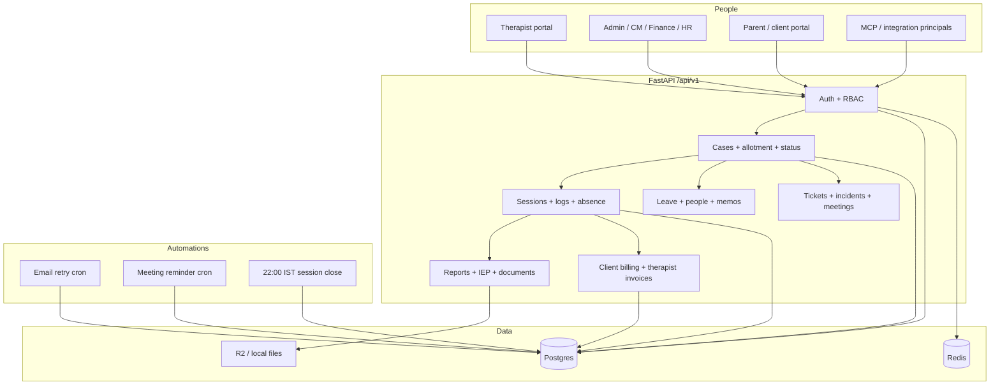
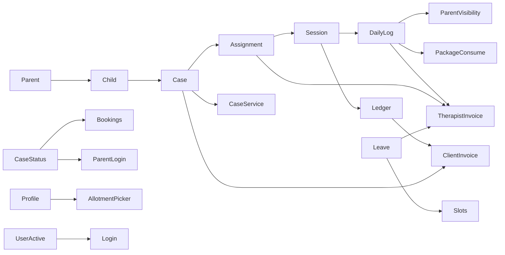

# Current system map

**Evidence date:** 29 August 2026. Docs such as `docs/ARCHITECTURE.md` (last updated May 2026) are **stale** on parent billing, IEP, and finance. This file is from code.

---

## 1. Architecture (discovered)

| Concern | Implementation | Evidence |
| --- | --- | --- |
| API | FastAPI `app.main:app`, router `backend/app/api/v1/router.py` | 45 route modules under `/api/v1` |
| UI | Vite React, `frontend/src/routes/AppRoutes.jsx` | Portals: `/therapist`, `/parent`, `/admin` (HR/Finance/CM share admin login) |
| ORM | SQLAlchemy 2 mapped models | `backend/app/models/` (~72 files) |
| Migrations | Alembic | `backend/alembic/versions/` (~132 files); multi-head merges are chronic |
| Queue | **No Celery** | FastAPI `BackgroundTasks` + Railway cron TOMLs |
| Cache / lock | Redis | `app.core.security` startup ping |
| Auth | JWT, portal-specific login | `auth_service`, `portal_login_service` |
| Permissions | Role → permission list + grants | `permissions.py`, `service_access.py`, `module_write.py` |
| Feature flags | Env settings | `config.py` + `feature_flags.py` |
| Email | Zepto/SMTP + `email_logs` | `railway.email-cron.toml` every 10 min |
| Files | local or R2 | `storage/factory.py` |
| Payments | Always `MockPaymentProvider` | `payment_provider.py` |
| Bookkeeping | Zoho Books optional | Default `NoOpBookkeepingProvider` |
| AI | No LLM client | Observation insights are deterministic Layer 1 |
| Deploy | Railway API + Vercel frontend | `docs/RAILWAY_VERCEL.md` (deploy names; verify env separately) |

### Environment-specific behaviour (CONFIRMED defaults in `config.py`)

| Flag | Default | Effect |
| --- | --- | --- |
| `enable_billing` | false | Billing routers 404 |
| `billing_ledger_writes` | false | Ledger upserts no-op |
| `billing_ledger_drafts` | true | Draft-from-ledger allowed if billing on |
| `finance_cutover_complete` | false | Control Tower stays “provisional” |
| `payout_export_enabled` / `payout_release_enabled` | false | Export/release 403 |
| `acceptance_gating_enabled` | false | Parent-accept columns informational |
| `enable_clinical_reports_engine` | false in config; prod docs say on | Clinical report routes 404 if off |
| `enable_structured_evidence` | false | Session evidence taps ignored |
| Frontend `VITE_ENABLE_CLIENT_BILLING` | forced off on canonical production | Parent/admin billing UI |

**STRONG INFERENCE:** Production may override these. Code defaults are “safe off” for money. Runtime truth is Railway/Vercel env, not this repo.

---

## 2. Portals and routes (CONFIRMED)

### Therapist `/therapist`

Dashboard, cases, case detail, session logs, monthly/clinical reports, invoices (payout claims), support, leave, slots, meetings, profile, notifications.

### Parent `/parent`

Dashboard, case hub, reports, billing, book, session logs, profile, support, meetings. Closed/deactivated cases hidden (`case_portal_visibility`).

### Staff `/admin` (and `/admin/cm`, `/hr/*` redirects)

Landing from `GET /api/v1/admin/home`. Cases, logs, reports, invoices, compose, payouts, finance leave, finance reports, people, IEP, support, HR reports, therapist profiles, service categories, staff/client profiles, meetings, workbench, CM home, CM log review.

Login aliases: `/clientlogin`, typo `/clinetlogin`, `/therapistlogin`, `/adminlogin`, `/stafflogin` → admin.

---

## 3. Feature inventory

Status: **Active** = used in current routes/services. **Partial** = flagged or incomplete. **Legacy** = still reachable but superseded. **Uncertain** = code exists, production use unknown.

| Feature | Users | Business purpose | Product/module | Frontend | Backend | Data | Permissions | Downstream | Status | Risk |
| --- | --- | --- | --- | --- | --- | --- | --- | --- | --- | --- |
| Case allotment | Admin, HR | Create child/parent/case + commercial terms + assignment | Clinical + billing | Admin cases / allotment queue | `allotment_service` | `cases`, `children`, `parent_guardians`, `case_assignments` | `case.create`, `case.assign` | Sessions, billing, parent invite | Active | High |
| Case / client status | Admin, HR, CM (update), therapist (request) | Pause, replace, close, reopen | Clinical | `CaseClientStatusCard`, HR cases | `client_status_service`, `case_status_request_service` | `cases.status`, `case_client_status_audit`, `case_status_requests` | `case.update` or `case.status_manage` | Bookings, assignments, parent login, billing cutoff | Active | High |
| Assignments | Admin, HR | Who holds the case | Clinical | Case hub | `assignment_service` | `case_assignments`, `case_services` | `case.assign` | Sessions, payouts, transitions | Active | High |
| Therapist transition | Admin, HR | Mid-month handover (3 dates) | Clinical + finance | Transition UI | `therapist_transition_service` | `case_therapist_transitions` | `case.assign` + billing update | Dual payout, logs | Active | High |
| Sessions | Therapist, CM | Clock, complete, void | Clinical | Daily logs, slots | `session_service`, `session_start_service` | `sessions` | `session.create/update` | Logs, ledger, invoices | Active | High |
| Session absence | Therapist, admin | Child absent / therapist leave on a visit | Clinical + finance | Logs | `session_absence_service` | `session_absence_requests` | session + leave | Ledger, package consume | Active | High |
| Daily logs | Therapist; CM/admin review | Structured + narrative evidence | Clinical | `DailyLogsPage` | `session_log_service`, `daily_logs.py` | `daily_logs` | `daily_log.create/review` | Parent visibility, package consume, reports | Active | Medium |
| Pending-log gate | Therapist | Cannot start next visit until last completed is logged | Clinical | `sessionStartRules.js` | `pending_log_gate_service` | `sessions` + `daily_logs` | — | Session start | Active | Medium |
| Day-end auto-close | System | Close IN_PROGRESS at 22:00 IST | Clinical | — | `session_day_end_service` | `sessions` | cron | Time confirmation | Active | Medium |
| Recurring schedule / slots | Therapist, admin, parent | Book visits | Clinical | Slots, book | `scheduling_service`, `booking.py` | `therapist_slots`, `recurring_schedule_assignments` | `slot.*` | Sessions | Active | Medium |
| Legacy monthly reports | Therapist, CM | Monthly narrative pipeline | Clinical | `/therapist/reports`, admin reports | `report_service` | `monthly_reports`, `observation_reports` | `monthly_report.*` | Parent publish | Active / dual | High |
| Clinical reports engine | Therapist, CM, parent | Observation + IEP v2 | Clinical | `TherapistClinicalReportPage` | `clinical_reports.py` | `clinical_reports` | flag + iep/report perms | Parent | Partial (flag) | High |
| IEP v1 plans | Admin | Older IEP table | Clinical | Admin IEP | `iep` models | `iep_plans` | `iep.manage` | Meetings | Legacy / parallel | Medium |
| Case documents | CM, admin | File workflow | Clinical | Case hub | `case_document_service` | `case_documents` | `case_document.*` | Parent review | Active | Medium |
| Client invoices | Finance, parent | Money in | billing | Parent billing, compose | `client_billing_service` | `client_invoices`, lines, payments | `invoice.*` + billing flag | Collections | Partial (flag) | Critical |
| Billing ledger | Finance | Event-level client amounts | billing | Control tower | `billing_ledger_service` | `billing_ledger` | writes flag | Draft invoices | Partial | Critical |
| Care packages | Finance, parent | Prepaid balance | billing | Packages tabs | `consume_package_session` | `care_packages`, `client_package_cycles` | billing | Remaining sessions | Partial / drift | Critical |
| Therapist invoices | Therapist, finance | Money out | billing | `/therapist/invoices`, admin payouts | `invoice_billing_service` | `invoices`, case/session/manual lines | `invoice.generate/approve` | Settlements | Active | Critical |
| Payout batches | Finance | Export / pay therapists | billing | Payouts dashboard | `payout_batch_service`, `payout_settlement_service` | batches, transfers, `payouts` (old) | export/release flags | Bank (mock) | Partial | Critical |
| Finance Control Tower | Finance, SA | Month health / exceptions | billing | Admin finance | `finance_control_tower_service` | reads many | role gate | Reporting | Partial | High |
| Low-margin approval | Admin | Block allotment if profit &lt; ₹5,000 | billing | Allotment | `billing_approval_service` | `billing_approval_requests` | `case.billing.update` | Case create | Active | Medium |
| Leave | Therapist, HR, finance (view) | Absence + credits | hr_ops | Leave pages | `leave_policy_service` | `therapist_leaves` | `leave.manage` | Slots, invoices | Active | High |
| People / onboard | Admin, HR | Staff directory, invites | people_admin | Admin people | `therapist_onboarding_service` | `users`, `therapist_profiles` | `user.manage`, `therapist.read` | Assignments | Active | High |
| Memos | HR, finance | Internal notes | hr_ops | HR memos | `hr.py` | `memos` | `memo.send` | — | Active | Low |
| Tickets | All portals | Support | all | Support hubs | `tickets.py` | `support_tickets` | `ticket.manage` | Incidents, disputes | Active | Medium |
| Incidents | Therapist, CM, admin | Safety events | clinical | Support | `incidents.py` | `incidents` | `incident.read_sensitive` | SLA on list | Active | Medium |
| CM meetings | CM, therapist, parent | Case review calls | clinical | Meetings pages | `cm_meeting_service` | `case_manager_meetings` | case read | Reminders | Active | Low |
| Parent portal auto-suspend | System | Close last case → parent cannot login | CRM | — | `client_status_service` | `users.is_active` | — | Parent login | Active | Medium |
| Zoho ID | Admin | Accounting join key | CRM/finance | Case form | `case_zoho_id_bulk_service` | `cases.zoho_id` | case update | Books (optional) | Active store | Medium |
| Zoho Books push | Finance | Push invoice | finance | — | `zoho_client_sync` | external | env | Accounting | Partial / no-op default | Medium |
| MCP / integration API | Machines | Read-only tools | infra | — | `app/mcp`, integrations | masked DTOs | integration JWT | External tools | Active | Medium |
| Import / Excel | Admin, HR | Bulk people, Zoho IDs, leave, duration outliers | ops | — | `import_production.py`, leave bulk, exports | various | admin/HR | Data quality | Active | High |
| Structured session evidence | Therapist | Goal/strategy taps | clinical | Log form | evidence services | `session_evidence` | `enable_structured_evidence` | IEP | Partial (off) | Low |
| Lead / sales CRM | — | Convert leads | — | — | **No model** | — | — | — | Absent | — |

---

## 4. Core entities (source of truth — first pass)

| Concept | Actual SSOT | Competing copies | Verdict |
| --- | --- | --- | --- |
| Case / client status | `cases.status` | Request queue + audit tables (history, not live) | One live field. Two write paths. |
| Therapist on case | `case_assignments` where `ACTIVE` | No `case.therapist_id` | CONFIRMED SSOT |
| Commercial client rate | `cases` rate columns + `product_billing_rules` + `case_billing_rate_changes` | Ledger copies amount at event; invoice snapshots freeze | Config vs snapshot — separate on purpose |
| Package remaining | `care_packages.used_sessions` (display) | `client_package_cycles.remaining_sessions` | **Competing** |
| Session clock | `sessions` | Log times can feed duration | Dual duration sources by design (Jun 9) |
| Log approval | `daily_logs.approval_status` | Visibility status is a second gate for parents | Related, not duplicate |
| Official clinical report | **Unclear** | `monthly_reports` vs `clinical_reports` vs `iep_plans` vs `case_documents` | **Competing** |
| Therapist pay for a month | Submitted `invoices` + line snapshots | Live preview, Control Tower, payout batches | Snapshot after submit; preview is not money |
| Client collectible | `client_invoices` + confirmed `client_payments` | Ledger, parent_billing_statements, Zoho | Invoice+payment if billing on; statements leftover |
| Employee login | `users.is_active` | `employment_status`, profile status | **Competing meanings** |
| Product line | `cases.product_module` + `service_categories` | `service_products`, `product_billing_rules`, user grants | Linked but not one field |

---

## 5. Dependency sketch

---

## 6. What documentation got wrong

| Doc claim | Code today |
| --- | --- |
| `ARCHITECTURE.md`: parent billing = `parent_billing_statements` | Parent money path is `client_invoices` when billing enabled |
| Package consume “future hook on COMPLETED” | Consume on **log approve** (prepaid) and some absences — not on complete |
| Homecare/shadow as only product modules | Catalog is `service_categories`; org modules are billing/people/hr |
| May 2026 architecture as current | Finance engine, transitions, clinical reports, MCP added since |

---

## 7. Audit execution plan (what was inspected)

1. Inventory routers, models, services, frontend routes, flags, crons.  
2. Deep-read case/session/assignment/status.  
3. Deep-read HR/RBAC/automations.  
4. Deep-read finance rails and flags.  
5. Git log 16 May–29 Aug 2026 (520 commits; repo birth 16 May).  
6. Cross-walk tests vs rules.  
7. Write this pack. No refactors.

Not done (out of scope / unsafe): production data sampling with PII; live Railway env dump; turning flags on; Playwright full suite.
