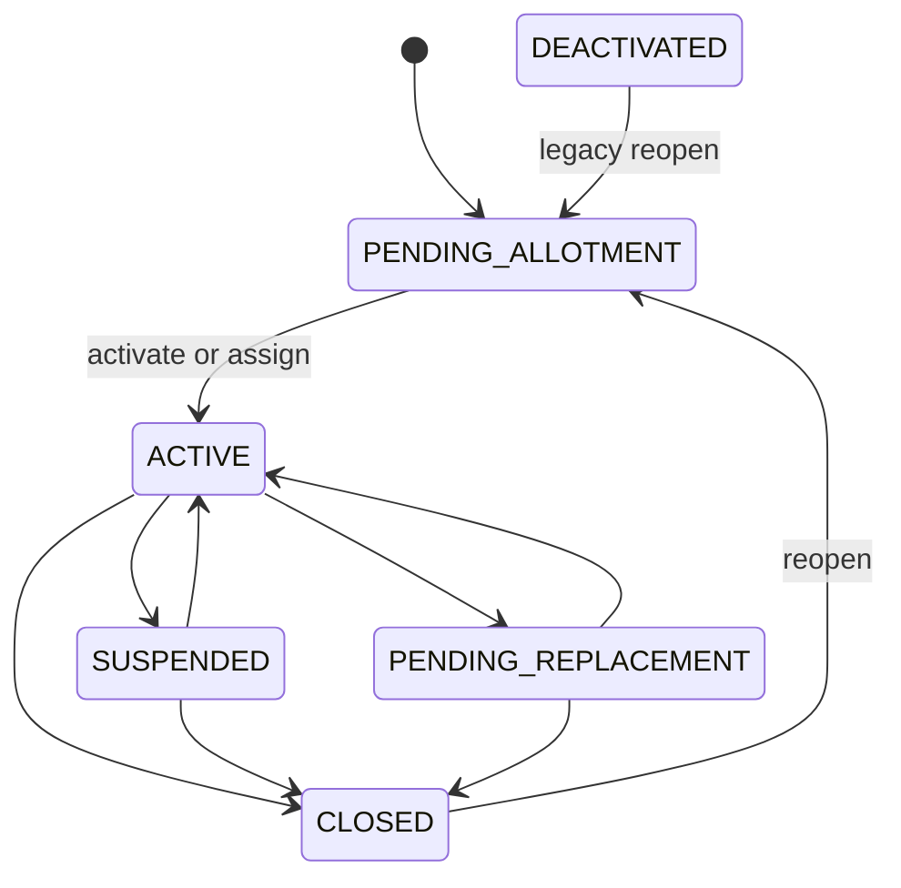
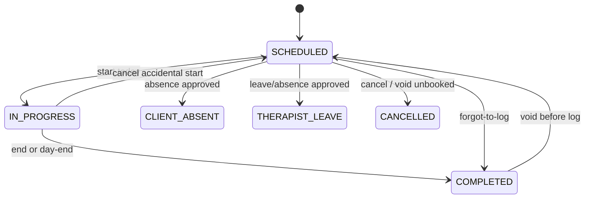

# Data integrity and impossible-state audit

An **invariant** should always be true. Classification:

- **HARD GUARANTEE** — database constraint or equivalent  
- **SOFT GUARANTEE** — backend validation on the happy path  
- **UI-ONLY GUARANTEE** — hidden/disabled in the app only  
- **NOT GUARANTEED** — possible in the database today  

No production PII was read. Examples are structural.

---

## State machines (actual, not assumed)

### Case / “client”

**Dead / leftover:** `DEACTIVATED` (no new path from ACTIVE). **Missing vs typical CRM:** no Lead, no HOLD (pause = SUSPENDED).

Invalid but possible: case ACTIVE with no assignment; SUSPENDED with IN_PROGRESS session; DEACTIVATED still listed on therapist “active” lists.

### Therapist / employee

Not one machine — three fields (see HR-001–003). Profile: DRAFT → PENDING → APPROVED → PAUSED / DELETED. Employment: ACTIVE / SUSPENDED / ARCHIVED. Login: `is_active`.

**No automatic** Applicant → Joining → Exit pipeline.

### Session

`NO_SHOW` / `RESCHEDULED`: enum only. Frontend `FLAGGED`: not stored.

### Daily log

PENDING → APPROVED / REJECTED; reject → resubmit PENDING. Visibility INTERNAL → APPROVED_FOR_PARENT. Mentor review is **independent**.

### Reports (legacy)

DRAFT → UNDER_REVIEW → APPROVED / REJECTED → PUBLISHED.

### Reports (clinical)

draft → in_progress → submitted_for_review → returned_for_changes → approved → locked / archived.

### Client invoice

DRAFT → generated/sent → paid / partial / overdue; disputes hold **lines**. Confirm payment is a second object (`client_payments`).

### Therapist invoice

DRAFT → IN_REVIEW → APPROVED → EXPORTING → PAID; QUERIED / REJECTED.

### Leave

PENDING → APPROVED / REJECTED / CANCELLED.

---

## Invariants

| Invariant | UI | Backend | DB | Test | Class |
| --- | --- | --- | --- | --- | --- |
| Session belongs to a case | — | FK used | `sessions.case_id` NOT NULL FK | implicit | **HARD** |
| One daily log per session | form | unique | unique `session_id` | log tests | **HARD** |
| Log only if session COMPLETED | form | `create_daily_log` check | none | log tests | **SOFT** |
| Active assignment points at eligible therapist | picker | **not** on create | no check | picker tests only | **NOT GUARANTEED** |
| Closed case cannot start session | button | `assert_case_allows_new_session` | none | start tests | **SOFT** (assert **after** IN_PROGRESS write — race leftover **POSSIBLE**) |
| Suspended case cannot start session | unclear | **not blocked** | none | **gap** | **NOT GUARANTEED** (and currently allowed) |
| Closed case ends assignments | — | `apply_case_closed_side_effects` | none | case close | **SOFT** |
| Inactive user has no ACTIVE assignment | people UI | **no** | none | **gap** | **NOT GUARANTEED** |
| Package remaining ≥ 0 | display `max(0,…)` | consume stops at total | no CHECK | | **SOFT** display; consume guard |
| Package remaining matches cycles | — | **not synced** | two tables | **gap** | **NOT GUARANTEED** |
| Payout lines trace to sessions | preview | session line FKs | FKs on lines | invoice tests | **SOFT** (manual lines exist) |
| Approved report linked to period | UI | report models | period fields vary by engine | engine tests | **SOFT** / dual engines |
| Parent sees only approved artifacts | filters | parent serializers | none | parent tests | **SOFT** |
| Therapist cannot see client prices | redact UI | redact API | none | redaction test | **SOFT** |
| Unique slot per therapist+date+time | UI | | unique constraint | slot tests | **HARD** |
| Case code unique | generate | | unique | | **HARD** |
| `NO_SHOW` unused | filters | no writer | enum allows | none | leftover allowed |
| Attendance is one of four values | chips | normalize **or store other strings** | String(64) | | **NOT GUARANTEED** |
| `is_active` ⇔ `employment_status==ACTIVE` | HR form | only some paths | none | **gap** | **NOT GUARANTEED** |
| Ledger row per completed visit | — | gated off by default | none | | **NOT GUARANTEED** |
| One official IEP per case | UI | two tables possible | none | | **NOT GUARANTEED** |

---

## Invalid states that can occur (CONFIRMED or STRONG INFERENCE)

1. `IN_PROGRESS` with no `actual_start_at` (day-end skips these).  
2. `COMPLETED` with no daily log (allowed; pending-log gate).  
3. `CLIENT_ABSENT` / `THERAPIST_LEAVE` plus a daily log (virtual logs).  
4. `SUSPENDED` case + new `IN_PROGRESS` session.  
5. `ACTIVE` assignment + `users.is_active=False`.  
6. `employment_status=ARCHIVED` + `is_active=True` (admin deactivate vs HR path).  
7. `care_packages.used_sessions` ≠ cycle `consumed_sessions`.  
8. Legacy monthly report **and** clinical report for the same month.  
9. `compensation_mode=PERCENTAGE` on old rows after coerce migration (if migration missed). **POSSIBLE RISK**.  
10. `parent_billing_statements` DUE while `client_invoices` PAID (or reverse).

---

## Time / date integrity

| Topic | Rule | Risk |
| --- | --- | --- |
| Canonical TZ | `Asia/Kolkata` in `timezone.py` | Good |
| Timestamps | UTC aware DateTime | Good |
| Session calendar | Date + wall-clock Time (IST) | Good if both ends use helpers |
| Billing month | `YYYY-MM` + `calendar.monthrange`; some `date.today()` **host local** | **Month boundary / UTC midnight** — MEDIUM |
| Leave / transition | Date-only IST “today” | Good |
| Day-end | 22:00 IST cron 16:30 UTC | Good if Railway TZ stays UTC |
| User `timezone` column | Preference; not billing SSOT | Confusion only |

Frontend dates: Indian DD-MM-YYYY (`frontend/src/lib/datetime.js`) — display, not money SSOT.

---

## Permissions vs data (who can break an invariant)

| Actor | Can create invalid state? |
| --- | --- |
| Admin/HR assign | Yes — ineligible therapist |
| Admin deactivate user | Yes — assignment remains |
| Therapist start | Yes — on suspended case |
| Finance confirm payment | Manual confirm on mock gateway — operational error, not constraint |
| Seed / import | Excel import can write rates/statuses without UI gates — **HIGH** |

---

## Safe local/staging note

This audit did **not** query a production database. If a staging DB is used later: count only (no names) of (a) ACTIVE assignments whose user `is_active=false`, (b) SUSPENDED cases with sessions after `status_effective_date`, (c) package vs cycle mismatches, (d) dual report rows per case/month.
